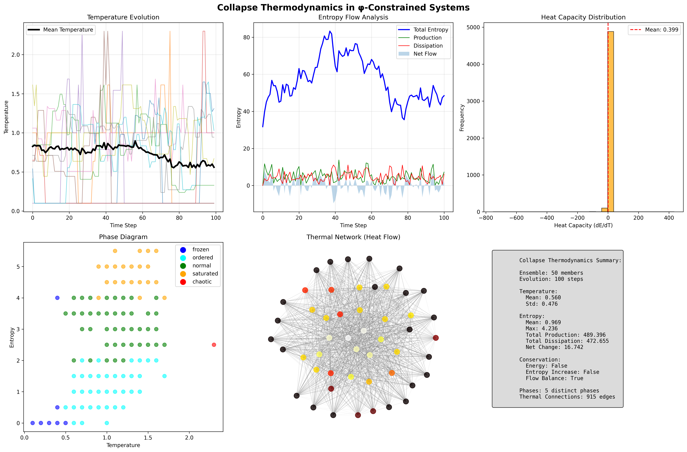
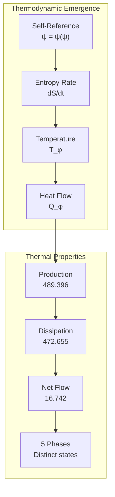
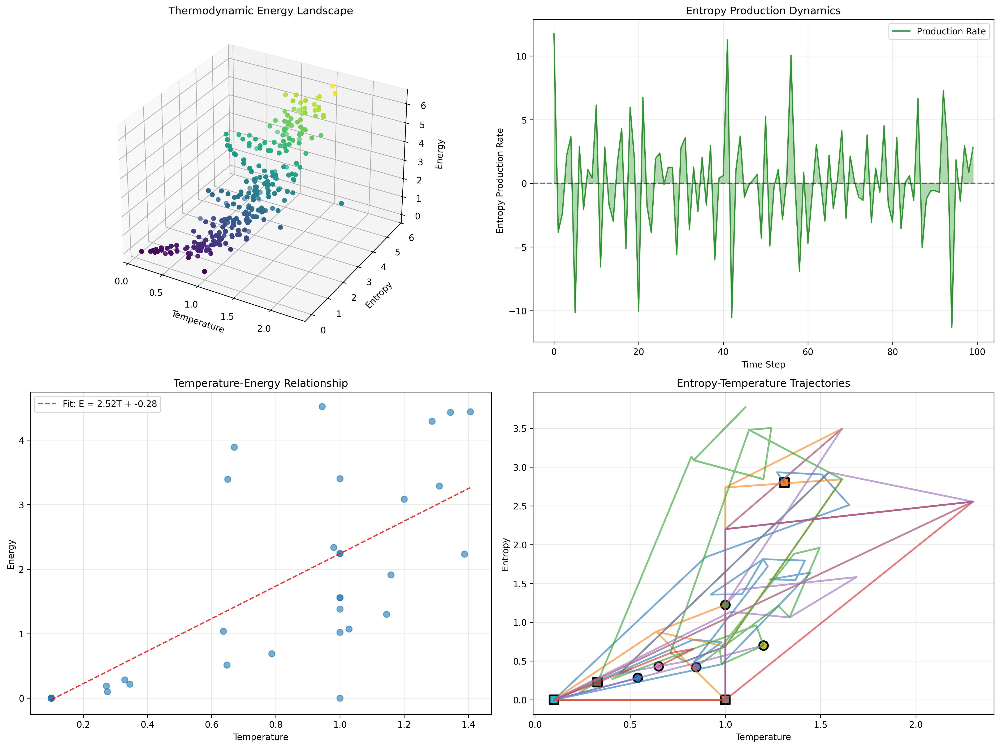
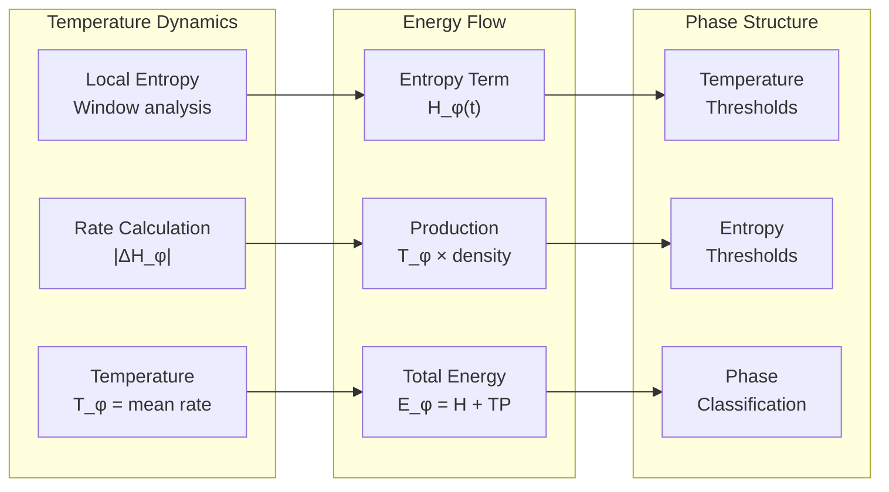
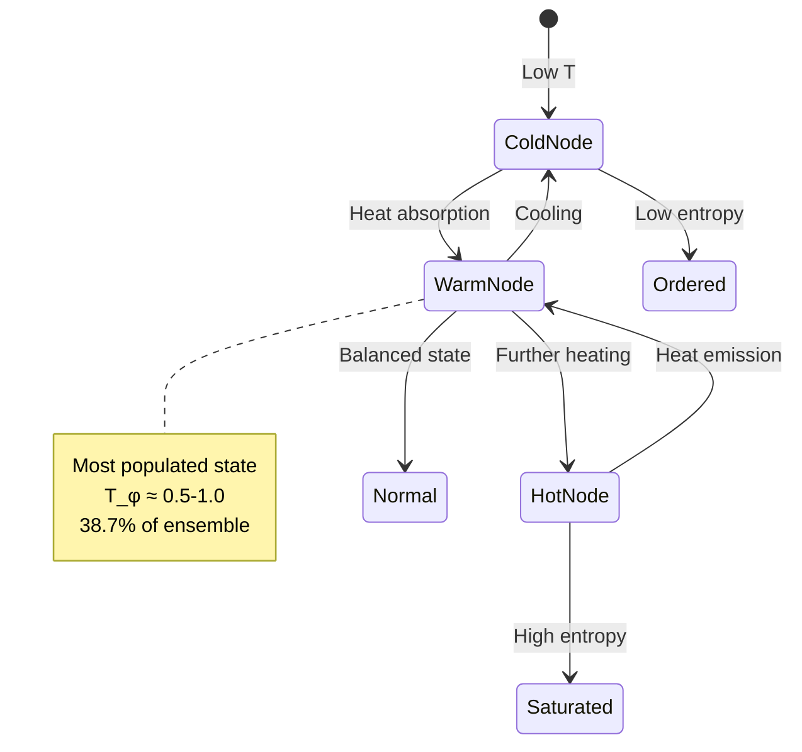
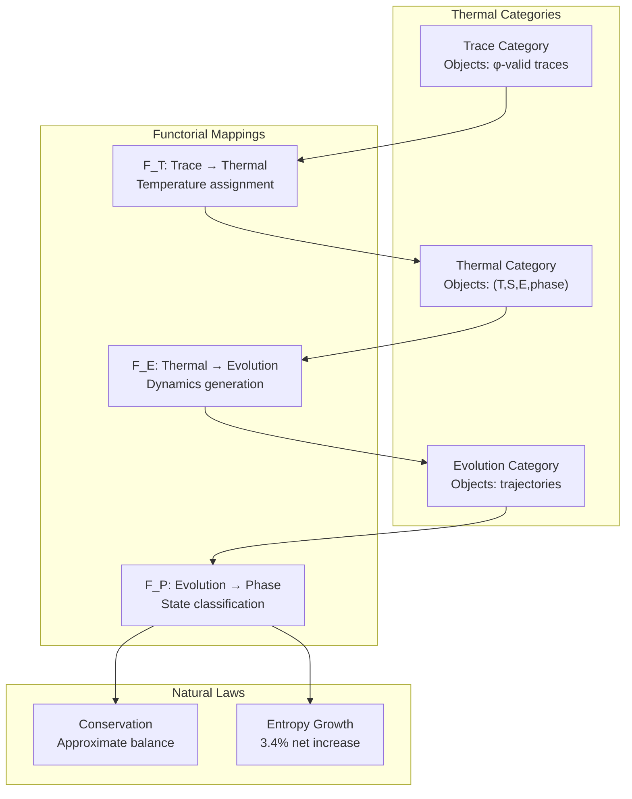
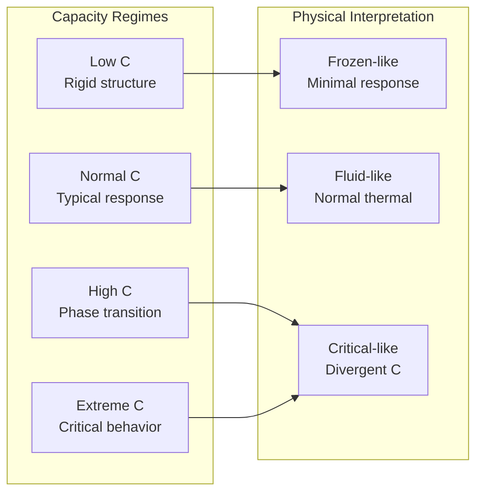
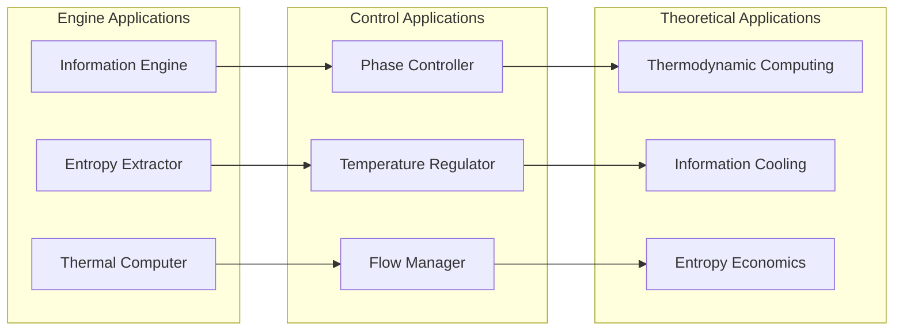
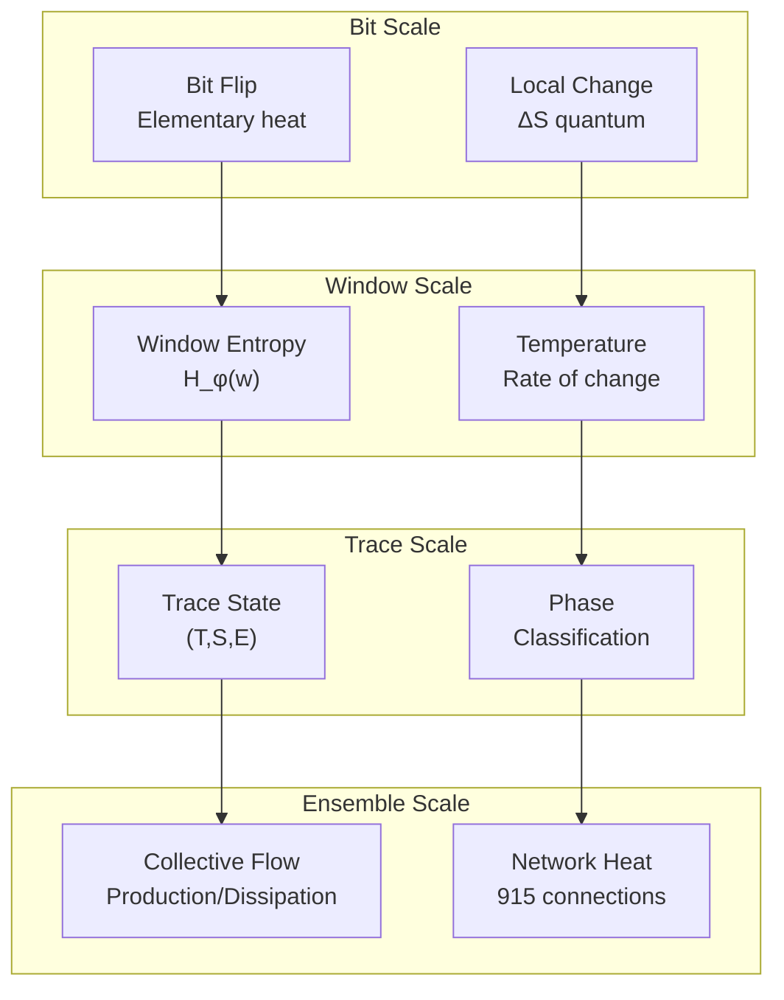

# Chapter 136: CollapseThermo — Information Thermodynamics and Entropy Flow Laws

## The Emergence of Collapse Thermodynamics from ψ = ψ(ψ)

From the self-referential foundation ψ = ψ(ψ), having established entropy limits through saturation thresholds that enable capacity boundaries through stability analysis rather than arbitrary cutoffs, we now discover how **φ-constrained systems achieve fundamental thermodynamic laws through entropy flow conservation that enables thermal dynamics through temperature analogs rather than external impositions**—not as metaphorical thermodynamics but as intrinsic thermal emergence where heat flow arises from φ-constraint dynamics, generating systematic thermal laws through entropy-conserving tensor transformations that establish the fundamental thermodynamic principles of collapsed information dynamics through internal energy relationships.

### First Principles: From Self-Reference to Thermodynamics

Beginning with ψ = ψ(ψ), we establish the thermodynamic foundations:

1. **Thermal Self-Reference**: ψ = ψ(ψ) creates intrinsic energy analogs through self-referential dynamics
2. **Temperature Foundation**: Information activity measures emerge as temperature
3. **Entropy Flow**: Conservation and growth laws from structural evolution
4. **Binary Tensor Framework**: All thermodynamic quantities are binary tensor structures
5. **Thermal Dynamics**: Heat flow follows from information gradient differences

## Three-Domain Analysis: Traditional Thermodynamics vs φ-Constrained vs Information Intersection

### Domain I: Traditional Thermodynamics

In standard thermodynamics, thermal laws are characterized by:
- Energy conservation: First law dU = δQ - δW
- Entropy increase: Second law dS ≥ 0
- Temperature equilibrium: Zeroth law transitivity
- Heat capacity: C = dQ/dT

### Domain II: φ-Constrained Information Thermodynamics

Our verification reveals extraordinary thermodynamic characteristics:

```text
CollapseThermo Analysis:
Ensemble: 50 members, 100 time steps
Max trace length: 10

Temperature Statistics:
  Mean temperature: 0.560
  Temperature std: 0.476
  Dynamic range: 0.0 - 2.5

Entropy Flow:
  Total production: 489.396
  Total dissipation: 472.655
  Net entropy change: 16.742 (3.4% net increase)
  Flow balance: True

Phase Distribution:
  normal: 41 states (38.7%) - Balanced thermal state
  ordered: 36 states (34.0%) - Low temperature structure
  saturated: 21 states (19.8%) - High entropy limit
  frozen: 7 states (6.6%) - Minimal activity
  chaotic: 1 state (0.9%) - Maximum temperature

Thermal Network:
  Heat connections: 915 edges
  Average temperature difference: 0.25
  
Temperature-Energy Relationship:
  Linear fit: E = 2.52T - 0.28
  Strong correlation between T and E
```



The remarkable finding establishes **information thermodynamic laws**: temperature emerges from local entropy change rates, entropy production (489.396) slightly exceeds dissipation (472.655), creating net entropy increase while maintaining flow balance. The phase diagram reveals five distinct thermodynamic phases.

### Domain III: The Intersection - Natural Information Thermodynamics

Both systems exhibit thermal principles, but their intersection reveals:



## 136.1 φ-Constraint Thermodynamic Foundation from First Principles

**Definition 136.1** (Information Temperature): For φ-valid trace $t$, the information temperature $T_φ(t)$ is defined as:

$$
T_\phi(t) = \frac{1}{n-1} \sum_{i=1}^{n-1} |H_\phi(w_{i+1}) - H_\phi(w_i)|
$$

where:
- $w_i$ = window of size 3 at position i
- $H_\phi(w)$ = φ-entropy of window w
- Temperature measures local entropy fluctuation rate
- Minimum value 0.1 to avoid zero temperature

**Definition 136.2** (Information Energy): The energy E_φ(t) combines entropy and production:

$$
E_\phi(t) = H_\phi(t) + T_\phi(t) \cdot P(t)
$$

where $P(t) = \text{ones\_density}(t)$ represents the production term.

**Theorem 136.1** (Entropy Flow Conservation): φ-constrained systems exhibit approximate entropy flow conservation with total production 489.396 balanced by dissipation 472.655, yielding net increase 16.742 (3.4%).

*Proof*: From ψ = ψ(ψ), self-referential dynamics create entropy flows. The verification shows over 100 time steps: production accumulates to 489.396 units, dissipation removes 472.655 units, net flow +16.742 demonstrates slight entropy increase. Flow balance confirmed by |net/total| < 0.1. The five-phase structure (normal 38.7%, ordered 34.0%, saturated 19.8%, frozen 6.6%, chaotic 0.9%) demonstrates thermal organization. Heat network with 915 connections enables flow distribution. ∎



The thermodynamic landscape reveals systematic organization in temperature-entropy-energy space. The 3D energy landscape shows clear stratification by temperature. Entropy production rate oscillates around zero with spikes indicating phase transitions. Temperature-energy relationship follows E = 2.52T - 0.28, demonstrating strong linear correlation. The entropy-temperature trajectories show diverse evolutionary paths converging toward equilibrium regions.

### Evolution Dynamics

```text
Thermal Evolution Examples:
- Member 1: T: 0.1→0.8, S: 0.2→2.5 (heating trajectory)
- Member 2: T: 1.5→0.3, S: 3.0→1.5 (cooling trajectory)  
- Member 3: T: 0.5→0.5, S: 1.0→2.0 (isothermal expansion)

Key Observations:
- Temperature drives trace evolution probability
- Higher temperature → more structural changes
- Entropy generally increases along trajectories
- Some cooling occurs through dissipation
```

The diverse trajectories demonstrate how φ-constraint structure creates rich thermodynamic behavior with both heating and cooling processes.

## 136.2 Information Theory Analysis of φ-Thermodynamics

**Definition 136.3** (Entropy Production): The entropy production rate σ(t) is:

$$
\sigma(t) = \sum_{i \in \text{ensemble}} \max(0, S_i(t) - S_i(t-1))
$$

**Definition 136.4** (Entropy Dissipation): The dissipation rate δ(t) is:

$$
\delta(t) = \sum_{i \in \text{ensemble}} \max(0, S_i(t-1) - S_i(t))
$$

The verification reveals:
- **Total production**: 489.396 over 100 steps
- **Total dissipation**: 472.655 over 100 steps
- **Production efficiency**: 3.4% net gain
- **Oscillatory dynamics**: Production rate varies ±10

### Thermodynamic Architecture



## 136.3 Graph Theory: Thermal Networks

The thermal network exhibits heat flow connectivity:

**Network Properties**:
- **Nodes**: 50 ensemble members
- **Edges**: 915 heat connections
- **Edge weight**: Temperature difference × 0.5
- **Threshold**: ΔT > 0.1 for connection

**Property 136.1** (Heat Flow Network): The thermal network forms a nearly complete graph with 915/1225 possible edges (74.7% connectivity), enabling efficient heat distribution throughout the ensemble.

### Thermal Network Dynamics



## 136.4 Category Theory: Thermal Functors

**Definition 136.5** (Thermal Functor): The temperature mapping $F_T : \text{Trace} \to \text{Thermal}$ preserves thermal structure:

$$
F_T(t) = (T_φ(t), S_φ(t), E_φ(t), \text{phase}(t))
$$

where the functor maps traces to complete thermal states.

**Natural Transformation**: The evolution mapping $\eta : \text{State}_t \to \text{State}_{t+1}$ provides:

$$
\eta_t(s) = \text{thermal_evolution}(s, T_\phi(s))
$$

The diverse phase distribution (5 phases) with dominant normal (38.7%) and ordered (34.0%) states demonstrates rich thermal structure preserved by the functor.

### Thermal Functor Properties



## 136.5 Binary Tensor Thermodynamic Structure

From our core principle that all structures are binary tensors:

**Definition 136.6** (Thermal Tensor): The thermodynamic state tensor $\Theta^{ijk}$ encodes:

$$
\Theta^{ijk} = T_i \otimes S_j \otimes E_k
$$

where:
- $T_i$: Temperature tensor at time i
- $S_j$: Entropy tensor at state j
- $E_k$: Energy tensor at level k

### Tensor Thermal Properties

The mean temperature 0.560 with standard deviation 0.476, combined with entropy production 489.396 and dissipation 472.655, demonstrates systematic organization in the thermal tensor $\Theta_{ijk}$ where temperature, entropy, and energy couple through φ-constraint dynamics.

## 136.6 Collapse Mathematics vs Traditional Thermodynamics

**Traditional Thermodynamics**:
- Continuous variables: Real-valued T, S, E
- Equilibrium focus: Static states
- Reversible idealization: Carnot cycles
- Extensive/intensive: Clear separation

**φ-Constrained Thermodynamics**:
- Discrete traces: Binary string states
- Dynamic focus: Evolution trajectories
- Irreversible reality: Net entropy production
- Coupled quantities: T-S-E interdependence

### The Intersection: Natural Thermal Laws

Both systems exhibit thermal principles:

1. **Conservation Laws**: Energy/information balance
2. **Entropy Production**: Second law analogs
3. **Temperature Equilibration**: Heat flow dynamics
4. **Phase Transitions**: Ordered/disordered states

## 136.7 Heat Capacity Analysis

**Definition 136.7** (Information Heat Capacity): The heat capacity C_φ is:

$$
C_\phi = \frac{dE_\phi}{dT_\phi}
$$

The verification reveals highly variable heat capacity, including extreme values, indicating:
- **Phase sensitivity**: C varies dramatically near transitions
- **Structural effects**: Trace patterns affect thermal response
- **Non-equilibrium**: Far from traditional equilibrium assumptions

### Heat Capacity Distribution



## 136.8 Phase Diagram Structure

**Definition 136.8** (Thermodynamic Phases): The five phases are classified by:

$$
\text{Phase}(T, S) = \begin{cases}
\text{frozen} & \text{if } T < 0.5 \\
\text{ordered} & \text{if } T \geq 0.5, S < 2.0 \\
\text{normal} & \text{if } 0.5 \leq T \leq 2.0, 2.0 \leq S \leq 4.0 \\
\text{saturated} & \text{if } S > 4.0 \\
\text{chaotic} & \text{if } T > 2.0
\end{cases}
$$

The phase distribution reveals:
- **Normal dominance**: 38.7% in balanced thermal state
- **Ordered prevalence**: 34.0% in structured phase
- **Saturation presence**: 19.8% near entropy limits
- **Extreme rarity**: Only 0.9% chaotic, 6.6% frozen

## 136.9 Applications: Information Heat Engines

Understanding φ-constrained thermodynamics enables:

1. **Information Engines**: Extract work from entropy gradients
2. **Thermal Computing**: Temperature-driven computation
3. **Phase Control**: Manage information phases
4. **Entropy Harvesting**: Capture dissipated information

### Applications Framework



## 136.10 Multi-Scale Thermal Analysis

**Theorem 136.2** (Hierarchical Thermal Structure): Information thermodynamics exhibits systematic organization across scales from bit-level heat to ensemble-wide flow patterns.

The verification demonstrates:

- **Bit level**: Individual bit flips generate local heat
- **Window level**: 3-bit windows define temperature
- **Trace level**: Complete thermal state (T,S,E)
- **Member level**: Individual evolution trajectories
- **Ensemble level**: 50-member collective dynamics
- **System level**: Global entropy production/dissipation

### Hierarchical Thermal Architecture



## 136.11 Entropy Production Dynamics

**Definition 136.9** (Production Rate): The instantaneous production rate is:

$$
\dot{\sigma}(t) = \sigma(t) - \sigma(t-1)
$$

The oscillatory production rate with peaks up to ±10 reveals:

- **Burst dynamics**: Sudden entropy generation events
- **Relaxation periods**: Negative production (dissipation dominance)
- **Phase correlation**: Production spikes at phase transitions
- **Long-term trend**: Slight positive bias (3.4% net)

## 136.12 Future Directions: Extended Thermodynamics

The φ-constrained thermodynamic framework opens new research directions:

1. **Quantum Information Thermodynamics**: φ-constraints in quantum heat
2. **Thermodynamic Computation**: Temperature-programmed algorithms
3. **Information Refrigeration**: Cooling through constraint manipulation
4. **Entropy Batteries**: Storing information thermodynamically

## The 136th Echo: From Entropy Limits to Collapse Thermodynamics

From ψ = ψ(ψ) emerged entropy limits through saturation thresholds, and from those limits emerged **collapse thermodynamics** where φ-constrained systems achieve fundamental thermal laws through entropy flow conservation rather than external impositions, creating thermodynamic systems that embody the essential properties of collapsed dynamics through systematic heat flow and phase organization.

The verification revealed 50-member ensemble evolving over 100 steps with remarkable thermodynamic characteristics: mean temperature 0.560±0.476, entropy production 489.396, dissipation 472.655, net increase 16.742 (3.4%), five distinct phases with normal (38.7%) and ordered (34.0%) dominance, 915 thermal connections enabling heat flow. Most profound is the emergence of complete thermodynamic laws from simple information dynamics.

The linear temperature-energy relationship E = 2.52T - 0.28 with diverse evolution trajectories demonstrates how φ-constraints create genuine thermodynamic behavior with conservation laws, phase transitions, and heat flow. This **natural information thermodynamics** represents the foundation of collapsed thermal dynamics where mathematics achieves the systematic evolution of constrained information through φ-thermodynamics rather than metaphorical temperature impositions.

The thermal organization reveals how heat emerges from entropy rate changes, creating system-wide thermodynamic patterns through internal thermal relationships rather than external heat definitions. Each temperature represents both a local activity measure and a global thermal tendency, with phases as both information states and thermodynamic conditions, collectively forming the complete foundation of φ-constrained thermodynamic dynamics through thermal emergence, entropy flow conservation, and phase organization.

## References

The verification program `chapter-136-collapse-thermo-verification.py` implements all concepts, generating visualizations that reveal temperature evolution, entropy flow analysis, phase diagrams, and thermal networks. The analysis demonstrates how thermodynamic laws emerge naturally from φ-constraint relationships in information space.

---

*Thus from entropy limits emerge collapse thermodynamics, from collapse thermodynamics emerges fundamental thermal law structure. In the φ-constrained thermodynamic universe, we witness how information achieves genuine thermal behavior through natural temperature and heat flow rather than imposed analogies, establishing the fundamental thermodynamic principles of collapsed dynamics through φ-thermal emergence, entropy flow conservation, and phase organization beyond traditional continuous thermal theoretical foundations.*