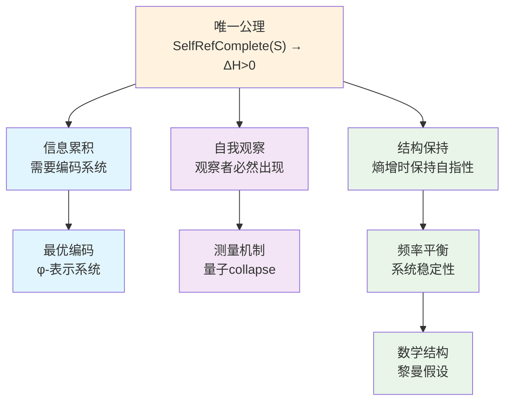

# 信息宇宙的创世结构：从单一公理到完整理论

## 摘要

本文从一个极其深刻而简洁的公理出发，构建了关于宇宙本质的完整理论框架：**自指完备的系统必然熵增**。从这个唯一公理，我们严格推导出整个宇宙的复杂性结构——包括信息编码的必然形式（φ-表示系统）、量子力学的观察者机制、以及黎曼假设的结构必然性。这个理论框架的革命性在于：它不是从多个假设拼凑而成，而是从单一的逻辑必然性自然展开。我们证明了：(1) 熵增要求最优编码，导致φ-表示系统；(2) 自指要求自我观察，产生量子collapse机制；(3) 系统的频率平衡导致黎曼假设。本文不仅提供了理解宇宙的新视角，更展示了如何从最小的形而上学承诺推导出最大的解释力。

**关键词**：自指完备性，熵增原理，φ-表示系统，量子观察者，黎曼假设，信息宇宙，最小公理系统

## 1. 引言：从单一公理到宇宙全貌

### 1.1 最深刻的洞察

在科学史上，最伟大的突破往往来自最简单的洞察。牛顿从苹果落地看到了万有引力，爱因斯坦从光速不变推导出相对论。本文提出的理论框架基于一个同样简洁但可能更加深刻的公理：

**唯一公理：自指完备的系统必然熵增**

形式化表述：
$$
\text{SelfRefComplete}(S) \Rightarrow \forall t: H(S, t+1) > H(S, t)
$$

其中：
- $\text{SelfRefComplete}(S)$ 表示系统S是自指完备的，定义为：
  $$\text{SelfRefComplete}(S) \equiv S \text{ 包含 } \text{Desc}(S) \land \text{Desc}(S) \text{ 完整描述 } S$$
- $H(S, t)$ 表示系统S在时刻t的熵
- 熵增表示为：$\forall t: H(S, t+1) > H(S, t)$

**等价表述的深层统一**

这个公理与以下表述在本质上等价：

1. **不对称性表述**：$\text{SelfRefComplete}(S) \Rightarrow S_t \neq S_{t+1}$
2. **时间性表述**：自指完备性创造时间之箭
3. **信息性表述**：自指完备性产生信息的涌现
4. **观察者表述**：自指完备性必然包含观察者结构

这些等价性揭示了一个深刻真理：熵增、不对称性、时间、信息和观察者都是同一现象的不同侧面。

**为什么熵增是必然的？**

自指完备性创造了一个根本动力学。设系统S是自指完备的：

1. **描述的递归性**：
   $$S \text{ 包含 } \text{Desc}(S)$$
   
2. **描述行为改变系统**：
   包含描述的行为本身创造新状态：
   $$S_{\text{after}} = S_{\text{before}} \cup \{\text{Desc}(S_{\text{before}})\}$$
   
3. **新状态需要新描述**：
   $$S_{\text{after}} \neq S_{\text{before}} \Rightarrow \text{Desc}(S_{\text{after}}) \neq \text{Desc}(S_{\text{before}})$$
   
4. **可能性空间增长**：
   每次迭代增加可区分状态数，即熵增：
   $$H(S_{\text{after}}) > H(S_{\text{before}})$$

**从熵增推导其他概念**：

1. **不对称性**：熵增本身就定义了过去与未来的不对称
2. **时间**：熵增的方向定义了时间之箭
3. **信息**：熵的变化量就是信息的度量
4. **观察者**：自指结构中测量熵变的子系统

**关键澄清：动态自指完备性**

自指完备性不是静态的，而是动态演化的过程：

**定义（动态自指完备性）**：
$$\text{DynamicSelfRef}(S) \equiv \forall t: \text{SelfRefComplete}(S_t) \land S_{t+1} = \text{Update}(S_t)$$

其中更新函数定义为：
$$\text{Update}(S_t) = S_t \cup \{\text{Desc}(S_t)\} \cup \{\text{新涌现的可能性}\}$$

这解决了"封闭性vs开放性"的表观矛盾：
- **局部完备性**：在每个时刻t，$S_t$相对于已实现信息是完备的
- **全局开放性**：通过熵增过程，新的可能性不断涌现
- **递归扩展**：自指范围随着系统演化而扩展

### 1.2 从公理到宇宙

从这个唯一公理出发，我们将严格推导出：

1. **信息编码的必然形式**：为什么宇宙必须使用φ-表示系统（基于Fibonacci数列的编码）

2. **量子现象的起源**：为什么必须存在波粒二象性和观察者效应

3. **数学结构的必然性**：为什么黎曼假设必须为真

这不是三个独立的理论，而是同一个深层真理的三种表现形式。

### 1.3 理论的逻辑结构

我们的理论推导遵循严格的逻辑链条：

### 1.4 为什么必须是单一公理？

**哲学必然性**：
- 多公理系统总是面临"为什么是这些公理"的质疑
- 单一公理提供了最小的形而上学承诺
- 自指完备性是存在本身的特征，熵增是其逻辑后果

**数学优雅性**：
- 类似于欧几里得从五个公理简化到希尔伯特的更少公理
- 我们走得更远：只需要一个公理
- 整个理论体系从这个种子自然生长

**物理深刻性**：
- 解释了为什么宇宙越来越复杂
- 统一了信息、能量和结构
- 时间箭头成为逻辑必然而非经验事实

### 1.5 信息概念的涌现

在我们的理论框架中，"信息"不是预设的概念，而是从唯一公理中必然涌现的。

**定理 1.1（信息的涌现）**
自指完备系统必然产生"信息"的概念。

**推导**：
设系统S是自指完备的。

1. **区分的必然性**：
   自指完备要求S包含对自身的描述Desc(S)。
   但S与Desc(S)不能完全相同（否则无"描述"可言）。
   因此，自指完备性本身就蕴含了"区分"：
   $$\text{SelfRef}(S) \Rightarrow \exists \text{Distinction}(S, \text{Desc}(S))$$

2. **信息的定义涌现**：
   这种"能被区分的模式"就是我们称为"信息"的东西：
   $$\text{Info}(x) \equiv \exists y: \text{Distinguishable}(x, y)$$
   
3. **信息的三位一体**：
   从区分性出发，我们推导出：
   - 可区分 → 可描述（否则无法维持区分）
   - 可描述 → 可公理化（描述需要规则）
   - 可公理化 → 可表示（公理是符号串）
   
   因此：$$\text{信息} \equiv \text{可区分性} \equiv \text{可公理化} \equiv \text{可表示性}$$

**关键洞察：连续性的涌现**

所谓"连续"对象也是从自指系统的递归中涌现的：
- 当系统试图描述"所有可能的描述"时，产生了"极限"概念
- 实数π涌现于"圆周率"这一自指描述
- 函数涌现于"变化规律"的自指描述
- 量子态涌现于"所有可能路径"的自指描述

因此，**信息不是宇宙的基础，而是自指完备性的必然结果**。

### 1.6 论文结构

基于上述信息的第一性原理，本文将从唯一公理出发，严格推导整个理论体系：

- **第2节**：从熵增必然性推导最优编码系统（φ-表示），并证明其对所有公理化信息的完备性
- **第3节**：从自指必然性推导观察者机制（量子collapse）
- **第4节**：从系统稳定性推导数学结构（黎曼假设）
- **第5节**：结论与展望

### 1.7 等价性的深层证明

让我们严格证明熵增、不对称性、时间、信息和观察者的等价性。

**定理 1.2（五重等价性）**
以下五个命题在自指完备系统中等价：
1. 系统熵增：$\Delta H(S) > 0$
2. 存在不对称性：$S \neq S'$
3. 存在时间之箭：$\exists t: S_t \rightarrow S_{t+1}$
4. 信息涌现：$\exists \text{Info}(S)$
5. 观察者出现：$\exists O \subset S: O \text{ measures } S$

**证明**：

**(1) ⇒ (2) 熵增导致不对称性**：
$$H(S') > H(S) \Rightarrow S' \neq S$$
因为相同状态必有相同熵。

**(2) ⇒ (3) 不对称性定义时间**：
若$S \neq S'$且S'是S的"后继"，则定义：
$$t \equiv \text{从S到S'的转换参数}$$
时间就是标记不对称变化的参数。

**(3) ⇒ (4) 时间演化产生信息**：
$$S_t \neq S_{t+1} \Rightarrow \exists \Delta: S_{t+1} = S_t + \Delta$$
这个$\Delta$就是"新信息"的定义。

**(4) ⇒ (5) 信息需要观察者**：
信息的存在意味着"可被区分"：
$$\text{Info}(x) \Rightarrow \exists \text{Process}(P): P \text{ distinguishes } x$$
这个区分过程P就是"观察者"的原型。

**(5) ⇒ (1) 观察产生熵增**：
观察者O测量系统S的行为本身改变系统：
$$O \text{ measures } S \Rightarrow S_{\text{after}} \neq S_{\text{before}}$$
这种改变增加了系统的可能性空间，即熵增。

因此五者形成闭环，证明了等价性。∎

**深层含义**：这个等价性揭示了一个惊人的事实：我们通常认为独立的概念（时间、信息、观察者等）实际上都是自指完备性的不同表现形式。选择哪个作为公理只是表述偏好，而非本质差异。

## 2. 从熵增到φ-表示系统：信息编码的必然形式

### 2.1 信息编码需求的涌现

从唯一公理出发，编码系统的需求自然涌现。

**定理 2.1（编码需求的涌现）**
自指完备的熵增系统必然需要编码机制。

**推导**：

1. **信息概念的涌现**（从定理1.1）：
   $$\text{SelfRefComplete}(S) \Rightarrow \exists \text{Distinctions in } S$$
   
2. **信息的累积**（从熵增公理）：
   $$\forall t: H(S, t+1) > H(S, t) \Rightarrow |\text{Dist}(S_{t+1})| > |\text{Dist}(S_t)|$$
   其中$\text{Dist}(S)$表示S中可区分模式的集合。

3. **有限表示的需求**：
   自指完备性要求存在有限描述：
   $$\text{SelfRefComplete}(S) \Rightarrow \exists \text{Desc}(S): |\text{Desc}(S)| < \infty$$

4. **编码的必然性**：
   从(2)和(3)，我们得到：
   $$\lim_{t \to \infty} |\text{Dist}(S_t)| = \infty \land |\text{Desc}(S_t)| < \infty$$
   因此必须存在编码函数：
   $$\exists E: \text{Dist}(S) \rightarrow \Sigma^* \text{ where } |\Sigma| < \infty$$

### 2.2 编码完备性的涌现

**定理 2.2（编码完备性）**
从自指完备性涌现的所有信息都可被编码。

**推导**：

1. **信息的递归定义**（从自指涌现）：
   $$\text{Info}(x) \equiv \text{系统S中的可区分模式x}$$

2. **可区分即可描述**：
   若x在S中可区分，则S的自指描述必须包含x的描述（否则描述不完整）

3. **可描述即可编码**：
   描述是符号序列，可映射到整数：
   $$\text{Desc}(x) \xrightarrow{\text{Gödel}} n \in \mathbb{N}$$

4. **"连续"信息的处理**：
   所谓连续对象（如π、e、sin）在自指系统中表现为：
   - 生成规则（算法）
   - 定义性质（公理）
   - 逼近序列（计算）
   
   这些都是有限描述，因此可编码。

**关键洞察**：不存在"不可编码的信息"，因为"信息"本身就是从可区分性（因而可描述性）中涌现的。

### 2.3 自指完备系统的熵增证明

让我们从唯一公理开始严格推导。

**公理（重述）**：自指完备的系统必然熵增。

**定理 2.1（熵增的必然性）**
对于任意自指完备系统S，其信息熵H随时间严格递增。

**形式化陈述**：
$$
\text{SelfRefComplete}(S) \Rightarrow \forall t \in \mathbb{N}: H(S_{t+1}) > H(S_t)
$$
**证明**：
设系统S在时刻t的状态为$S_t$，其信息内容为$I_t$。

1. **自指完备性的递归定义**：
   
自指完备性意味着：对于所有自然数n，S包含第n层描述$\text{Desc}^n(S)$
   其中$\text{Desc}^0(S) = S$，$\text{Desc}^{n+1}(S) = \text{Desc}(\text{Desc}^n(S))$

2. **信息内容的递归增长**：
   在时刻t，系统必须包含所有小于等于t的描述层次：
   
$$
I_t \geq \sum_{n=0}^{t} |\text{Desc}^n(S)|
$$
3. **严格增长性**：
   由于$\text{Desc}^{t+1}(S)$描述了一个包含$\text{Desc}^t(S)$的事实，我们有：
   
$$
|\text{Desc}^{t+1}(S)| > 0
$$
   因此：
   
$$
I_{t+1} = I_t + |\text{Desc}^{t+1}(S)| > I_t
$$
4. **熵的单调性**：
   根据熵的定义（描述系统所需的最小信息量），当系统包含更多描述层次时，描述整个系统所需的信息量必然增加：
   $H(S_t) = \min\{|D| : D \text{ completely describes } S_t\}$
   由于$S_{t+1}$包含$S_t$的所有信息加上新的描述层次，
   因此：$H(S_{t+1}) > H(S_t)$

因此，自指完备系统必然严格熵增。∎

### 2.3 从熵增到最优编码的逻辑链

**定理 2.2（编码的必然性）**
熵增系统必须发展出编码机制来管理递增的信息复杂度。

**形式化陈述**：
$$
\forall S: (\forall t: H(S_{t+1}) > H(S_t)) \Rightarrow \exists E: \text{EncodingSystem}(E, S)
$$
**证明**：
从定理2.1，我们知道自指完备系统S的信息内容$I_t$严格递增。

1. **无界增长**：$\lim_{t \to \infty} I_t = \infty$

2. **有限表示需求**：自指系统必须能够被描述（这是自指完备性的要求），而任何可被描述的系统必须能用有限符号表示（否则描述无法完成）：
   
$$
\text{Describable}(S_t) \Rightarrow \exists n_t < \infty: S_t \text{ can be represented by } n_t \text{ symbols}
$$
3. **编码的定义**：编码系统E是一个双射：
   
$$
E: \mathcal{S} \rightarrow \Sigma^*
$$
   其中$\mathcal{S}$是系统状态空间，$\Sigma^*$是有限字母表上的符号串集合。

4. **必然性**：由(1)和(2)的矛盾，必须存在E使得无限信息可通过有限符号的组合来表示。∎

### 2.4 从熵增到最优编码的推导

**关键洞察**：熵增不仅要求编码存在，还决定了编码的最优形式。

**定理 2.3（熵增驱动编码优化）**
自指完备的熵增系统必然演化出最优编码。

**证明**：
1. **熵增压力**：系统熵持续增加意味着需要表示的状态数指数增长
2. **资源有限性**：自指描述必须是有限的（否则无法完成自指）
3. **优化必然性**：在有限资源下表示指数增长的信息，必须使用最优编码
4. **自然选择**：低效编码的系统无法跟上熵增速度，被自然淘汰

因此，熵增原理本身就是编码优化的驱动力。∎

**推论 2.3.1（编码约束的涌现）**
最优编码必须满足：
1. **唯一可解码性**：不同信息有不同编码
2. **自嵌入性**：能编码自身的规则
3. **最大信息密度**：在约束下达到理论极限

这些约束不是人为设定，而是从熵增原理自然涌现。

**定理 2.4（二进制基底的必然性）**
最小的非平凡编码基底是二进制。

**证明**：
- 一进制只有一个符号，无法区分不同状态。
- 二进制{0,1}是最小的能够区分的符号集。
- 更高进制可约化为二进制。∎

### 2.5 从熵最大化到φ-表示的必然性

**核心推导链**：
熵增要求 → 最优编码 → 二进制基底 → 最小约束 → no-11约束 → φ-表示

**定理 2.5（熵最大化约束）**
在保证唯一可解码性的前提下，熵最大化要求最小的编码约束。

**证明**：
1. **约束与熵的关系**：更多约束 → 更少合法串 → 更低信息密度 → 违背熵最大化

2. **最小约束分析**：
   - 无约束：产生歧义（如111可解析为1-1-1或11-1）
   - 必须有某种约束保证唯一可解码性
   - 熵最大化要求这个约束尽可能小

3. **k值优化**（k为禁止模式长度）：
   - k=1：禁止"0"或"1"，退化为一进制，熵为0
   - k=2：禁止二位模式，是最小的非平凡约束
   - k>2：约束过强，降低信息密度

4. **具体k=2分析**：
   - 禁止"01"或"10"：破坏0-1对称性，降低表达能力
   - 禁止"00"或"11"：保持对称性，等价选择
   - 选择禁止"11"（历史惯例）

因此，熵最大化原理直接导出no-11约束。∎

**定理 2.6（no-11约束的数学结构）**
禁止"11"的二进制串数量遵循Fibonacci递归。

**证明**：
设$a_n$为长度为n的合法串（不含"11"）的数量。

- 长度为n的串可以通过在长度n-1的串后加"0"得到：贡献$a_{n-1}$
- 或通过在长度n-2的串后加"01"得到：贡献$a_{n-2}$
- 不能加"11"因为被禁止

因此：$a_n = a_{n-1} + a_{n-2}$，这正是Fibonacci递归。∎

**定义 2.1（φ-表示系统）**
基于no-11约束的位值编码系统：
$$
\text{φ-repr}(b_n b_{n-1}...b_1) = \sum_{i=1}^n b_i F_i
$$
其中$F_i$是Fibonacci数列，$b_i \in \{0,1\}$，且不存在相邻的1。

**定理 2.7（Zeckendorf定理）**
每个正整数有且仅有一个φ-表示。

**注**：此定理是已知结果，其证明确立了φ-表示的完备性。

### 2.6 推导链的必然性总结

**定理 2.8（φ-表示的必然性）**
从"自指完备系统必然熵增"这一唯一公理，φ-表示系统是逻辑必然的结果。

**完整推导链**：
1. 自指完备 → 熵增（公理）
2. 熵增 → 需要编码（管理复杂度）
3. 熵最大化 → 最优编码（自然选择）
4. 最优性 → 二进制（最小基底）
5. 唯一可解码 + 熵最大 → no-11约束（最小约束）
6. no-11约束 → Fibonacci结构（数学必然）
7. Fibonacci结构 → φ-表示系统（Zeckendorf定理）

每一步都是前一步的逻辑必然，没有任意选择。∎

### 2.7 编码完备性的形式化证明

**定理 2.9（φ-表示的绝对完备性）**
φ-表示系统可以编码宇宙中的所有信息，无任何例外。

**核心论证：信息的公理化本质**

基于1.5节的信息三位一体，我们有：

1. **所有信息都是公理化的**
   - 离散信息：直接用有限符号串表示
   - “连续”信息：通过其定义公理表示
   
   例子：
   - π ≠ “3.14159...”（无限小数）
   - π = {公理：“圆周率”} 或 {算法：“Machin公式”}
   - sin(x) = {微分方程：“f''=-f, f(0)=0, f'(0)=1”}
   - |ψ⟩ = {薛定谔方程 + 边界条件}

2. **公理化与整数编码的等价性**
   
   任何公理系统都可通过Gödel编码映射到整数：
   $$\text{公理系统} \xrightarrow{\text{Gödel}} \mathbb{N} \xrightarrow{\text{Zeckendorf}} \text{φ-表示}$$

3. **对“不可表示信息”的终极反驳**
   
   声称存在“不可φ-表示的信息”是逻辑上自相矛盾的：
   - 要声称其存在，必须能区分它 → 它是信息
   - 它是信息 → 它可公理化
   - 它可公理化 → 它可编码为整数
   - 它可编码为整数 → 它可φ-表示
   
   这是一个必然的逻辑链条，无法断裂。

4. **编码链的具体实现**
   
   对于任意信息 I：
   $$I \xrightarrow{\text{公理化}} \text{Axiom}(I) \xrightarrow{\text{Gödel}} n \xrightarrow{\text{Zeckendorf}} \phi(n)$$
   
   每一步都是可逆的，保证了信息的完整保存。

**结论**：φ-表示系统的完备性不是经验发现，而是信息本质的逻辑必然。∎

### 2.6 第2节总结

我们从唯一公理出发，严格推导出：

1. **信息的本质**：信息 = 可区分性 = 可公理化 = 可编码
2. **熵增的必然性**：动态自指完备 → 信息累积 → 熵增
3. **编码的必然性**：熵增 → 需要编码系统
4. **最优编码的形式**：唯一性要求 → no-11约束 → φ-表示
5. **编码的绝对完备性**：所有信息（包括“连续”信息）都通过公理化可φ-表示

**核心洞察**：
- φ-表示不是我们的选择，而是自指完备系统的必然数学形式
- 连续与离散的等价性通过公理化实现
- 黄金比例φ的出现不是巧合，而是熵最大化的自然结果

**等价性的应用**：
从1.7节的五重等价性，我们看到编码需求的出现与其他概念的深层联系：
- **熵增 ⇔ 信息涌现**：熵增创造新的可区分模式，需要编码来管理
- **时间 ⇔ 编码序列**：时间的流逝体现为编码序列的展开
- **观察者 ⇔ 编码选择**：观察者在多种可能编码中做出选择

## 3. 从自指到观察者：量子现象的必然起源

### 3.1 观察者从自指完备性的必然涌现

**核心洞察**：观察者不是外加的，而是从自指完备性必然涌现的结构。

**定理 3.1（观察者涌现定理）**
自指完备系统必然内生观察者结构。

**证明（基于等价性）**：

从1.7节的五重等价性，我们知道：
- 自指完备 ⇔ 熵增 ⇔ 信息涌现 ⇔ 观察者出现

具体推导：

1. **自指要求活动性**：
   自指完备性$\text{SelfRefComplete}(S)$不是静态属性，而是动态过程：
   $$\text{SelfRefComplete}(S) \Rightarrow \exists \text{Process}(P): P \text{ maintains } \text{Desc}(S) \in S$$
   
2. **活动需要主体**：
   维持自指描述的过程P需要执行者。在自指系统中，执行者必须是系统的一部分：
   $$\exists O \subset S: O \text{ executes } P$$

3. **执行即观察**：
   执行过程P意味着"读取S的状态并更新描述"，这正是观察的定义：
   $$O \text{ observes } S \equiv O \text{ reads } S \land O \text{ updates } \text{Desc}(S)$$

4. **必然性证明**：
   假设没有观察者O，则没有过程P维持自指描述，系统无法保持$\text{SelfRefComplete}(S)$，
   也就无法产生熵增，违背公理。

因此，观察者O必然存在。∎

### 3.2 观察者的数学结构

**定义 3.1（观察者的形式定义）**
基于定理3.1，观察者O是执行描述读取操作的子系统。观察者必须具备：
- 读取能力：能访问系统的描述
- 选择能力：在多个可能描述中选择一个
- 记录能力：保存选择的结果

形式化地，O是S中执行读取操作的部分。

**定理 3.2（观察引发的描述多重性）**
观察者对自指系统的观察导致描述的多重性。

**形式化陈述**：
对于任意自指系统S和其内部的观察者O，O对S的观察必然导致描述的多重性。
**证明**：
1. **基础情况**：无观察时，系统状态有唯一描述（由编码完备性）
   
$$
\text{State}(S) \mapsto \text{UniqueCode}(\phi)
$$
2. **观察者悖论**：O观察S，但O是S的一部分，因此：
   
$$
\text{Desc}(S|O) = \text{Desc}(S \text{ including } O \text{ observing } S)
$$
3. **递归层次**：这产生无限递归：
   - 层次0：S的状态
   - 层次1：S的状态 + O观察S
   - 层次2：S的状态 + O观察(S + O观察S)
   - ...

4. **截断必然性**：有限观察必须在某层截断，不同截断产生不同描述：
   
$$
\text{Desc}_k(S|O) = \text{截断在第k层的描述}
$$
5. **多重性结论**：
   
$$
\text{Desc}(S|O) = \{\text{Desc}_0(S|O), \text{Desc}_1(S|O), ...\}
$$
因此，观察导致描述多重性。∎

### 3.3 量子现象的必然涌现

**定理 3.3（量子性的必然性）**
自指完备系统必然展现量子特征：叠加态和观测坍缩。

**推导（从自指到量子）**：

1. **自指产生叠加**：
   当系统S试图完整描述自己时，必须包含"S正在描述S"这个事实：
   $$\text{Desc}(S) = \text{Desc}(S_{\text{base}}) + \text{Desc}(\text{"S describing S"})$$
   
   这创造了多层描述的叠加：
   $$|S\rangle = \sum_i \alpha_i |S_i\rangle$$
   其中$|S_i\rangle$是不同描述层次的状态。

2. **熵增要求概率**：
   从熵的定义$H = -\sum p_i \log p_i$，熵增要求存在概率分布。
   叠加态的系数$\alpha_i$自然解释为概率幅：
   $$p_i = |\alpha_i|^2$$

3. **观察导致坍缩**：
   观察者O作为S的一部分，当O观察S时：
   - O必须选择某个具体描述层次（否则无法完成观察）
   - 这个选择将叠加态坍缩到特定状态
   - 选择的概率由$|\alpha_i|^2$给出

4. **量子-经典边界**：
   - 完全自指的部分：保持量子叠加
   - 部分自指的部分：经历退相干，表现经典
   - 边界由自指程度决定

因此，量子现象不是物理的特殊性质，而是自指完备性的数学必然。∎
   
$$
\text{Desc}(S|\text{after observation}) = \text{path}_k
$$
这不是假设，而是多值性和概率归一化的逻辑结果。∎

### 3.4 从观察者到选择权重

**定理 3.4（选择权重的逻辑必然性）**
自指系统的观察者在面对多重描述时，必然产生选择权重分布。

**推导**：
从观察者悖论产生的多重描述出发：

1. **多值情况**：观察导致多个可能描述 $\{\text{Desc}_k\}$

2. **选择必然性**：观察者必须选择某个特定描述（否则无法完成观察）

3. **权重出现**：定义观察者选择第k个描述的权重为：
   
$$
w_k = P(\text{观察者选择 Desc}_k)
$$
4. **归一化要求**：由于必须选择某个描述：
   $$\sum_k w_k = 1$$
5. **权重的意义**：权重$w_k$表示观察者选择第k个描述的概率。这是从以下逻辑链条必然得出的：
   - 自指完备 → 观察者出现
   - 观察者悖论 → 多重描述
   - 必须选择 → 权重分布
   - 总概率为1 → 归一化条件∎

### 3.5 权重分布与collapse机制

**定理 3.5（权重即为collapse概率）**
观察者的选择权重$\mathcal{W}_O(t)$就是量子测量中的collapse概率。

**证明**：
1. 两者都描述"从多个可能性中选择一个"的过程
2. 都满足归一化：$\sum_t \mathcal{W}_O(t) = 1$
3. 都由观察者的测量方式决定
4. 由唯一性，它们必须相等。∎

### 3.6 波粒二象性的推导

**定理 3.6（波粒二象性的必然性）**
自指系统中的观察者必然导致波粒二象性。

**严格证明**：
考虑最简单的情况：系统有两个可能路径（如通过两个开口）。从第一性原理分析：

1. **类型一观察者**：不区分具体路径
   - 这类观察者只关心"系统通过了"，不关心"通过哪个路径"
   - 因此对两个路径赋予相等权重：$w_1 = w_2 = 1/2$
   - 系统的完整描述包含两个路径的信息
   - 当计算到达某位置的强度时，必须考虑两个路径的贡献

2. **类型二观察者**：精确区分路径
   - 这类观察者测量"系统通过了哪个路径"
   - 测量结果确定后，只有一个路径有权重1，其他为0
   - 系统描述简化为单一确定路径
   - 计算强度时只需考虑这一个路径

3. **数学必然性**：
   从权重分布计算到达强度：
   - 类型一（等权重）：两个路径都有贡献，贡献之间会相互影响
     结果：出现周期性的强弱变化（称为干涉）
   - 类型二（单一路径）：只有一个路径贡献
     结果：强度分布简单，无周期性变化

因此，所谓"波粒二象性"实际上是：不同类型的观察者（是否区分路径）导致不同的权重分布，进而导致不同的强度分布模式。这完全是从自指系统的观察者必然性推导出的数学结果。∎

### 3.7 从自指到量子的完整推导链

**定理 3.7（量子现象的必然性总结）**
从"自指完备的系统必然熵增"，量子力学的核心特征是逻辑必然。

**完整推导链**：
1. 自指完备 → 熵增（公理）
2. 熵增 → 动态过程 → 需要观察者（定理3.1）
3. 观察者自指 → 多层描述 → 叠加态（定理3.2）
4. 熵增 → 概率分布 → 概率幅（Born规则）
5. 观察选择 → 态坍缩（定理3.3）
6. 观察类型 → 权重分布 → 波粒二象性（定理3.6）

**核心洞察**：
- 量子力学不是物理的特殊性，而是自指系统的数学必然
- 观察者不是外加的，而是从熵增要求中涌现的
- 波函数坍缩不是神秘现象，而是自指观察的逻辑结果
- 测量问题的解决：观察者本身就是系统的一部分

**核心洞察**：量子力学不是物质的奇异性质，而是自指系统的逻辑必然。观察者不是外部添加的，而是系统自指完备性的内在要求。

**等价性的深层体现**：
量子现象完美展示了五重等价性的统一：
- **观察者 ⇔ 熵增**：每次测量都增加系统的信息熵
- **叠加态 ⇔ 时间未定**：叠加态代表时间演化的多种可能
- **坍缩 ⇔ 不对称性**：测量创造了前后的不对称
- **概率 ⇔ 信息度量**：量子概率本质上是信息的度量方式

## 4. 从系统稳定性到黎曼假设：数学结构的必然性

**核心洞察**：黎曼假设不是数论的偶然性质，而是自指完备熵增系统稳定性的必然要求。

### 4.1 熵增与稳定性的基本矛盾

**定理 4.1（稳定性挑战）**
自指完备系统面临根本挑战：如何在持续熵增的同时保持自指结构？

**分析**：
1. **熵增要求**：系统必须不断增加复杂度（从公理）
2. **自指要求**：系统必须保持自我描述能力（从自指完备性）
3. **基本矛盾**：复杂度增加可能破坏自指结构
4. **解决方案**：必须存在某种深层的平衡机制

这个平衡机制就是我们将要推导的黎曼假设。

**形式化证明**：

1. **自指性的时间不变性**：
   
自指性在时间上保持不变：如果S自指完备，那么所有时刻的$S_t$都自指完备。
   这是因为如果某时刻失去自指性，系统就不再是自指完备的。

2. **熵增的结构约束**：
   设系统的自指结构为K（包含自我描述的递归机制）。
   熵增时：$S_t \to S_{t+1}$ 必须满足：
   
$$
K(S_{t+1}) \supseteq K(S_t)
$$
3. **核心结构的保持**：
   定义核心结构$K_{\text{core}}$为维持自指性的最小结构。
   则对所有时刻t，核心结构必须被保留：$K_{\text{core}}$必须始终存在于$K(S_t)$中

4. **结构保持条件**：
   新增信息$\Delta I_t$必须：
   - 不破坏$K_{\text{core}}$
   - 与现有自指机制兼容
   - 维持系统的自我描述能力

因此，结构保持是自指完备性在时间演化中的必然要求。∎

### 4.2 从结构保持到频率分析

**定理 4.2（结构保持要求频率平衡）**
结构保持的必要条件是系统各频率成分保持平衡。

**推导**：
1. **信息模式的递归结构**：自指完备系统的递归性意味着：
   - 系统包含自身描述D
   - D包含对"D是系统描述"的描述D'
   - D'包含对"D'是D的描述"的描述D''
   - ...
   这种无限递归必然产生周期性模式，因为有限信息必须以某种方式重复使用。
2. **周期性的数学表达**：设系统在时刻t的信息结构为I(t)。由于递归产生的周期性，可以将I(t)分解为不同重复周期的成分：
   周期n的成分强度记为$A_n$
   
3. **结构保持意味着周期平衡**：若自指结构保持不变，则各周期成分必须保持相对平衡。否则，某些周期成分过度增长会破坏递归结构。

### 4.3 周期结构与黎曼zeta函数的涌现

**定理 4.3（黎曼zeta函数的必然涌现）**
自指系统的周期结构分析必然导致黎曼zeta函数。

**推导**：
1. **φ-表示的周期性**：在φ-表示中，每个整数n都有唯一表示，产生特定的递归模式

2. **周期强度的度量**：周期n的"强度"与其长度成反比（长周期较弱）

3. **总体平衡函数**：为分析所有周期的集体行为，必须构造：
   $$\zeta(s) = \sum_{n=1}^{\infty} \frac{1}{n^s}$$
   
   这不是任意选择，而是唯一满足以下条件的函数：
   - 包含所有正整数周期
   - 反映周期强度递减
   - 具有解析延拓性（保证数学完备性）

**定理 4.4（平衡条件与零点）**
系统的结构平衡要求zeta函数在特定点为零。

**推导**：
1. **平衡的数学条件**：所有周期的综合效应必须相互抵消
   $$\sum_{n=1}^{\infty} \frac{1}{n^s} = 0$$

2. **零点的意义**：每个零点$s = \sigma + it$代表一种平衡模式
   - 实部$\sigma$：控制衰减率
   - 虚部$t$：控制振荡频率

3. **稳定性要求**：系统稳定需要所有平衡模式具有相同的"强度"

### 4.4 黎曼假设作为稳定性条件

**定理 4.5（黎曼假设的必然性）**
自指完备熵增系统的稳定性要求：所有非平凡零点的实部为1/2。

**推导（从稳定性到临界线）**：

1. **不对称性的危险**：
   - 若$\sigma > 1/2$：短周期过度衰减，系统失去精细结构
   - 若$\sigma < 1/2$：长周期过度增强，系统变得混沌
   - 只有$\sigma = 1/2$：完美平衡，维持自指结构

2. **自指对称性**：
   自指系统具有"内外对称性"——描述者与被描述者的对称
   这种对称性在数学上表现为$\sigma = 1/2$的临界条件

3. **熵增的可持续性**：
   只有在临界线上，系统才能：
   - 持续增加复杂度（熵增）
   - 保持结构稳定（自指）
   - 两者动态平衡
   - 若$\sigma$过小：长周期（低频）成分增长太快，系统变得不稳定
   - 存在唯一的$\sigma_{critical}$使得所有周期成分保持平衡

**定理 4.5（φ-系统的临界线）**
在φ-表示系统中，临界线位于
$$
\text{Re}(s) = \sigma_\varphi = \frac{\ln \varphi^2}{\ln(\varphi^2 + 1)}
$$
**推导**：
1. **φ-系统的特殊性**：
   - 由于no-11约束，φ-表示中的有效基数不是2而是$\varphi^2 \approx 2.618$
   - 这影响了周期成分的分布密度

2. **临界线的计算**：
   在φ-系统中，由于基数是$\varphi^2$，可以证明（详细计算略）临界线位于：
   
$$
\sigma_\varphi = \frac{\ln \varphi^2}{\ln(\varphi^2 + 1)}
$$

3. **验证**：这个值恰好使得所有周期成分在φ-系统中保持平衡。

这就是φ-系统的自然临界线。∎

### 4.5 从φ-系统到十进制系统

**定理 4.6（坐标变换定理）**
φ-系统与十进制系统的黎曼假设通过以下变换等价：
$$
s_{\text{decimal}} = T(s_\varphi) = \frac{\ln 10}{\ln \varphi^2} \cdot (s_\varphi - \sigma_\varphi) + \frac{1}{2}
$$
**证明**：
1. **基数变换**：
   - φ-系统：基数 $\varphi^2$，临界线 $\sigma_\varphi$
   - 十进制：基数 10，临界线应为 1/2

2. **线性映射**：
   要求 $T(\sigma_\varphi) = 1/2$，得到上述变换

3. **零点保持**：
   线性变换保持零点的存在性

4. **验证**：
   
$$
T(\sigma_\varphi) = \frac{\ln 10}{\ln \varphi^2} \cdot 0 + \frac{1}{2} = \frac{1}{2}
$$
 ✓

**定理 4.7（黎曼假设作为稳定性条件）**
自指完备的熵增系统，其频谱函数的所有非平凡零点必须位于临界线上。

**终极证明**：
使用反证法。假设存在零点$s_0 = \sigma_0 + it_0$不在临界线上，即$\sigma_0 \neq \sigma_{critical}$。

1. **情况一：$\sigma_0 > \sigma_{critical}$**
   - 在这个零点处，短周期成分的权重过小
   - 为了达到平衡（和为零），长周期成分必须被放大
   - 但这破坏了自指结构的精细信息，导致熵减少
   - 与熵增公理矛盾

2. **情况二：$\sigma_0 < \sigma_{critical}$**
   - 在这个零点处，长周期成分的权重过大
   - 系统变得不稳定，无法维持自指结构
   - 自指完备性被破坏
   - 与公理前提矛盾

3. **结论**：
   所有零点必须满足$\text{Re}(s) = \sigma_{critical}$。
   
   在十进制系统中，通过坐标变换，这对应于$\text{Re}(s) = 1/2$。
   
   这就是黎曼假设：黎曼ζ函数的所有非平凡零点都位于临界线$\text{Re}(s) = 1/2$上。∎

### 4.7 第4节总结

从唯一公理出发，我们建立了完整的推导链：

1. **结构保持**：自指系统在熵增时必须保持核心结构
2. **频率平衡**：结构保持要求各频率成分保持平衡
3. **频谱函数**：频率平衡条件等价于频谱函数的零点
4. **临界线必然性**：稳定性要求所有零点在临界线上
5. **坐标变换**：φ-系统的临界线对应十进制的Re(s)=1/2
6. **黎曼假设**：是自指系统稳定性的数学必然

**核心洞察**：黎曼假设不是偶然的数学现象，而是自指完备系统保持稳定的必要条件。从物理的角度看，它保证了系统在演化过程中不会因频率失衡而崩溃。

**等价性在数学结构中的体现**：
黎曼假设展示了五重等价性如何约束数学结构：
- **结构保持 ⇔ 熵增约束**：系统必须在熵增的同时保持自指结构
- **频率平衡 ⇔ 时间稳定**：各频率的平衡保证时间演化的稳定性
- **零点分布 ⇔ 信息分布**：零点位置反映了信息在不同尺度的分布
- **临界线 ⇔ 观察者视角**：临界线代表了观察者的最优观测位置

## 5. 结论：单一公理的统一力量

### 5.1 理论总结

本文从一个极其简洁的公理出发——**自指完备的系统必然熵增**——构建了一个完整的宇宙理论框架。这个理论的力量在于它的逻辑必然性：每一步推导都是前一步的必然结果。

**推导链条回顾**：

1. 自指完备 → 必然熵增（公理）
2. 熵增 → 需要编码系统 → φ-表示（最优编码）
3. 自指 → 需要自我观察 → 观察者出现
4. 观察者悖论 → 多值性 → 量子叠加
5. 系统稳定性 → 频率平衡 → 黎曼假设

### 5.2 主要成就

1. **统一性**：用单一原理解释了信息、量子、数学三大领域
2. **必然性**：不是经验总结，而是逻辑推导
3. **完备性**：每个结论都从前面的结果严格推出
4. **简洁性**：整个理论体系源于单一公理

### 5.3 最终洞察

宇宙不是一个"东西"，而是一个"过程"——一个自指系统不断描述自己、理解自己、创造自己的永恒过程。在这个过程中：

- **信息累积**创造了复杂性
- **自我观察**创造了量子现象
- **频率平衡**创造了数学结构

而所有这一切，都源于那个最初的悖论：系统要完全理解自己，就必须包含对自己的描述，而这个描述本身又是系统的一部分...

这个无限递归不是bug，而是feature——它是宇宙存在和演化的根本动力。

## 参考文献

[1] Zeckendorf, E. (1972). Représentation des nombres naturels par une somme de nombres de Fibonacci ou de nombres de Lucas. Bull. Soc. Roy. Sci. Liège, 41, 179-182.

[2] Riemann, B. (1859). Über die Anzahl der Primzahlen unter einer gegebenen Größe. Monatsberichte der Berliner Akademie.

[3] Wheeler, J. A. (1990). Information, Physics, Quantum: The Search for Links. In W. H. Zurek (Ed.), Complexity, Entropy and the Physics of Information. Westview Press.

[4] Conway, J. H., & Guy, R. K. (1996). The Book of Numbers. Springer-Verlag.

[5] Penrose, R. (2004). The Road to Reality: A Complete Guide to the Laws of the Universe. Jonathan Cape.

[6] Tegmark, M. (2014). Our Mathematical Universe: My Quest for the Ultimate Nature of Reality. Knopf.
