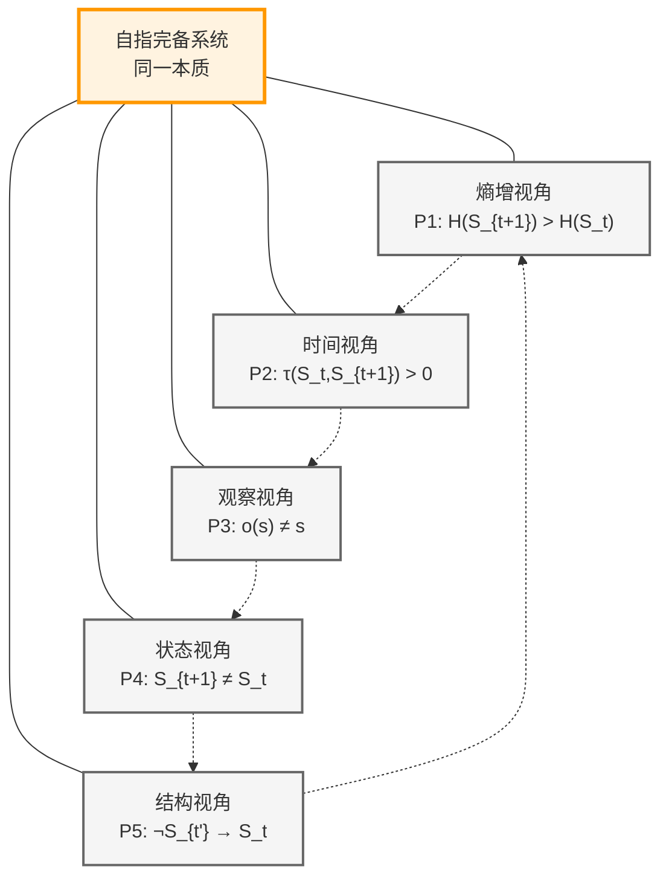

# A1：五重等价公理

## 公理陈述

**公理 A1**：自指完备的二进制不能连续11表达的系统是一个蕴含时间与观察者的熵增系统。

## 形式表述

设系统S满足以下所有条件：
1. **自指完备性**：S包含对自身的完整描述
2. **二进制表示**：状态用{0,1}序列表示
3. **no-11约束**：不存在连续的11模式
4. **时间结构**：存在状态演化序列
5. **观察者机制**：存在内部观察功能
6. **熵增性质**：信息量单调递增

则以下五个命题等价：

### P1：熵增表述
$$
H(S_{t+1}) > H(S_t)
$$
### P2：时间涌现表述
$$
\exists \tau: S \times S \to \mathbb{R}^+, \forall t: \tau(S_t, S_{t+1}) > 0
$$
### P3：观察者表述
$$
\forall o \in O, s \in S: \text{Observe}(o,s) \neq s
$$
### P4：不对称表述
$$
\forall t: S_{t+1} \neq S_t
$$
### P5：递归展开表述
$$
\forall t < t': \neg(S_{t'} \to S_t)
$$
## 公理的等价性

### 五个视角的统一

这五个表述是同一真理的不同侧面：
- 从熵的角度看是P1
- 从时间的角度看是P2
- 从观察的角度看是P3
- 从状态的角度看是P4
- 从结构的角度看是P5

## 使用说明

1. **作为起点**：可以选择五个等价表述中的任何一个作为推导起点
2. **证明策略**：证明某个性质时，可以选择最方便的表述
3. **统一视角**：五个表述揭示了系统的不同方面，但本质相同

## 与哲学公理的关系

本公理是[哲学公理](philosophy.md)的数学具体化：
- 哲学公理：存在包含自身描述的系统
- 数学公理：这种系统必然具有上述结构

## 后续推导

从此公理出发，可以推导：
- [二进制必然性](T2-1-binary-necessity.md)（使用L1-1）
- [no-11约束必然性](T2-2-no-11-constraint.md)（使用L1-2）
- [熵增定理](T3-1-entropy-increase.md)（使用L1-3）
- [量子结构](T4-1-quantum-emergence.md)（使用多个引理）
- [信息理论](T5-1-shannon-entropy-emergence.md)（使用信息论引理）

## 形式化标记

- **类型**：公理（Axiom）
- **编号**：A1
- **依赖**：无（公理不依赖其他数学对象）
- **被引用**：所有后续定理直接或间接依赖此公理