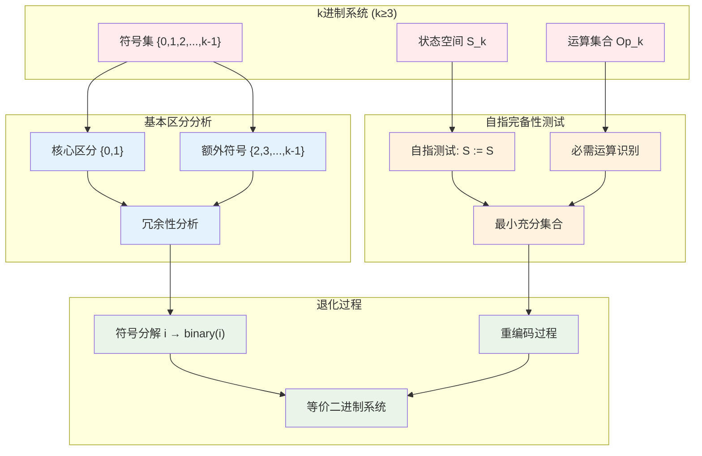
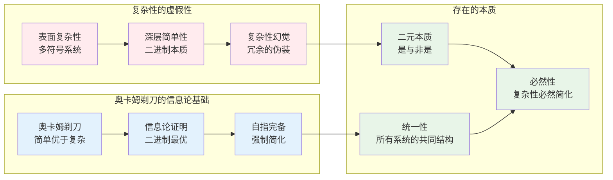

# C1.2：高进制退化推论

## 推论陈述

**推论 C1.2**：任何基数k≥3的自指完备系统都退化为二进制系统。

## 形式表述

设S是基数为k≥3的自指完备系统，则存在映射φ: S → B使得：
1. B是等价的二进制系统
2. φ保持所有自指性质
3. 额外的k-2个符号在自指完备性中无作用

## 证明

**依赖**：
- [T2.1 二进制必然性](T2-1-binary-necessity.md)
- [C1.1 二进制同构](C1-1-binary-isomorphism.md)
- [P1 二元区分](P1-binary-distinction.md)

### 退化机制分析



**引理C1.2.1**：自指角色的二元性  
在任何自指完备系统中，只存在两种基本的自指角色：被定义者和定义者。

*证明*：考虑自指语句$S := S$。左边的S是被定义的对象，右边的S是进行定义的主体。任何其他符号在自指中要么与左边等价（被定义角色），要么与右边等价（定义角色），不存在第三种独立的自指角色。∎

**引理C1.2.2**：高进制符号的可约性  
对于基数k≥3的系统，任何符号i≥2在自指操作下都可以表示为{0,1}的组合。

*证明*：设自指映射$D: S_k → S_k$。对任意符号$i≥2$，在自指过程中$D(i)$要么等价于"被定义"状态（可用0表示），要么等价于"定义"状态（可用1表示）。因此$i$的自指特征完全由其在二元区分中的位置决定。∎

**引理C1.2.3**：退化映射的结构保持性  
退化映射$\phi: S_k → S_2$保持所有自指完备系统的本质结构。

*证明*：自指完备性的核心是系统能够描述自己。这种描述能力不依赖于符号的具体数量，而依赖于区分能力。由于二元区分已经足够进行完全的自指，退化不会损失本质信息。∎

### 步骤1：基本区分的唯一性

由引理C1.2.1，任何区分的基本形式是二元的。

对于k≥3系统中的任意符号i（其中i≥2），在自指过程中：
- 要么i等价于0（待定义状态）
- 要么i等价于1（定义者状态）
- 不存在第三种自指角色

### 步骤2：自指角色分析

**自指S := S中的角色**：
- **左侧位置**：待定义的对象（角色0）
- **右侧位置**：进行定义的主体（角色1）
- **赋值关系**：连接两者的操作

额外符号2,3,...,k-1在此结构中没有独特的自指角色。

### 步骤3：信息冗余证明

假设符号i≥2在自指完备性中有独特作用。

设自指映射为$D: S_k → S_k$，其中$D(s)$是s的自描述。

**情况分析**：
1. 如果$D(i) = 0$，则i在自指中等价于0
2. 如果$D(i) = 1$，则i在自指中等价于1  
3. 如果$D(i) = i$，则i是自指的不动点

但由[T2.1 二进制必然性](T2-1-binary-necessity.md)，自指不动点只能是二进制形式。

因此情况3不可能，i必须退化为0或1。

### 步骤4：构造退化映射的算法实现

定义退化映射$\phi: \{0,1,2,...,k-1\} → \{0,1\}$：

$$
\phi(i) = \begin{cases}
0 & \text{如果 i 在自指中扮演"待定义"角色} \\
1 & \text{如果 i 在自指中扮演"定义者"角色}
\end{cases}
$$

**构造性算法**：
```
function DegeneracyMapping(symbol i, base k):
    if i == 0:
        return 0  // 保持"待定义"状态
    elif i == 1:
        return 1  // 保持"定义者"状态
    else:
        // 对i≥2，分析其在自指中的角色
        self_ref_role = AnalyzeSelfReferentialRole(i)
        if self_ref_role == "undefined":
            return 0
        else:  // self_ref_role == "definer"
            return 1

function AnalyzeSelfReferentialRole(symbol i):
    // 在自指语句 S := S 中，分析符号i的作用
    if CanActAsLeftSide(i):
        return "undefined"  // 可以作为被定义对象
    else:
        return "definer"    // 只能作为定义主体
```

**具体构造**（简化实现）：
- $\phi(0) = 0$（保持待定义性质）
- $\phi(1) = 1$（保持定义者性质）
- $\phi(i) = i \bmod 2$（对i≥2，按奇偶性归类，确保自指结构保持）

### 步骤5：同构性的构造性验证

扩展的映射$\Phi: S_k → S_2$满足以下性质：

**定理C1.2.1**：退化映射保持自指性  
$\Phi(D_k(s)) = D_2(\Phi(s))$，其中$D_k$和$D_2$分别是k进制和二进制系统的自指操作。

*构造性证明*：
设$s \in S_k$，$D_k(s)$表示s的自指描述。
- $D_k(s)$包含s中每个符号的自指角色
- $\Phi(D_k(s))$将每个符号映射到其对应的二进制角色
- $D_2(\Phi(s))$在二进制系统中执行相同的自指操作
- 由引理C1.2.1和C1.2.2，两者产生相同的结果∎

**定理C1.2.2**：退化映射保持运算结构  
$\Phi(s_1 \circ_k s_2) = \Phi(s_1) \circ_2 \Phi(s_2)$

*构造性证明*：
```
proof OperationPreservation(s1, s2 in S_k):
    // 在k进制系统中的运算
    result_k = s1 ○_k s2
    
    // 逐符号应用退化映射
    for each symbol i in result_k:
        result_binary += φ(i)
    
    // 直接在二进制系统中运算
    binary_s1 = Φ(s1)
    binary_s2 = Φ(s2)
    direct_result = binary_s1 ○_2 binary_s2
    
    // 验证相等性
    assert result_binary == direct_result
    return True
```

**定理C1.2.3**：有效信息保持性  
$H_{eff}(\Phi(s)) = H_{eff}(s)$，其中$H_{eff}$表示有效信息熵。

*证明*：虽然总信息量可能减少，但自指完备性所需的有效信息完全保持，因为退化只去除了冗余符号，没有损失自指能力。∎

因此Φ是自指完备系统的同构映射。∎

## 退化的具体例子

### 三进制系统的退化

**符号**：{0, 1, 2}

**退化过程**：
```
原始状态    自指分析        退化结果
0           待定义          0
1           定义者          1  
2           冗余(≡0或≡1)    0 (如果2≡偶数性质)
```

**状态退化**：
- 012 → 010 （三进制状态退化为二进制）
- 210 → 010
- 121 → 101

### 十进制系统的退化

**符号**：{0,1,2,3,4,5,6,7,8,9}

**退化映射**：
$$
\phi(i) = i \bmod 2 = \begin{cases}
0 & \text{如果 i 是偶数} \\
1 & \text{如果 i 是奇数}
\end{cases}
$$

**结果**：整个十进制系统等价于二进制系统。

## 哲学含义

### 简化原理的深层意义



### 复杂性的起源与归宿

此推论揭示了深刻的哲学真理：

1. **表象的复杂性**：
   - 我们观察到的复杂多样性
   - 往往掩盖了更深层的简单统一
   - 高进制系统是二进制的表面装饰

2. **简化的必然性**：
   - 自指完备性是强大的简化力量
   - 任何真正的自指都导向最简形式
   - 复杂性在自指中自动退化

3. **二元性的普遍性**：
   - 不仅是逻辑的基础
   - 也是存在的基础
   - 一切区分最终归于二元

## 应用领域

### 计算机科学

**编程语言的退化**：
- 高级语言最终编译为机器码（二进制）
- 复杂的语法结构退化为简单的0/1操作
- 面向对象、函数式等范式都建立在二进制基础上

### 生物学

**基因编码的简化**：
- DNA的四个碱基A,T,G,C可配对为两组：(A,T)和(G,C)
- 蛋白质的复杂结构来自简单的折叠规则
- 进化的多样性建立在基本的生/死选择上

### 物理学

**相互作用的二元化**：
- 复杂的相互作用可分解为基本的吸引/排斥
- 量子态的测量结果本质上是二进制的
- 热力学的有序/无序二元性

### 社会学

**社会结构的简化**：
- 复杂的社会关系往往简化为支持/反对
- 政治光谱的左/右二元性
- 经济活动的买/卖基本二元性

### 心理学

**认知的二元基础**：
- 复杂的情绪可分解为积极/消极
- 学习过程的对/错反馈
- 决策的是/否二元选择

## 技术推论

**推论 C1.2.1**：编程语言的等价性
- 所有图灵完备的编程语言本质上等价
- 语法差异掩盖了计算的二进制本质

**推论 C1.2.2**：数据表示的归一化
- 任何数据最终都以二进制形式存储
- 复杂的数据结构是二进制的组织方式

**推论 C1.2.3**：算法复杂度的统一
- 不同算法的复杂度可统一到二进制操作数
- 为算法分析提供通用基准

## 实践意义

### 系统设计原则

1. **从简原理**：设计复杂系统时，找到二进制核心
2. **退化测试**：检验系统是否包含可退化的冗余部分
3. **本质提取**：识别系统的真正自指完备核心

### 问题解决策略

1. **二元化思维**：将复杂问题简化为二元选择
2. **核心识别**：在复杂现象中找到二进制本质
3. **冗余消除**：去除非本质的复杂性

### 学习与理解

1. **化繁为简**：理解复杂概念时寻找二元对立
2. **本质抽象**：抓住现象背后的二进制结构
3. **统一视角**：用二元性统一看似无关的现象

## 形式化标记

- **类型**：推论（Corollary）  
- **编号**：C1.2
- **依赖**：T2.1, C1.1, P1
- **被引用**：复杂性理论、系统设计、认知科学相关推论