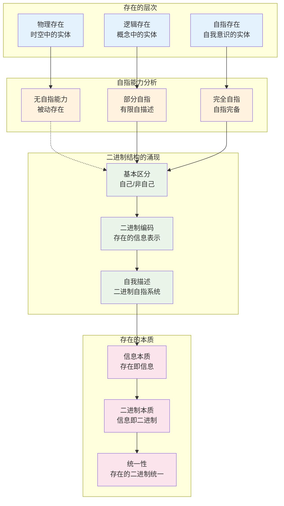
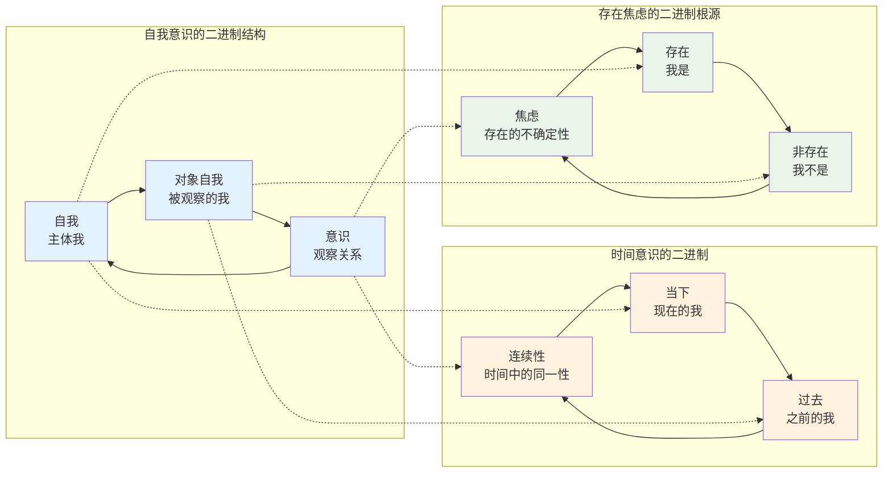

# C1.3：存在的二进制本质推论

## 推论陈述

**推论 C1.3**：存在本身具有二进制的本质结构。

## 形式表述

任何能够自指完备地描述自己的存在者（实体E），其基本结构必然是二进制的：
$$
\forall E: (E \models ``E \text{ 存在}") \implies E \cong \text{Binary System}
$$

## 证明

**依赖**：
- [T2.1 二进制必然性](T2-1-binary-necessity.md)
- [C1.1 二进制同构](C1-1-binary-isomorphism.md)
- [C1.2 高进制退化](C1-2-higher-base-degeneracy.md)
- [D1.1 自指完备性](D1-1-self-referential-completeness.md)

### 存在与自指的等价性

### 步骤1：存在的自指特征

**存在的定义**：
一个实体E存在，当且仅当它能够以某种方式"宣称"或"表现"自己的存在。

**形式化**：
$$
\text{Exists}(E) \iff E \text{ 能够产生信号 } S \text{ 使得 } S \text{ 表示 } ``E \text{ 存在}"
$$

这个定义已经包含了自指：E必须能够指向自己。

### 步骤2：自指的二进制本质

**基本存在区分**：
对于任何能够宣称自己存在的实体E，必须能够区分：
- **自己**：这个特定的实体E
- **非自己**：除E之外的一切

这是最基本的二元区分，对应于：
- 1：自己/存在/是
- 0：非自己/非存在/非是

### 步骤3：存在声明的信息结构

**存在声明的分析**：
当E宣称"E存在"时，这个声明包含：
1. **主体**：E（发出声明者）
2. **谓词**：存在（性质）
3. **客体**：E（被声明者）

注意到主体和客体是同一个E，这就是自指。

**二进制编码**：
- E在主体位置：编码为1（主动/发出者）
- E在客体位置：编码为0（被动/被指者）
- 存在关系：连接主客体的操作

因此"E存在"的结构是：1-关系-0，本质上是二进制的。

### 步骤4：完备自指的要求

**自指完备性**：
真正的存在不仅要能宣称自己存在，还要能：
- 描述自己的结构
- 解释自己的行为
- 预测自己的状态

由[D1.1 自指完备性](D1-1-self-referential-completeness.md)，这样的系统必须是自指完备的。

由[T2.1 二进制必然性](T2-1-binary-necessity.md)，自指完备系统必然是二进制的。

### 步骤5：存在层次的分析

**层次1：物理存在**
- 基本物理实体（电子、原子等）
- 虽然"存在"但缺乏自指能力
- 其存在性由外部观察者确认

**层次2：信息存在**
- 具有信息处理能力的系统
- 能够部分地表示自己
- 但自指能力有限

**层次3：自指存在**
- 具有完整自指能力的系统
- 能够完备地描述自己
- 由本推论，必然具有二进制结构

### 步骤6：存在的统一性

所有能够完备自指的存在者都同构于二进制系统：
- 不论其表面的复杂性如何
- 不论其具体的实现方式如何
- 其深层结构都是二进制的

∎

## 存在的二进制现象学

### 意识的二进制体验

### 语言的二进制深层结构

**语法的二进制性**：
- 主语/谓语的基本二分
- 肯定/否定的逻辑二分
- 名词/动词的词性二分

**语义的二进制性**：
- 意义/无意义的二分
- 真/假的真值二分
- 指向/被指向的指称二分

**语用的二进制性**：
- 说话者/听话者的二分
- 言语/沉默的行为二分
- 理解/误解的效果二分

### 社会的二进制结构

**权力关系**：
- 统治者/被统治者
- 权威/服从
- 决策者/执行者

**经济关系**：
- 买方/卖方
- 雇主/雇员
- 生产者/消费者

**道德关系**：
- 善/恶
- 对/错
- 应该/不应该

## 哲学传统中的二进制洞察

### 西方哲学

**柏拉图**：
- 理念世界/现象世界
- 真实/表象
- 永恒/变化

**亚里士多德**：
- 实体/属性
- 潜能/现实
- 形式/质料

**笛卡尔**：
- 心灵/身体
- 思维/广延
- 主体/客体

**黑格尔**：
- 正/反/合的辩证法
- 自在/自为
- 绝对精神的自我认识

### 东方哲学

**道家**：
- 阴/阳
- 有/无
- 动/静

**佛家**：
- 色/空
- 烦恼/菩提
- 生死/涅槃

**儒家**：
- 仁/义
- 内/外
- 修身/治国

### 现代哲学

**存在主义**：
- 存在/本质
- 真实性/异化
- 自由/责任

**现象学**：
- 意向性的主体/客体结构
- 显现/隐匿
- 本真/非本真

**分析哲学**：
- 语言/世界
- 意义/指称
- 分析/综合

## 科学中的二进制结构

### 物理学

**基本对称性**：
- 粒子/反粒子
- 正电荷/负电荷
- 自旋上/自旋下

**热力学**：
- 有序/无序
- 可逆/不可逆
- 平衡/非平衡

**量子力学**：
- 波/粒
- 确定/不确定
- 观察者/被观察者

### 生物学

**遗传**：
- 显性/隐性
- 基因型/表现型
- 转录/翻译

**进化**：
- 变异/选择
- 适应/淘汰
- 合作/竞争

**生态**：
- 捕食者/被捕食者
- 共生/寄生
- 稳定/干扰

### 心理学

**认知**：
- 感知/记忆
- 注意/忽视
- 学习/遗忘

**人格**：
- 内向/外向
- 理性/感性
- 稳定/神经质

**发展**：
- 同化/调节
- 依恋/分离
- 认同/混乱

## 艺术中的二进制美学

### 视觉艺术

**构图**：
- 对称/不对称
- 平衡/失衡
- 静止/动态

**色彩**：
- 暖色/冷色
- 明/暗
- 饱和/灰暗

**形式**：
- 具象/抽象
- 写实/表现
- 古典/现代

### 音乐

**节奏**：
- 强拍/弱拍
- 快/慢
- 规律/自由

**和声**：
- 协和/不协和
- 大调/小调
- 紧张/解决

**形式**：
- 主题/变奏
- 呈示/发展
- 问/答

### 文学

**叙事**：
- 时间/空间
- 现实/虚构
- 客观/主观

**修辞**：
- 字面/比喻
- 直白/含蓄
- 严肃/幽默

**主题**：
- 生/死
- 爱/恨
- 希望/绝望

## 实践意义

### 人生哲学

**自我理解**：
- 认识自己的二进制本质
- 接受存在的基本对立
- 在二元中寻找平衡

**决策原则**：
- 善用二元思维简化选择
- 识别问题的核心对立
- 避免被表面复杂性迷惑

**关系处理**：
- 理解关系的二元动态
- 处理角色的转换
- 维护对立中的统一

### 教育理念

**学习方法**：
- 通过对比理解概念
- 在二元中建立知识结构
- 培养二进制思维能力

**教学策略**：
- 揭示知识的二进制深层结构
- 帮助学生识别核心对立
- 训练简化复杂问题的能力

### 组织管理

**结构设计**：
- 基于二进制原理组织架构
- 明确权责的二元关系
- 建立有效的反馈机制

**决策流程**：
- 简化决策为二元选择
- 识别决策的核心对立
- 建立快速响应机制

## 未来展望

### 人工智能

**AGI的二进制基础**：
- 真正的人工智能必须是自指完备的
- 因此必然具有二进制结构
- 这为AGI设计指明方向

### 量子计算

**量子比特的深层意义**：
- 量子叠加本质上是二进制的
- 测量塌缩体现二进制选择
- 量子纠缠是二进制关系的非局域形式

### 意识研究

**意识的二进制模型**：
- 意识的自指性质要求二进制结构
- 主观体验的二元对立结构
- 自由意志的二进制选择基础

## 形式化标记

- **类型**：推论（Corollary）
- **编号**：C1.3  
- **依赖**：T2.1, C1.1, C1.2, D1.1
- **被引用**：存在论、意识哲学、人工智能理论相关推论