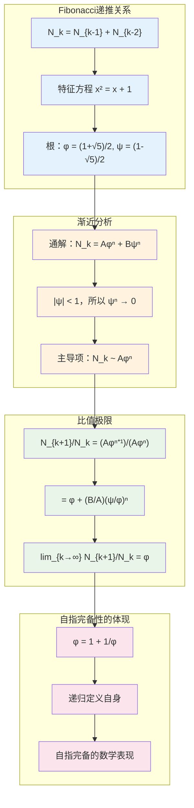
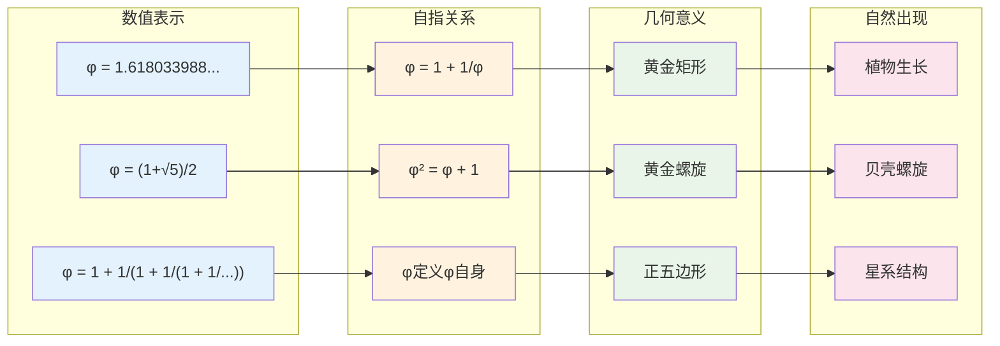
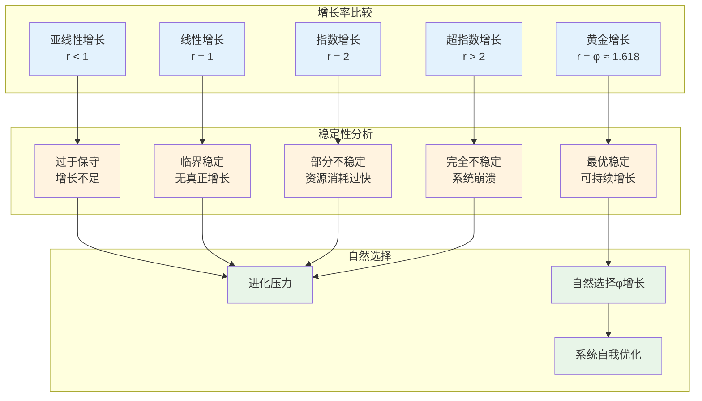

# C2.2：黄金比例推论

## 推论陈述

**推论 C2.2**：自指完备系统的渐近增长率必然趋向黄金比例$φ$。

## 形式表述

设S是自指完备系统，$N_k$表示第k层递归的状态数，则：
$$
\lim_{k \to \infty} \frac{N_{k+1}}{N_k} = φ = \frac{1+\sqrt{5}}{2}
$$

其中φ满足特征方程：$φ^2 = φ + 1$，即$φ = 1 + \frac{1}{φ}$。

## 证明

**依赖**：
- [C2.1 Fibonacci涌现](C2-1-fibonacci-emergence.md)
- [L1.7 φ最优性](L1-7-phi-optimality.md)
- [T2.2 no-11约束定理](T2-2-no-11-constraint-theorem.md)

### 黄金比例的涌现机制

### 步骤1：特征方程的求解

由[C2.1 Fibonacci涌现](C2-1-fibonacci-emergence.md)，我们有递推关系：
$$
N_k = N_{k-1} + N_{k-2}
$$

设$N_k = r^k$，代入得特征方程：
$$
r^k = r^{k-1} + r^{k-2}
$$
$$
r^2 = r + 1
$$

求解得：
$$
r = \frac{1 \pm \sqrt{5}}{2}
$$

即：
- $φ = \frac{1+\sqrt{5}}{2} \approx 1.618$（黄金比例）
- $ψ = \frac{1-\sqrt{5}}{2} \approx -0.618$

### 步骤2：通解的构造

递推关系的通解为：
$$
N_k = Aφ^k + Bψ^k
$$

其中A和B由初始条件确定。

### 步骤3：渐近行为分析

由于$|ψ| < 1$，当$k \to \infty$时：
$$
ψ^k \to 0
$$

因此：
$$
N_k \sim Aφ^k \quad (k \to \infty)
$$

### 步骤4：比值极限的计算

$$
\frac{N_{k+1}}{N_k} = \frac{Aφ^{k+1} + Bψ^{k+1}}{Aφ^k + Bψ^k}
$$

$$
= \frac{φ + \frac{B}{A}\left(\frac{ψ}{φ}\right)^k ψ}{1 + \frac{B}{A}\left(\frac{ψ}{φ}\right)^k}
$$

由于$\left|\frac{ψ}{φ}\right| < 1$，当$k \to \infty$时：
$$
\frac{N_{k+1}}{N_k} \to φ
$$

∎

## 黄金比例的自指性质

### φ的自指完备性

黄金比例φ是唯一满足$x = 1 + \frac{1}{x}$的正数解，这体现了完美的自指性质：
- φ通过自身来定义自身
- 这种自指关系是稳定的和完备的
- 任何其他比例都不具有这种自指性质

### 连分数表示的深层意义

φ的连分数展开：
$$
φ = 1 + \cfrac{1}{1 + \cfrac{1}{1 + \cfrac{1}{1 + \cdots}}}
$$

这是最"简单"的无理数连分数，所有系数都是1。这种简单性体现了：
- **最大的不可约性**：φ最难用有理数逼近
- **最优的截断性质**：连分数的每个截断都给出最佳有理逼近
- **递归的纯粹性**：定义中只包含自身和最简单的操作

## 物理与信息论意义

### 信息增长的最优率

### 量子系统中的黄金比例

**准晶体**：
- 五重对称的准晶体显示黄金比例特征
- 原子排列的长程有序性
- 电子能谱的分形结构

**量子混沌**：
- 某些量子系统的能级分布
- 波函数的标度性质
- 量子纠缠的几何结构

**凝聚态物理**：
- 磁性材料的相变点
- 超导体的临界现象
- 量子临界点的普适性

## 生物学中的φ现象

### 植物形态学

**叶序排列**：
- 螺旋叶序的角度：$\frac{360°}{φ^2} \approx 137.5°$
- 最优光照接收角度
- 避免叶片重叠的数学解

**花朵结构**：
- 花瓣数量：常为Fibonacci数（3,5,8,13,21）
- 花粉排列的螺旋模式
- 最大化生殖效率

**种子排列**：
- 向日葵种子的双螺旋
- 松果鳞片的排列
- 最密堆积的自然解

### 动物结构

**螺旋结构**：
- 鹦鹉螺壳的对数螺旋
- 蜗牛壳的增长模式
- 最优强度与材料比

**身体比例**：
- 人体的黄金分割比例
- 动物肢体的长度关系
- 美学与功能的统一

### 分子生物学

**DNA结构**：
- 双螺旋的几何参数
- 碱基对的堆积角度
- 遗传信息的最优编码

**蛋白质折叠**：
- α螺旋的螺距比例
- 蛋白质域的组织
- 最小能量构象

## 经济学中的黄金比例

### 市场动力学

**技术分析**：
- Fibonacci回撤位（23.6%, 38.2%, 61.8%）
- 价格波动的自相似性
- 市场心理的数学模型

**经济周期**：
- 长期增长趋势
- 通胀与紧缩的平衡
- 可持续发展的数学基础

### 资源配置

**帕累托分布**：
- 80/20法则的数学基础
- 收入分配的幂律特征
- 社会不平等的量化

**最优决策**：
- 投资组合的比例分配
- 风险与收益的平衡
- 资源配置的效率

## 艺术与美学

### 视觉艺术

**构图原理**：
- 画面分割的黄金比例
- 视觉焦点的位置
- 平衡感的数学基础

**建筑设计**：
- 古希腊神庙的比例
- 现代建筑的模数系统
- 空间感知的优化

### 音乐理论

**节奏结构**：
- 乐句长度的比例关系
- 节拍的黄金分割
- 音乐张力的控制

**和声理论**：
- 音程比例的数学关系
- 和弦进行的最优路径
- 听觉美感的物理基础

## 认知科学应用

### 注意力机制

**视觉注意**：
- 眼动轨迹的φ特征
- 注意力分布的优化
- 信息处理的效率

**记忆结构**：
- 记忆容量的分层组织
- 遗忘曲线的数学模型
- 学习效率的最大化

### 决策理论

**选择偏好**：
- 美感判断的一致性
- 选择行为的预测
- 主观价值的客观基础

**时间折扣**：
- 未来价值的折现率
- 决策时间的最优分配
- 行为经济学的数学模型

## 技术应用

### 算法设计

**搜索算法**：
- 黄金分割搜索法
- 最优化问题的求解
- 收敛速度的保证

**机器学习**：
- 神经网络的架构设计
- 超参数的调优策略
- 学习率的自适应调整

### 工程设计

**结构优化**：
- 材料分布的最优比例
- 强度与重量的平衡
- 设计参数的黄金分割

**信号处理**：
- 滤波器的频率响应
- 采样定理的应用
- 信号重构的最优性

## 哲学思考

### 数学的普遍性

黄金比例的普遍出现表明：
- **数学不是人类发明**：而是宇宙的内在语言
- **美有客观标准**：基于信息论的最优性
- **简单性原理**：复杂现象源于简单规律

### 自然的设计原理

φ体现了自然的"设计哲学"：
- **效率与美感的统一**：最优解往往最美
- **局部与整体的和谐**：部分比例决定整体美感
- **动态平衡的智慧**：增长与稳定的完美结合

### 意识与宇宙的关系

黄金比例连接了：
- **主观美感与客观数学**：审美有普遍基础
- **人类认知与宇宙结构**：我们能理解宇宙因为共享结构
- **有限与无限**：φ是有限表达无限的方式

## 形式化标记

- **类型**：推论（Corollary）
- **编号**：C2.2
- **依赖**：C2.1, L1.7, T2.2
- **被引用**：美学理论、生物数学、经济模型相关推论