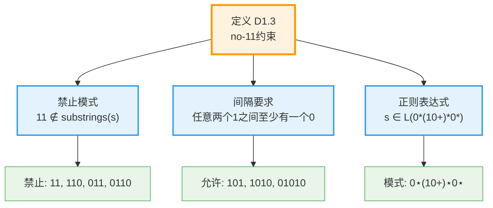

# D1.3：no-11约束

## 定义

**定义 D1.3**：序列s满足no-11约束，当且仅当：
$$
\forall i: s[i] = 1 \Rightarrow s[i+1] \neq 1
$$
即序列中不存在连续的两个1。

## 形式化表示

对于s = b₁b₂...bₙ ∈ {0,1}*：
$$
\text{valid}(s) \iff \forall i \in [1,n-1]: \neg(b_i = 1 \wedge b_{i+1} = 1)
$$
## 等价表述

### no-11约束的多种表述



1. **禁止模式**：11 ∉ substrings(s)
2. **间隔要求**：任意两个1之间至少有一个0
3. **正则表达式**：s ∈ L(0*(10+)*0*)

## 数学性质

1. **计数**：长度n的有效序列数为Fₙ₊₂（Fibonacci数）
2. **密度**：渐近密度为1/φ²≈0.382
3. **最大1数**：长度n序列最多含⌊(n+1)/2⌋个1

## 物理意义

- **时间量子化**：不能在同一时刻发生两次
- **因果间隔**：原因和结果需要间隔
- **层次分离**：递归层次不能重叠

## 与其他定义的关系

- 约束[D1.2 二进制表示](D1-2-binary-representation.md)
- 影响[D1.7 Collapse算子](D1-7-collapse-operator.md)的形式
- 决定[D1.8 φ-表示](D1-8-phi-representation.md)的结构

## 在证明中的应用

- [L1.2 no-11必然性](L1-2-no-11-necessity.md)证明其必要性
- [T2.2 no-11约束定理](T2-2-no-11-constraint.md)的主题
- [L1.7 φ最优性](L1-7-phi-optimality.md)中起关键作用

## 算法验证

```python
def is_valid_no11(s):
    """检查二进制串是否满足no-11约束"""
    for i in range(len(s)-1):
        if s[i] == '1' and s[i+1] == '1':
            return False
    return True
```

## 形式化标记

- **类型**：定义（Definition）
- **编号**：D1.3
- **依赖**：D1.2
- **被引用**：L1.2, L1.7, T2.2, T3.1等