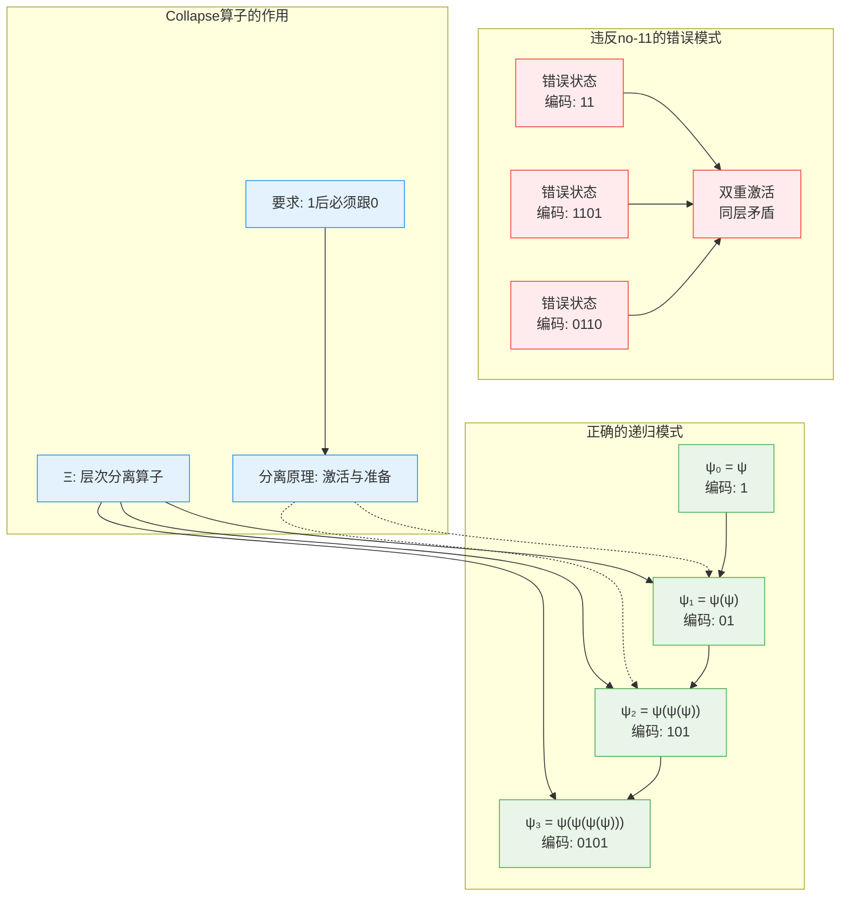

# L1.2：no-11约束的必然性

## 引理陈述

**引理 L1.2**：自指完备的二进制系统必然满足no-11约束。

## 形式表述

设系统S满足[D1.1 自指完备性](D1-1-self-referential-completeness.md)和[D1.2 二进制表示](D1-2-binary-representation.md)，则必然满足[D1.3 no-11约束](D1-3-no-11-constraint.md)。

## 证明

**依赖**：
- [D1.1 自指完备性](D1-1-self-referential-completeness.md)
- [D1.2 二进制表示](D1-2-binary-representation.md)
- [D1.7 Collapse算子](D1-7-collapse-operator.md)

### 递归层次论证

**步骤1：递归的本质**
- 自指通过递归$ψ→ψ(ψ)→ψ(ψ(ψ))→...$实现
- 每层递归必须产生"新"内容，即信息增量$\Delta I > 0$
- 否则递归退化为平凡重复

**步骤2：二进制编码的层次结构**
在φ-表示系统中：
- 0表示"准备/间隔状态"
- 1表示"激活/递归展开"
- 连续11表示"无间隔的双重激活"
- 这违反了递归的层次分离原则

**步骤3：形式化矛盾证明**

假设存在状态$s \in S$包含连续的1，即$\exists i: s[i] = 1 \wedge s[i+1] = 1$。

**矛盾论证**：

**引理L1.2.1**：信息增量函数的单调性
对于$\Xi$-可达状态$s, s'$，若$s \subset s'$，则$\Delta I(s) < \Delta I(s')$。

*证明*：由[D2.2 信息增量](D2-2-information-increment.md)的构造性定义。∎

**引理L1.2.2**：层次可区分性要求
若$s[i] = s[i+1] = 1$，则位置$i$和$i+1$对应的递归层次无法区分。

*证明*：设$\text{Level}: \{0,1\}^* \times \mathbb{N} \to \mathcal{L}$为层次解析函数：
$$
\text{Level}(s, i) = \begin{cases}
0 & \text{如果 } s[i] = 0 \\
\text{Level}(s, i-1) + 1 & \text{如果 } s[i] = 1 \text{ 且 } s[i-1] = 0 \\
\text{undefined} & \text{如果 } s[i] = s[i-1] = 1
\end{cases}
$$
连续11使Layer函数未定义，违反系统的良定义性。∎

**主要矛盾**：连续11导致$\Xi$算子的信息增加性失效，与自指完备性矛盾。

### 信息论证明

**步骤4：冗余分析**
- 11模式是信息冗余
- 第二个1不增加新信息
- 违背[D2.2 信息增量](D2-2-information-increment.md)的正定性

**步骤5：熵增要求**
- 自指系统必须满足熵增
- 冗余模式降低信息密度
- 与[L1.3 熵单调性](L1-3-entropy-monotonicity.md)冲突

### 因果结构论证

**步骤6：时间间隔**
- 每次"实现"（1）需要时间
- 连续实现违背时间的离散性
- 必须有"间隔"（0）分隔

因此，no-11约束是自指完备性的必然结果。∎

## 推论

1. **Fibonacci计数**：有效状态数按Fibonacci数增长
2. **黄金比例**：系统增长率趋向φ
3. **因果间隔**：原因和结果必须分离

## 在定理中的应用

- 支撑[T2.2 no-11约束定理](T2-2-no-11-constraint.md)
- 用于[L1.7 φ最优性](L1-7-phi-optimality.md)
- 解释[C2.2 黄金比例](C2-2-golden-ratio.md)

## 物理对应

- **Pauli不相容**：同一态不能重复占据
- **能级间隔**：激发态之间的必要间隔
- **时间量子**：最小时间单位的存在

## 哲学意义

no-11约束体现了：
- 差异创造意义
- 重复消解创新
- 间隔维护秩序

## 形式化标记

- **类型**：引理（Lemma）
- **编号**：L1.2
- **依赖**：D1.1, D1.2, D1.7
- **被引用**：T2.2, L1.7, C2.2等