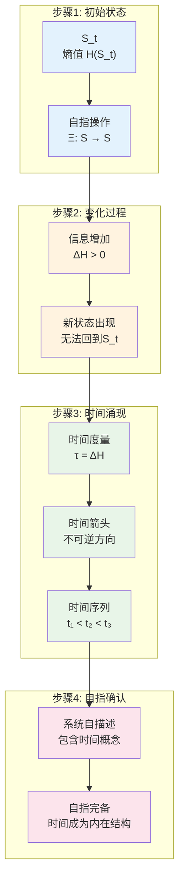
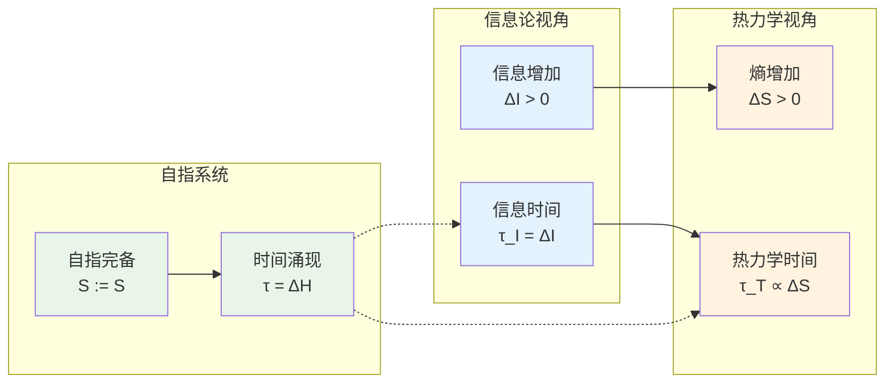
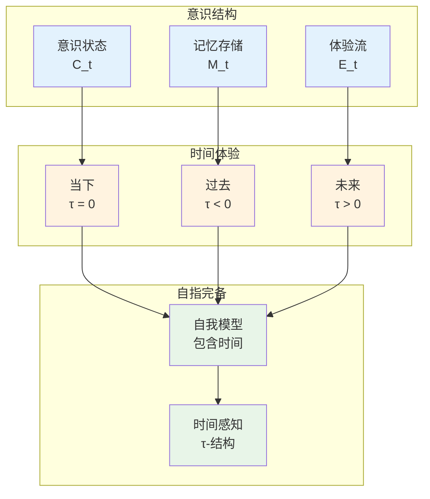

# L1.4：时间涌现引理

## 引理陈述

**引理 L1.4**：自指完备系统中，熵的变化必然涌现时间结构。

## 形式表述

设S是自指完备系统，若$H(S_{t+1}) > H(S_t)$，则存在时间度量τ: S×S→ℝ⁺使得：
$$
τ(S_t, S_{t+1}) = H(S_{t+1}) - H(S_t) > 0
$$

## 证明

**依赖**：
- [D1.1 自指完备性](D1-1-self-referential-completeness.md)
- [D1.4 时间度量](D1-4-time-metric.md)
- [D1.6 熵定义](D1-6-entropy.md)

### 构造性证明

**步骤1：时间度量的构造**

给定自指完备系统S的状态序列，定义时间度量函数：
$$
\tau: S \times S \to \mathbb{R}
$$
$$
\tau(S_i, S_j) = \begin{cases}
H(S_j) - H(S_i) & \text{如果存在因果链 } S_i \to S_j \\
0 & \text{如果 } S_i = S_j \\
\text{undefined} & \text{如果不存在因果连接}
\end{cases}
$$
**步骤2：良定义性验证**

*证明τ良定义：*
1. **定义域明确**：τ在所有可达状态对上有定义
2. **函数性**：对每对状态，τ值唯一确定
3. **计算可行**：τ(S_i, S_j)通过熵函数H可计算 ∎

**步骤3：时间度量公理验证**

*证明τ满足时间度量要求：*
1. **正定性**：若$S_i \to S_j$且$S_i \neq S_j$，则由熵增原理，$\tau(S_i, S_j) = H(S_j) - H(S_i) > 0$
2. **恒等性**：$\tau(S_i, S_i) = H(S_i) - H(S_i) = 0$
3. **传递性**：若$S_i \to S_j \to S_k$，则$\tau(S_i, S_k) = \tau(S_i, S_j) + \tau(S_j, S_k)$ ∎

### 时间的涌现机制

**步骤3：时间箭头的确立**

熵增确定时间方向：
- 正方向：$τ(S_t, S_{t+1}) > 0$（熵增）
- 负方向：$τ(S_{t+1}, S_t) < 0$（熵减，不可能）

**步骤4：自指的时间结构**

系统必须能够"记住"自己的状态变化：
- 时间度量τ本身成为系统状态的一部分
- 满足自指完备性：系统描述包含时间概念

∎

## 物理意义

### 时间的信息论基础

时间不是容器，而是信息增长的度量：
- 物理时间 ∝ 信息时间
- 可逆过程：信息守恒，时间停滞
- 不可逆过程：信息增加，时间流动

### 与热力学的联系

## 推论

**推论 L1.4.1**：时间是量子化的
- 最小时间单位：$Δτ_{min} = 1$ bit的信息增加
- 时间的离散性源于信息的离散性

**推论 L1.4.2**：时间旅行不可能
- 回到过去要求$τ(S_{t+1}, S_t) > 0$
- 但这违反熵增原理

**推论 L1.4.3**：时间的相对性
- 不同观察者有不同的熵增率
- 因此体验不同的时间流速

## 应用

### 量子力学

- 量子测量的不可逆性
- 波函数塌缩的时间箭头
- 量子纠缠的时空结构

### 相对论

- 时空的信息几何
- 引力时间延缓的信息解释
- 黑洞信息悖论的新视角

### 计算理论

- 算法复杂度的时间度量
- 计算的不可逆性
- 量子计算的时间优势

## 深入思考

### 时间的本体论地位

时间不是：
- 先验的容器（牛顿时间）
- 纯粹的幻觉（某些哲学观点）

时间是：
- 信息变化的测度
- 自指系统的内在结构
- 涌现但客观的性质

### 与意识的关系

## 形式化标记

- **类型**：引理（Lemma）
- **编号**：L1.4
- **依赖**：D1.1, D1.4, D1.6
- **被引用**：T1.1, T3.1, 时间相关的所有定理