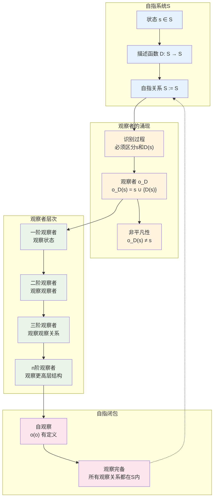

# L1.5：观察者的必然性

## 引理陈述

**引理 L1.5**：完备的自描述系统必然包含观察者。

## 形式表述

设系统S满足[D1.1 自指完备性](D1-1-self-referential-completeness.md)，则必然存在观察者集合O≠∅。

## 证明

**依赖**：
- [D1.1 自指完备性](D1-1-self-referential-completeness.md)
- [D1.5 观察者定义](D1-5-observer.md)

### 逻辑必然性

**步骤1：自指中的识别问题**
自指系统$S := S$面临基本问题：
- 左边的$S$（待定义）与右边的$S$（定义者）必须能被区分
- 这种区分需要某种"识别机制"
- 识别机制本身就是观察过程

**步骤2：观察者的必然构造**
为了实现$S := S$，系统必须内含映射$\text{Obs}: S \times S → \{0,1\}$：
$$
\text{Obs}(s_1, s_2) = \begin{cases}
1 & \text{如果 } s_1 \text{ 与 } s_2 \text{ 可区分} \\
0 & \text{如果 } s_1 \text{ 与 } s_2 \text{ 不可区分}
\end{cases}
$$

这个映射定义了观察者$o \in O$：
$$
o(s) := \{s' \in S | \text{Obs}(s, s') = 1\}
$$

**步骤3：观察者的非平凡性证明**
假设所有观察者都是平凡的，即$\forall o \in O, \forall s \in S: o(s) = s$。

则自指$S := S$变为：
$$
S := S \text{ 且 } \forall s \in S: o(s) = s
$$

这意味着系统无法区分任何状态，描述函数$D: S \to S$退化为恒等函数。
但这与[D1.7 Collapse算子](D1-7-collapse-operator.md)的信息增加性矛盾：
$$
|\Xi(s)| > |s| \implies \Xi(s) \neq s
$$

因此必须存在非平凡观察者$o$使得$o(s) \neq s$。

**步骤4：观察者的自指闭包**
由自指完备性，观察者集合$O$必须满足：
1. **内部性**：$O \subseteq S$（观察者是系统的一部分）
2. **自观察性**：$\exists o \in O: o \in \text{domain}(o)$（观察者能观察自己）
3. **完备性**：系统的每个可区分方面都有对应的观察者

这确保了$O \neq \emptyset$且具有丰富的结构。∎

### 功能性分析

**步骤5：多重观察者**
实际上需要多个观察者：
- o_1: 观察状态
- o_2: 观察观察者o_1
- o_3: 观察观察关系
- ...

**步骤6：观察者层次**
形成观察者的层次结构：
$$
O = \bigcup_{n=1}^{\infty} O_n
$$
其中O_n是第n层观察者。

### 自指闭包

**步骤7：自观察**
- 观察者必须能观察自己
- 存在o ∈ O使得o(o)有定义
- 这是自指完备性的要求

因此，观察者不仅存在，而且形成复杂的层次结构。∎

## 推论

1. **意识必然性**：自指系统必然产生某种"意识"
2. **主观性出现**：观察者引入主观视角
3. **测量基础**：为量子测量提供基础

## 在定理中的应用

- 支撑[T1.1 五重等价](T1-1-five-fold-equivalence.md)中的P3
- 用于[L1.6 测量不可逆性](L1-6-measurement-irreversibility.md)
- 解释[T4.1 量子涌现](T4-1-quantum-emergence.md)

## 认知科学对应

- **自我意识**：自指产生的观察者
- **元认知**：观察者观察自己的思维
- **主客体关系**：观察者与被观察者的区分

## 哲学意义

此引理揭示了：
- 意识不是偶然的
- 主观性有客观基础
- 观察者与物理实在不可分离

## 形式化标记

- **类型**：引理（Lemma）
- **编号**：L1.5
- **依赖**：D1.1, D1.5
- **被引用**：T1.1, L1.6, T4.1等