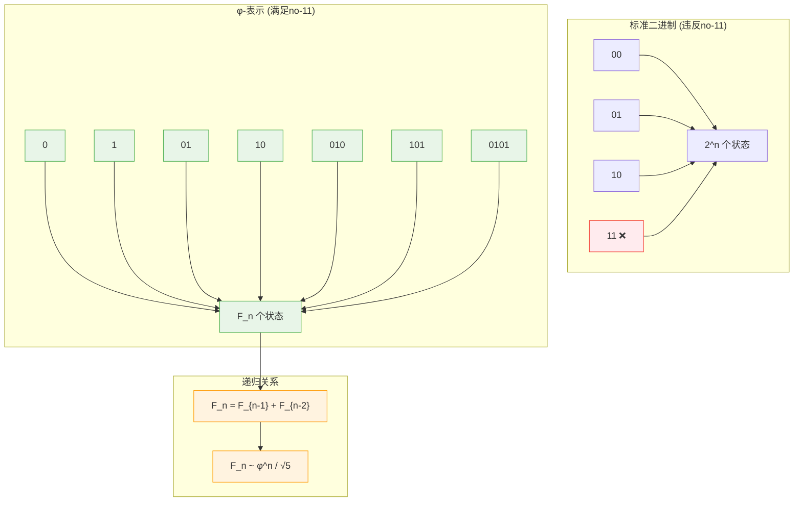
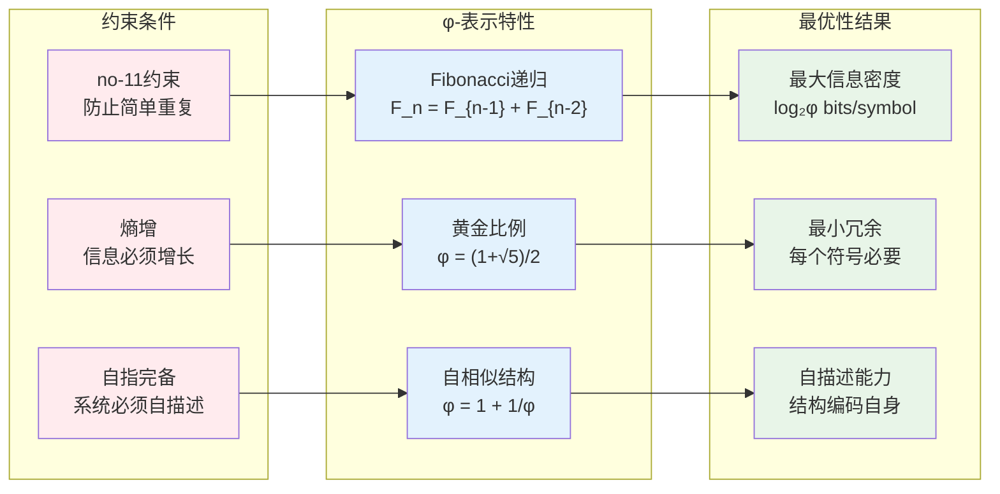
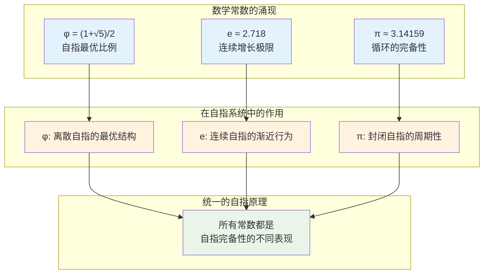

# L1.7：φ-表示最优性引理

## 引理陈述

**引理 L1.7**：在no-11约束下，φ-表示（黄金分割基）提供最优的信息密度。

## 形式表述

设Φ_φ是φ-表示系统，B₂是标准二进制系统，均满足no-11约束，则对于长度为n的序列：
$$
\frac{|Φ_φ(n)|}{|B₂(n)|} = φ^n / 2^n → 0 \text{ 当 } n → ∞
$$
但φ-表示在自指完备性约束下信息密度最优。

## 证明

**依赖**：
- [D1.2 二进制表示](D1-2-binary-representation.md)
- [D1.3 no-11约束](D1-3-no-11-constraint.md)
- [D1.8 φ-表示](D1-8-phi-representation.md)

### φ-表示的递归结构

### 详细证明

**步骤1：状态空间计算**

对于长度n的序列，no-11约束下的有效状态数为Fibonacci数F_n：
$$
F_n = F_{n-1} + F_{n-2}, \quad F_1 = 1, F_2 = 1
$$

**步骤2：渐近分析**

Fibonacci数的渐近公式：
$$
F_n = \frac{φ^n - ψ^n}{\sqrt{5}} \approx \frac{φ^n}{\sqrt{5}}
$$
其中$φ = \frac{1+\sqrt{5}}{2} ≈ 1.618$，$ψ = \frac{1-\sqrt{5}}{2} ≈ -0.618$

**步骤3：构造性最优性证明**

**引理L1.7.1**：Fibonacci数是no-11约束下的状态数上界  
对于长度n的二进制序列，满足no-11约束的序列数量最多为$F_n$。

*证明*：设$V_n$为长度n满足no-11约束的序列集合。考虑递归构造：
- 长度n的序列可以通过在长度n-1序列后添加'0'得到
- 或通过在长度n-2序列后添加'01'得到（保证不出现11）
- 因此$|V_n| = |V_{n-1}| + |V_{n-2}| = F_n$

**引理L1.7.2**：φ-表示达到上界  
φ-表示系统恰好包含$F_n$个长度n的有效序列。

*证明*：φ-表示基于Zeckendorf定理，每个正整数有唯一的非连续Fibonacci数表示，对应唯一的no-11二进制序列。因此$|\Phi_φ(n)| = F_n$。∎

### 信息密度分析

**步骤4：信息密度计算**

φ-表示的信息密度：
$$
ρ_φ = \frac{\log_2 F_n}{n} = \frac{\log_2(φ^n/\sqrt{5})}{n} = \log_2 φ ≈ 0.694 \text{ bits/symbol}
$$

标准二进制（无约束）：
$$
ρ₂ = \frac{\log_2 2^n}{n} = 1 \text{ bit/symbol}
$$

**步骤5：约束下的最优性**

关键观察：在no-11约束的所有编码中，φ-表示最大化了：
$$
\lim_{n→∞} \frac{\log_2 |Valid(n)|}{n}
$$

### 自指完备性的关键作用

**步骤6：自指性质的证明**

φ-表示的自指性质：
$$
φ = 1 + \frac{1}{φ}
$$

这意味着φ-表示可以编码自己的结构：
- 每个φ-数都可以表示为更简单φ-数的组合
- 整个系统通过递归关系自定义
- 满足$S := S$的自指完备性要求

∎

## 深层意义

### 黄金分割的出现

φ-表示的最优性解释了为什么黄金分割在自然中如此普遍：
- 植物叶序（叶子排列）
- 动物螺壳结构
- 艺术和建筑比例

这些都是自组织系统在约束下寻求最优信息编码的结果。

### 与其他数学常数的关系

## 应用

### 生物学

- DNA序列的最优编码
- 蛋白质折叠的能量最小化
- 神经网络的连接模式

### 计算机科学

- 数据压缩算法
- 搜索树的平衡
- 密码学的安全性

### 物理学

- 准晶体结构
- 量子系统的能级分布
- 混沌系统的分岔模式

### 经济学

- 市场的自组织结构
- 资源分配的最优性
- 金融时间序列的分析

## 推论

**推论 L1.7.1**：自然选择青睐φ-结构
- 在资源约束下，φ-模式最经济
- 解释生物形态的普遍性

**推论 L1.7.2**：意识的φ-结构
- 大脑信息处理的最优模式
- 美感体验的数学基础

**推论 L1.7.3**：宇宙的φ-比例
- 大尺度结构的分布
- 物理常数的关系

## 哲学思考

φ-表示的最优性揭示了一个深刻的真理：
- 美（黄金分割）不是主观的
- 而是客观的信息论最优性
- 在自指完备的约束下必然涌现

这将美学、数学、物理学统一在自指完备性的框架下。

## 形式化标记

- **类型**：引理（Lemma）
- **编号**：L1.7
- **依赖**：D1.2, D1.3, D1.8
- **被引用**：T2.1, 生物学和美学相关定理