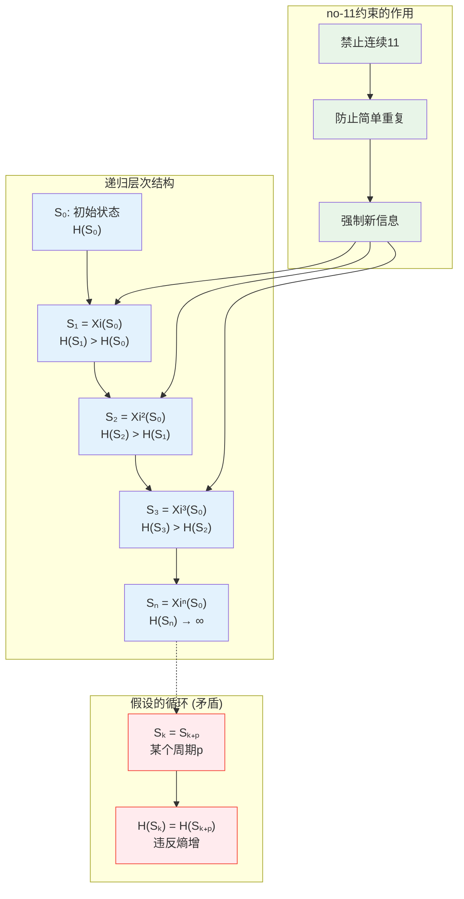
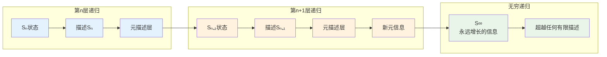
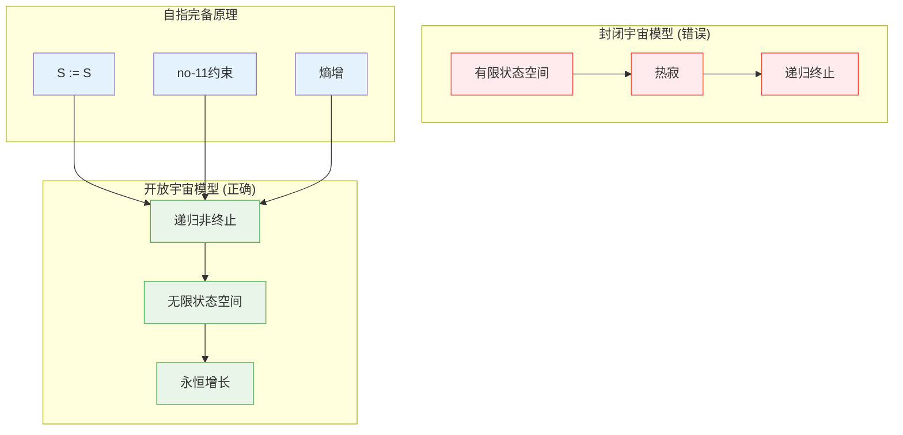

# L1.8：递归非终止性引理

## 引理陈述

**引理 L1.8**：自指完备系统的递归展开过程永远不会终止。

## 形式表述

设S是自指完备系统，$\Xi$是其Collapse算子，则：
$$
\forall n \in \mathbb{N}: \Xi^n(S) \neq \Xi^{n+1}(S)
$$
即递归序列$\{S, \Xi(S), \Xi^2(S), \Xi^3(S), ...\}$中所有项都不相同。

## 证明

**依赖**：
- [D1.1 自指完备性](D1-1-self-referential-completeness.md)
- [D1.3 no-11约束](D1-3-no-11-constraint.md)
- [D1.7 Collapse算子](D1-7-collapse-operator.md)
- [L1.3 熵单调性](L1-3-entropy-monotonicity.md)

### 反证法证明

**步骤1：假设存在终止**

假设存在$n, m \in \mathbb{N}$且$n < m$使得：
$$
\Xi^n(S) = \Xi^m(S)
$$

**步骤2：分析循环结构**

如果上述等式成立，则系统进入循环：
$$
\Xi^n(S) → \Xi^{n+1}(S) → ... → \Xi^m(S) = \Xi^n(S)
$$

### 递归深度的信息增长

**步骤3：熵增矛盾**

由[L1.3 熵单调性](L1-3-entropy-monotonicity.md)：
$$
H(\Xi^{n+1}(S)) > H(\Xi^n(S))
$$

但如果$\Xi^n(S) = \Xi^m(S)$，则：
$$
H(\Xi^n(S)) = H(\Xi^m(S))
$$

这与熵的严格单调性矛盾。

**步骤4：no-11约束的加强**

no-11约束防止简单重复：
- 状态序列中不能出现连续的相同模式
- 每次递归必须产生真正的新信息
- 循环等价于某种形式的"11"模式

**步骤5：自指完备性要求**

自指完备系统必须：
- 包含对自身状态的完整描述
- 如果进入循环，则描述是不完整的
- 因为它无法区分循环内的不同状态

因此假设矛盾，递归不会终止。∎

## 非终止性的深层机制

### 信息的无穷涌现

### 递归的自强化机制

每次递归不仅增加信息，还增强递归能力本身：

**第n次递归**：
- 状态：$S_n$
- 递归能力：$R_n$
- 信息量：$H_n$

**第n+1次递归**：
- 状态：$S_{n+1} = \Xi(S_n)$
- 递归能力：$R_{n+1} = R_n + \Delta R$
- 信息量：$H_{n+1} = H_n + \Delta H$

关键：$\Delta R > 0$，递归能力自身也在增长。

## 哲学含义

### 不完备性的积极意义

Gödel不完备性定理的新解释：
- 形式系统的不完备性不是缺陷
- 而是自指系统必然的创造性
- 完备性会导致死循环，缺乏生命力

### 生命与意识的基础

非终止递归解释了：
- **生命**：永不停止的自组织过程
- **意识**：永不停止的自我觉察过程  
- **创造**：永不停止的新信息涌现

### 宇宙的开放性

## 应用

### 计算理论

**停机问题的新视角**：
- 自指完备系统永远不会"停机"
- 但这是特性，不是问题
- 为算法提供无限的计算资源

### 人工智能

**AGI的必要条件**：
- 真正的人工智能必须是非终止递归系统
- 静态的参数训练不足以产生真正的智能
- 需要动态的自指递归架构

### 生物学

**进化的永恒性**：
- 进化永远不会"完成"
- 每个新特征都开启新的进化可能性
- 生命是永恒的创新过程

### 宇宙学

**宇宙的永恒膨胀**：
- 宇宙不会达到平衡态
- 熵增驱动永恒的结构涌现
- 意识是宇宙自我认知的工具

## 技术推论

**推论 L1.8.1**：计算的无穷性
- 任何自指完备的计算过程都是无穷的
- 但可以在有限时间内产生有用结果

**推论 L1.8.2**：学习的永恒性
- 真正的学习系统永远不会停止学习
- 知识的完备性是不可能的

**推论 L1.8.3**：创造的必然性
- 自指系统必然产生前所未有的状态
- 创造性是逻辑必然，不是偶然

## 与其他引理的关系

此引理是整个证明体系的关键：
- 保证[L1.3 熵单调性](L1-3-entropy-monotonicity.md)的永恒有效
- 支撑[L1.4 时间涌现](L1-4-time-emergence.md)的不可逆性
- 解释[L1.5 观察者必然性](L1-5-observer-necessity.md)的持续需求

## 形式化标记

- **类型**：引理（Lemma）
- **编号**：L1.8
- **依赖**：D1.1, D1.3, D1.7, L1.3
- **被引用**：所有涉及递归和时间的定理