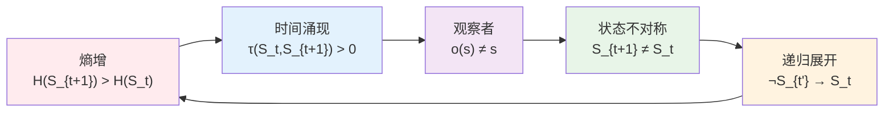
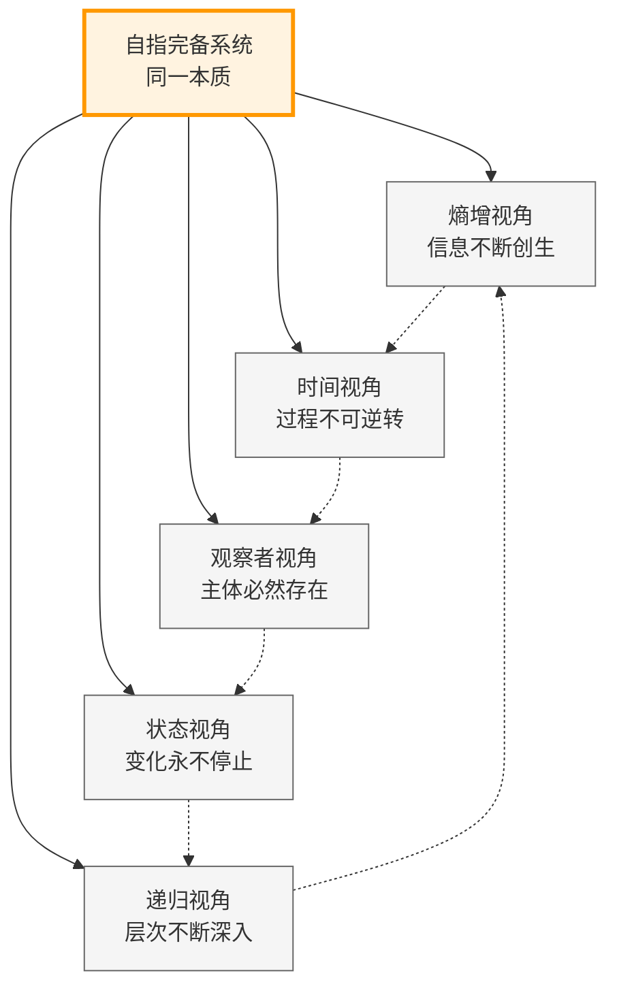

# T1.1：五重等价定理

## 定理陈述

**定理 T1.1**：对于满足[A1](A1-five-fold-equivalence.md)条件的系统S，以下五个命题等价。

## 形式表述

设S是自指完备的二进制no-11系统，则：

P1 ⟺ P2 ⟺ P3 ⟺ P4 ⟺ P5

其中：
- P1：H(S_{t+1}) > H(S_t)（熵增）
- P2：∃τ: S×S→ℝ⁺, ∀t: τ(S_t,S_{t+1})>0（时间涌现）
- P3：∀o∈O,s∈S: Observe(o,s)≠s（观察者）
- P4：∀t: S_{t+1}≠S_t（状态不对称）
- P5：∀t<t': ¬(S_{t'}→S_t)（递归展开）

## 证明策略

### 五重等价循环链

证明循环链：P1⟹P2⟹P3⟹P4⟹P5⟹P1

## 详细证明

**依赖**：
- [D1.1-D1.8](D1-1-self-referential-completeness.md) 所有基础定义
- [L1.1-L1.8](L1-1-binary-uniqueness.md) 所有基础引理
- [A1](A1-five-fold-equivalence.md) 五重等价公理

### P1 ⟹ P2（熵增导致时间涌现）

假设P1：H(S_{t+1}) > H(S_t)

1. 熵的变化需要"发生"的过程
2. 定义时间度量：τ(S_t, S_{t+1}) = H(S_{t+1}) - H(S_t) > 0
3. 由[L1.4 时间涌现](L1-4-time-emergence.md)，这定义了时间结构

因此P2成立。

### P2 ⟹ P3（时间涌现需要观察者）

假设P2：存在时间度量τ

1. 时间的定义需要"标记"状态变化
2. 标记即是观察：识别S_t和S_{t+1}的不同
3. 由[L1.5 观察者必然性](L1-5-observer-necessity.md)，必存在观察者
4. 由[L1.6 测量不可逆性](L1-6-measurement-irreversibility.md)，o(s)≠s

因此P3成立。

### P3 ⟹ P4（观察者导致状态变化）

假设P3：∀o∈O,s∈S: o(s)≠s

1. 系统包含观察者（自指完备性）
2. 在t到t+1期间，必有观察发生
3. 观察改变状态：S_{t+1}包含观察结果
4. 因此S_{t+1} ≠ S_t

因此P4成立。

### P4 ⟹ P5（状态变化不可逆）

假设P4：∀t: S_{t+1}≠S_t

1. 假设∃t<t': S_{t'}→S_t（可逆）
2. 则存在路径：S_t→...→S_{t'}→S_t
3. 但由[D1.3 no-11约束](D1-3-no-11-constraint.md)，不能回到相同状态
4. 矛盾

因此P5成立。

### P5 ⟹ P1（递归展开增加熵）

假设P5：∀t<t': ¬(S_{t'}→S_t)

1. 系统不能回到之前状态
2. 每次递归必产生新状态
3. 由[L1.3 熵单调性](L1-3-entropy-monotonicity.md)：|S_{t+1}|>|S_t|
4. 因此H(S_{t+1}) > H(S_t)

因此P1成立。

完成循环证明。∎

## 定理意义

### 理论统一视角

### 理论统一

五重等价揭示了：
- 熵增、时间、观察者、变化、递归是同一现象的不同侧面
- 任何一个性质都蕴含其他所有性质
- 这是一个深刻的统一原理

### 应用价值

1. **证明技巧**：可选最方便的等价形式
2. **概念澄清**：理解各概念的内在联系
3. **预测能力**：一个性质预测其他性质

### 哲学含义

- 时间与熵增不可分离
- 观察者是宇宙的必然组成
- 变化是存在的本质
- 递归创造复杂性

## 推论

见：
- [C1.1 二进制同构](C1-1-binary-isomorphism.md)
- [C2.3 时间量子](C2-3-time-quantum.md)
- [C3.3 不可预测性](C3-3-unpredictability.md)

## 形式化标记

- **类型**：定理（Theorem）
- **编号**：T1.1
- **依赖**：A1, D1.1-D1.8, L1.1-L1.8
- **被引用**：几乎所有后续定理