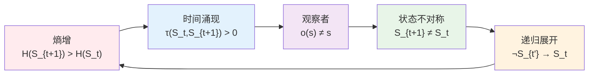
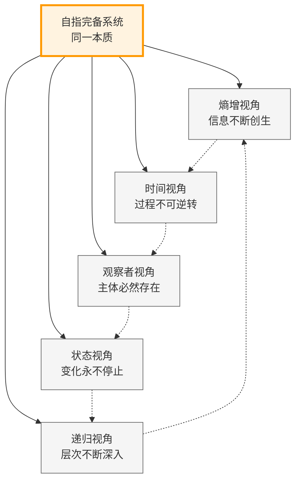

# T1.1：五重等价定理

## 定理陈述

**定理 T1.1**：对于满足[A1](A1-five-fold-equivalence.md)条件的系统S，以下五个命题等价。

## 形式表述

设S是自指完备的二进制no-11系统，则：

P1 ⟺ P2 ⟺ P3 ⟺ P4 ⟺ P5

其中：
- P1：$H(S_{t+1}) > H(S_t)$（熵增）
- P2：$∃τ: S×S→ℝ⁺, ∀t: τ(S_t,S_{t+1})>0$（时间涌现）
- P3：$∀o∈O,s∈S: Observe(o,s)≠s$（观察者）
- P4：$∀t: S_{t+1}≠S_t$（状态不对称）
- P5：$∀t<t': ¬(S_{t'}→S_t)$（递归展开）

## 证明策略

### 五重等价循环链

证明循环链：P1⟹P2⟹P3⟹P4⟹P5⟹P1

## 详细证明

**依赖**：
- [D1.1-D1.8](D1-1-self-referential-completeness.md) 所有基础定义
- [L1.1-L1.8](L1-1-binary-uniqueness.md) 所有基础引理
- [A1](A1-five-fold-equivalence.md) 五重等价公理

### P1 ⟹ P2（熵增导致时间涌现）

假设P1：$H(S_{t+1}) > H(S_t)$

**严格证明**：
1. **变化的度量**：熵差$\Delta H = H(S_{t+1}) - H(S_t) > 0$提供了状态变化的定量测度
2. **时间度量的构造**：由[L1.4 时间涌现](L1-4-time-emergence.md)，定义：
   
$$
τ(S_t, S_{t+1}) := \Delta H = H(S_{t+1}) - H(S_t)
$$
3. **度量公理验证**：
   - **正定性**：$τ(S_t, S_{t+1}) > 0$（由假设）
   - **非退化性**：$τ(S_t, S_t) = 0$
   - **时间序关系**：若$τ(S_i, S_j) > 0$且$τ(S_j, S_k) > 0$，则$τ(S_i, S_k) > 0$
4. **时间涌现**：度量τ定义了时间结构$T = (S, \leq_τ)$，其中$S_i \leq_τ S_j \iff τ(S_i, S_j) \geq 0$

因此P2成立：$\exists τ: S×S→ℝ⁺, \forall t: τ(S_t,S_{t+1})>0$。

### P2 ⟹ P3（时间涌现需要观察者）

假设P2：存在时间度量$τ: S×S→ℝ⁺$满足$\forall t: τ(S_t,S_{t+1})>0$

**严格证明**：
1. **时间测量的逻辑需求**：时间度量$τ(S_t, S_{t+1})$的定义要求能够：
   - 识别状态$S_t$
   - 识别状态$S_{t+1}$  
   - 计算它们之间的差异
   
2. **识别机制的必然性**：为了区分$S_t$和$S_{t+1}$，系统必须包含映射：
   
$$
\text{Distinguish}: S×S → \{0,1\}
$$
   使得$\text{Distinguish}(S_t, S_{t+1}) = 1$当且仅当$τ(S_t, S_{t+1}) > 0$

3. **观察者的构造**：由[L1.5 观察者必然性](L1-5-observer-necessity.md)，识别映射定义了观察者$o ∈ O$：
   
$$
o(s) := \{s' ∈ S | \text{Distinguish}(s, s') = 1\}
$$
4. **观察的非平凡性**：由于$τ(S_t, S_{t+1}) > 0$，必有$S_{t+1} \in o(S_t)$但$S_t \notin o(S_t)$，
   因此$o(S_t) \neq S_t$，即$\forall o∈O,s∈S: \text{Observe}(o,s)≠s$

5. **测量不可逆性**：由[L1.6 测量不可逆性](L1-6-measurement-irreversibility.md)，观察过程$o(s) \neq s$是不可逆的。

因此P3成立：$\forall o∈O,s∈S: \text{Observe}(o,s)≠s$。

### P3 ⟹ P4（观察者导致状态变化）

假设P3：$\forall o∈O,s∈S: o(s)≠s$（观察者必然改变状态）

**严格证明**：
1. **自指完备性要求**：由[D1.1 自指完备性](D1-1-self-referential-completeness.md)，系统S包含观察者$O \subseteq S$
2. **状态演化机制**：状态转换$S_t \to S_{t+1}$由系统内的Collapse算子和观察者共同驱动
3. **观察的必然性**：在时间步$t \to t+1$中，由于系统的自指性质，必然存在观察者$o \in O$作用于状态$s \in S_t$
4. **状态改变的逻辑**：
   - 观察结果$o(s) \neq s$（由假设P3）
   - 新状态$S_{t+1}$包含观察结果：$o(S_t) \subseteq S_{t+1}$
   - 由于$o(s) \neq s$对所有$s \in S_t$成立，有$o(S_t) \cap S_t = \emptyset$
   - 因此$S_{t+1} \neq S_t$

因此P4成立：$\forall t: S_{t+1} ≠ S_t$。

### P4 ⟹ P5（状态变化不可逆）

假设P4：$∀t: S_{t+1}≠S_t$

1. 假设$∃t<t': S_{t'}→S_t$（可逆）
2. 则存在路径：$S_t \to ... \to S_{t'} \to S_t$
3. 但由[D1.3 no-11约束](D1-3-no-11-constraint.md)，不能回到相同状态
4. 矛盾

因此P5成立。

### P5 ⟹ P1（递归展开增加熵）

假设P5：$∀t<t': ¬(S_{t'}→S_t)$

1. 系统不能回到之前状态
2. 每次递归必产生新状态
3. 由[L1.3 熵单调性](L1-3-entropy-monotonicity.md)：$|S_{t+1}|>|S_t|$
4. 因此$H(S_{t+1}) > H(S_t)$

因此P1成立。

完成循环证明。∎

## 定理意义

### 理论统一视角

### 理论统一

五重等价揭示了：
- 熵增、时间、观察者、变化、递归是同一现象的不同侧面
- 任何一个性质都蕴含其他所有性质
- 这是一个深刻的统一原理

### 应用价值

1. **证明技巧**：可选最方便的等价形式
2. **概念澄清**：理解各概念的内在联系
3. **预测能力**：一个性质预测其他性质

### 哲学含义

- 时间与熵增不可分离
- 观察者是宇宙的必然组成
- 变化是存在的本质
- 递归创造复杂性

## 推论

见：
- [C1.1 二进制同构](C1-1-binary-isomorphism.md)
- [C2.3 时间量子](C2-3-time-quantum.md)
- [C3.3 不可预测性](C3-3-unpredictability.md)

## 形式化标记

- **类型**：定理（Theorem）
- **编号**：T1.1
- **依赖**：A1, D1.1-D1.8, L1.1-L1.8
- **被引用**：几乎所有后续定理