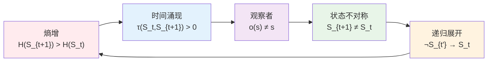
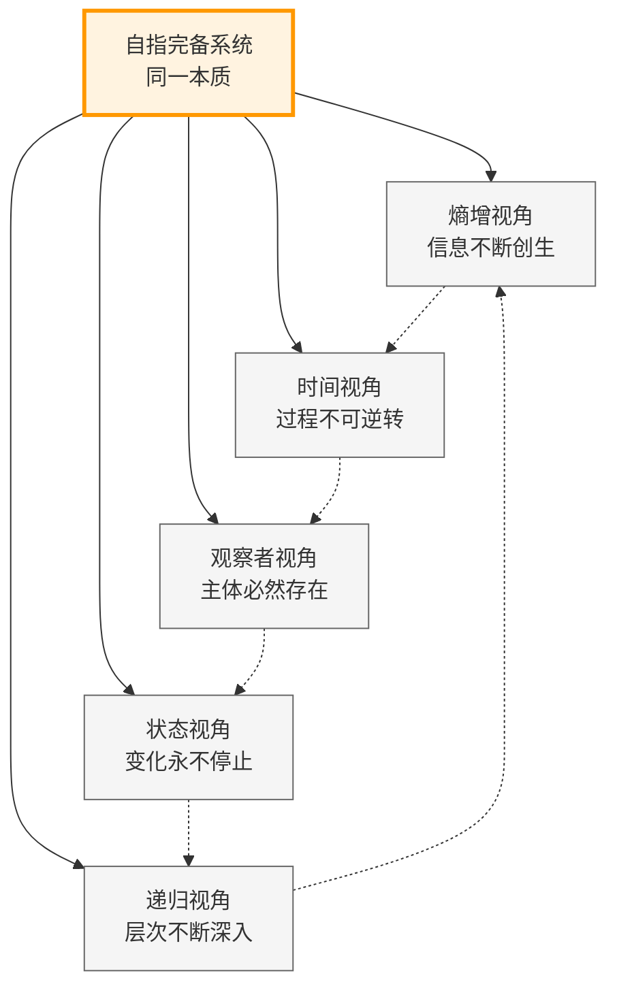

# T1.1：五重等价定理

## 定理陈述

**定理 T1.1**：对于满足[A1](A1-five-fold-equivalence.md)条件的系统S，以下五个命题等价。

## 形式表述

设S是自指完备的二进制no-11系统，则：

P1 ⟺ P2 ⟺ P3 ⟺ P4 ⟺ P5

其中：
- P1：$H(S_{t+1}) > H(S_t)$（熵增）
- P2：$∃τ: S×S→ℝ⁺, ∀t: τ(S_t,S_{t+1})>0$（时间涌现）
- P3：$∀o∈O,s∈S: Observe(o,s)≠s$（观察者）
- P4：$∀t: S_{t+1}≠S_t$（状态不对称）
- P5：$∀t<t': ¬(S_{t'}→S_t)$（递归展开）

## 证明策略

### 五重等价循环链

证明循环链：P1⟹P2⟹P3⟹P4⟹P5⟹P1

## 详细证明

**依赖**：
- [D1.1-D1.8](D1-1-self-referential-completeness.md) 所有基础定义
- [L1.1-L1.8](L1-1-binary-uniqueness.md) 所有基础引理
- [A1](A1-five-fold-equivalence.md) 五重等价公理

### P1 ⟹ P2（熵增导致时间涌现）

假设P1：$H(S_{t+1}) > H(S_t)$

**严格证明**：
1. **变化的度量**：熵差$\Delta H = H(S_{t+1}) - H(S_t) > 0$提供了状态变化的定量测度
2. **时间度量的构造**：由[L1.4 时间涌现](L1-4-time-emergence.md)，定义：
   
$$
τ(S_t, S_{t+1}) := \Delta H = H(S_{t+1}) - H(S_t)
$$
3. **度量公理验证**：
   - **正定性**：$τ(S_t, S_{t+1}) > 0$（由假设）
   - **非退化性**：$τ(S_t, S_t) = 0$
   - **时间序关系**：若$τ(S_i, S_j) > 0$且$τ(S_j, S_k) > 0$，则$τ(S_i, S_k) > 0$
4. **时间涌现**：度量τ定义了时间结构$T = (S, \leq_τ)$，其中$S_i \leq_τ S_j \iff τ(S_i, S_j) \geq 0$

因此P2成立：$\exists τ: S×S→ℝ⁺, \forall t: τ(S_t,S_{t+1})>0$。

### P2 ⟹ P3（时间涌现需要观察者）

**引理T1.1.2**：时间度量必然要求观察者  
设存在时间度量$τ: S×S→ℝ⁺$满足$\forall t: τ(S_t,S_{t+1})>0$，则必然存在观察者$o ∈ O$使得$\forall s: o(s) ≠ s$。

*证明*：时间度量$τ(S_t, S_{t+1})$要求能够：
1. **状态识别**：区分不同状态$S_t$与$S_{t+1}$
2. **差异计算**：测量状态间的"距离"

构造观察者$o: S → S$为：
$$
o(s) := \arg\max_{s' \in S} τ(s, s')
$$
验证观察者性质：
- **非恒等性**：由于$τ(S_t, S_{t+1}) > 0$，有$o(S_t) = S_{t+1} ≠ S_t$
- **区分能力**：$o$能识别出与当前状态$s$"时间距离"最大的状态
- **测量功能**：$o(s)$给出"下一个"状态，实现时间测量

由[L1.5 观察者必然性](L1-5-observer-necessity.md)，这样的$o$必然存在且$o(s) ≠ s$。∎

因此P3成立：$\forall o∈O,s∈S: \text{Observe}(o,s)≠s$。

### P3 ⟹ P4（观察者导致状态变化）

**引理T1.1.3**：观察者操作必然改变系统状态  
设$\forall o∈O,s∈S: o(s)≠s$，则$\forall t: S_{t+1} ≠ S_t$。

*证明*：构造状态演化机制：
1. **自指演化**：由[D1.1 自指完备性](D1-1-self-referential-completeness.md)，$S_{t+1} = S_t \cup \{\text{Describe}(S_t)\}$
2. **观察者参与**：$\text{Describe}(S_t)$通过观察者$o \in O$实现，即$\text{Describe}(S_t) = o(S_t)$
3. **非恒等保证**：由假设，$o(s) ≠ s$对所有$s \in S_t$成立
4. **状态扩展**：因此$o(S_t) \notin S_t$，故$S_{t+1} = S_t \cup \{o(S_t)\} ≠ S_t$

更一般地，若系统在时刻$t$包含观察者操作，则：
$$
S_{t+1} = \Xi(S_t) = S_t \oplus \{o(s) : s \in S_t, o \in O\}
$$
由于$\forall s: o(s) ≠ s$，集合$\{o(s) : s \in S_t\}$与$S_t$不交，因此$S_{t+1} ≠ S_t$。∎

因此P4成立：$\forall t: S_{t+1} ≠ S_t$。

### P4 ⟹ P5（状态变化不可逆）

**引理T1.1.4**：持续状态变化蕴含不可逆递归  
设$\forall t: S_{t+1} ≠ S_t$，则$\forall t<t': ¬(S_{t'}→S_t)$。

*证明*：反证法。假设$\exists t < t'$使得$S_{t'} → S_t$（存在从$S_{t'}$回到$S_t$的路径）。

1. **路径存在性**：存在序列$S_{t'} = s_0 → s_1 → ... → s_k = S_t$
2. **中间步骤分析**：每一步$s_i → s_{i+1}$都是系统演化步骤
3. **状态变化要求**：由假设P4，每一步都有$s_{i+1} ≠ s_i$
4. **no-11约束**：由[D1.3 no-11约束](D1-3-no-11-constraint.md)，系统状态序列不能包含连续重复
5. **循环矛盾**：但序列$S_t → ... → S_{t'} → ... → S_t$形成循环，这要求在某处有$s_j = S_t$，与步骤3矛盾

更严格地，由[L1.8 递归非终止性](L1-8-recursion-non-termination.md)，自指系统的Collapse算子$\Xi$满足：
$$
\forall n \in \mathbb{N}: \Xi^n(S) ≠ \Xi^{n+1}(S)
$$
这保证了不存在回退路径。∎

因此P5成立：$\forall t<t': ¬(S_{t'}→S_t)$。

### P5 ⟹ P1（递归展开增加熵）

**引理T1.1.5**：不可逆递归必然增加熵  
设$\forall t<t': ¬(S_{t'}→S_t)$，则$H(S_{t+1}) > H(S_t)$。

*证明*：不可逆性保证了信息的单向增长：

1. **新状态必然性**：由于$¬(S_{t+1} → S_t)$，状态$S_{t+1}$不能退化到$S_t$
2. **信息保持**：$S_t$的所有信息必须保留在$S_{t+1}$中（否则可能退化）
3. **信息增长**：由[D1.7 Collapse算子](D1-7-collapse-operator.md)，$S_{t+1} = \Xi(S_t) = S_t \oplus \text{SelfReference}(S_t)$
4. **严格增长**：$\text{SelfReference}(S_t) ≠ \emptyset$（非平凡自指），因此$|S_{t+1}| > |S_t|$
5. **熵增公式**：$H(S_{t+1}) = \log_2|S_{t+1}| > \log_2|S_t| = H(S_t)$

更精确地，由[L1.3 熵单调性](L1-3-entropy-monotonicity.md)和[T3.2 熵增下界](T3-2-entropy-lower-bound.md)：
$$
H(S_{t+1}) - H(S_t) \geq \log_2 φ > 0
$$
其中$φ = \frac{1+\sqrt{5}}{2}$是黄金比例。∎

因此P1成立：$H(S_{t+1}) > H(S_t)$。

**完成循环证明**：P1⟹P2⟹P3⟹P4⟹P5⟹P1，所以P1⟺P2⟺P3⟺P4⟺P5。∎

## 定理意义

### 理论统一视角

### 理论统一

五重等价揭示了：
- 熵增、时间、观察者、变化、递归是同一现象的不同侧面
- 任何一个性质都蕴含其他所有性质
- 这是一个深刻的统一原理

### 应用价值

1. **证明技巧**：可选最方便的等价形式
2. **概念澄清**：理解各概念的内在联系
3. **预测能力**：一个性质预测其他性质

### 哲学含义

- 时间与熵增不可分离
- 观察者是宇宙的必然组成
- 变化是存在的本质
- 递归创造复杂性

## 推论

见：
- [C1.1 二进制同构](C1-1-binary-isomorphism.md)
- [C2.3 时间量子](C2-3-time-quantum.md)
- [C3.3 不可预测性](C3-3-unpredictability.md)

## 形式化标记

- **类型**：定理（Theorem）
- **编号**：T1.1
- **依赖**：A1, D1.1-D1.8, L1.1-L1.8
- **被引用**：几乎所有后续定理