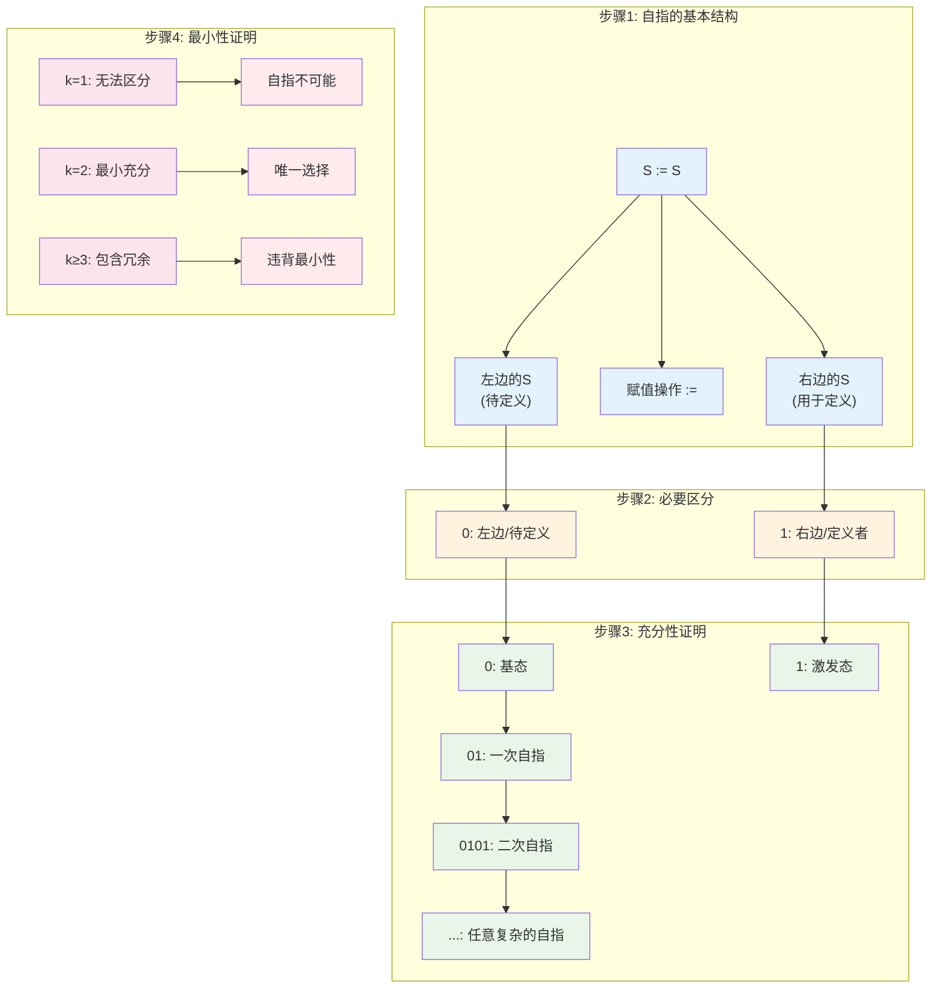

# T2.1：二进制必然性定理

## 定理陈述

**定理 T2.1**：自指完备系统必然使用二进制编码。

## 形式表述

设系统S满足[D1.1 自指完备性](D1-1-self-referential-completeness.md)，则其编码基数k = 2。

## 证明

**依赖**：
- [D1.1 自指完备性](D1-1-self-referential-completeness.md)
- [L1.1 二进制唯一性](L1-1-binary-uniqueness.md)
- [P1 二元区分](P1-binary-distinction.md)

### 构造性证明

**引理T2.1.1**：自指完备系统需要最小区分能力。

*证明*：设系统S满足自指完备性S = Φ(S)。为了判断元素$s \in S$是否满足描述函数$D$的条件，系统需要能够区分至少两种状态：满足和不满足。因此最小区分能力为2。∎

**引理T2.1.2**：区分能力k > 2时存在冗余。

*证明*：若编码使用k > 2个符号，则存在符号$a_3, a_4, \ldots, a_k$，它们可以通过$a_1, a_2$的组合表示，违背最小性原理。∎

### 自指的二进制结构

**步骤1：自指的基本结构**
考虑最简单的自指：S := S

这包含：
- 左边的S（待定义）
- 右边的S（用于定义）
- 赋值操作:=

**步骤2：必要区分**
为了识别左右两边，需要区分：
- 0：表示"左边"或"待定义"
- 1：表示"右边"或"定义者"

**步骤3：充分性证明**
用{0,1}可以编码所有自指结构：
- 基态：0
- 激发态：1
- 一次自指：01
- 二次自指：0101
- 任意复杂的自指：有限01序列

**步骤4：最小性证明**
- k=1：无法区分，自指不可能
- k≥3：包含冗余符号，违背最小性

因此k=2是唯一选择。∎

## 定理的加强形式

### 同构定理

**定理 T2.1'**：任何自指完备系统都同构于某个二进制系统。

*证明概要*：构造映射φ: S → {0,1}*，保持自指结构。

### 效率定理

**定理 T2.1''**：二进制编码在自指约束下信息密度最优。

*证明概要*：使用[L1.7 φ最优性](L1-7-phi-optimality.md)。

## 推论

直接推论：
- [C1.1 二进制同构](C1-1-binary-isomorphism.md)
- [C1.2 高进制退化](C1-2-higher-base-degeneracy.md)
- [C1.3 存在的二进制本质](C1-3-binary-nature-of-existence.md)

## 应用

### 计算机科学

- 解释计算机为何使用二进制
- 量子计算中的qubit基础
- 信息论的比特概念

### 物理学

- 量子态的二能级系统
- 费米子的二重性
- 相变的二态模型

### 哲学

- 有/无的基本对立
- 是/非的逻辑基础
- 阴/阳的东方智慧

## 历史注记

这个定理统一了：
- Leibniz的二进制算术
- Boole的逻辑代数
- Shannon的信息理论
- 现代计算机科学

## 形式化标记

- **类型**：定理（Theorem）
- **编号**：T2.1
- **依赖**：D1.1, L1.1, P1
- **被引用**：C1.1, C1.2, C1.3, 多个应用定理