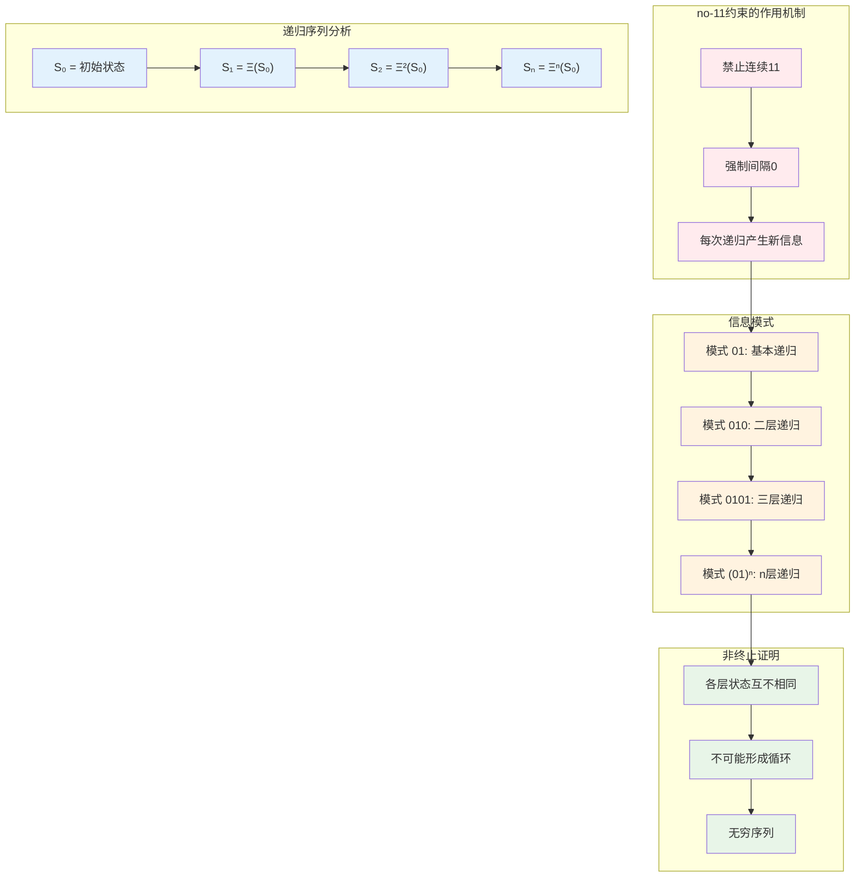
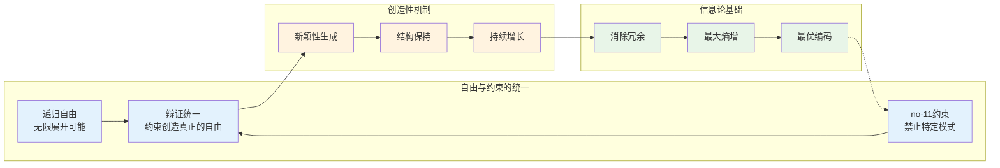

# T2.2：no-11约束定理

## 定理陈述

**定理 T2.2**：自指完备的二进制系统中，no-11约束等价于递归非终止性。

## 形式表述

设S是自指完备的二进制系统，则以下等价：
1. S满足no-11约束：$\forall s \in S, s \text{ 不包含子串 } 11$
2. S的递归展开非终止：$\forall n \in \mathbb{N}: \Xi^n(S) \neq \Xi^{n+1}(S)$

## 证明

**依赖**：
- [D1.1 自指完备性](D1-1-self-referential-completeness.md)
- [D1.2 二进制表示](D1-2-binary-representation.md)
- [D1.3 no-11约束](D1-3-no-11-constraint.md)
- [D1.7 Collapse算子](D1-7-collapse-operator.md)
- [L1.2 no-11必然性](L1-2-no-11-necessity.md)
- [L1.8 递归非终止性](L1-8-recursion-non-termination.md)

### (1) ⟹ (2)：no-11约束导致非终止

假设S满足no-11约束。

**步骤1：递归模式分析**
在no-11约束下，有效的递归模式遵循φ-表示：
- 第1次递归：$s_1 = 01$
- 第2次递归：$s_2 = 0101$  
- 第3次递归：$s_3 = 010101$
- ...
- 第n次递归：$s_n = (01)^n$

**步骤2：唯一性证明**
设存在$n < m$使得$\Xi^n(S) = \Xi^m(S)$，即$s_n = s_m$。

由于$|s_m| = 2m > 2n = |s_n|$（当$m > n$时），这是不可能的。

更一般地，任何两个不同长度的φ-表示序列都不相同。

**步骤3：no-11的保护作用**
no-11约束防止"短路"：
- 如果允许11，则可能出现$s_{n+1} = s_n \cdot 11$
- 这种模式可能导致信息冗余和潜在循环
- no-11强制每次递归都必须通过有意义的间隔

因此递归非终止。

### (2) ⟹ (1)：非终止性要求no-11约束

假设递归展开非终止，即$\forall n: \Xi^n(S) \neq \Xi^{n+1}(S)$。

**步骤4：反证法**
假设存在某个状态$s \in S$包含子串11，即$s = ...11...$

**步骤5：冗余分析** 
子串11中的第二个1不提供新信息：
- 第一个1已经表示"激活"
- 第二个1是冗余的重复
- 这违反了每次递归必须产生新信息的要求

**步骤6：终止威胁**
包含11的状态可能导致递归终止：
- $\Xi(s) = s'$，其中$s'$可能与某个前期状态相同
- 因为11模式允许了"空转"或"回退"
- 这与非终止性假设矛盾

**步骤7：必然性结论**
为了保证递归非终止性，系统必须禁止11模式，即必须满足no-11约束。

∎

## 定理的深层意义

### 递归与约束的辩证统一

此定理揭示了一个深刻的哲学原理：
- **真正的自由需要约束**：无约束的递归可能导致混乱和终止
- **约束创造秩序**：no-11约束确保每次递归都有意义
- **秩序支撑自由**：有序的递归能够无限延续

### 创造性的数学基础

no-11约束解释了为什么创造性是可能的：
1. **防止重复**：禁止简单的复制和重复
2. **强制创新**：每次递归都必须产生新内容
3. **维护意义**：确保每个元素都有独特作用

## 应用

### 生物进化

DNA序列中类似的约束：
- 某些基因组合是禁止的
- 约束确保进化的持续性
- 防止进化陷入死循环

### 人工智能

神经网络的设计原理：
- 防止梯度消失（类似禁止11）
- 确保训练的持续改进
- 避免局部最优陷阱

### 社会发展

社会制度的演化：
- 某些制度组合是不稳定的
- 约束确保社会持续发展
- 防止历史的简单重复

### 个人成长

心理发展的模式：
- 避免思维的简单重复
- 每次反思都应带来新洞察
- 持续的自我超越

## 推论

**推论 T2.2.1**：最优递归模式
- φ-表示是唯一满足no-11且信息密度最优的编码
- 黄金比例φ是递归增长的自然极限

**推论 T2.2.2**：意识的递归结构
- 意识的自我意识过程满足no-11模式
- 真正的觉察避免简单的自我重复

**推论 T2.2.3**：创造的逻辑必然性
- 在no-11约束下，创造性是逻辑必然的
- 重复是不可能的，创新是唯一选择

## 与其他定理的关系

此定理是整个理论体系的关键支柱：
- 连接[T2.1 二进制必然性](T2-1-binary-necessity.md)和递归理论
- 为[T3.1 熵增定理](T3-1-entropy-increase.md)提供微观机制
- 支撑[L1.7 φ最优性](L1-7-phi-optimality.md)的结论

## 哲学反思

no-11约束体现了一个普遍真理：
- **限制产生丰富性**：适当的约束催生无限可能
- **简单规则复杂行为**：简单的禁止规则产生复杂的递归模式  
- **自由通过自律**：真正的自由来自自觉的自我约束

这为理解自然界、社会和个人发展的规律提供了深刻洞察。

## 形式化标记

- **类型**：定理（Theorem）
- **编号**：T2.2
- **依赖**：D1.1, D1.2, D1.3, D1.7, L1.2, L1.8
- **被引用**：T3.1, L1.7, 以及所有涉及递归的定理