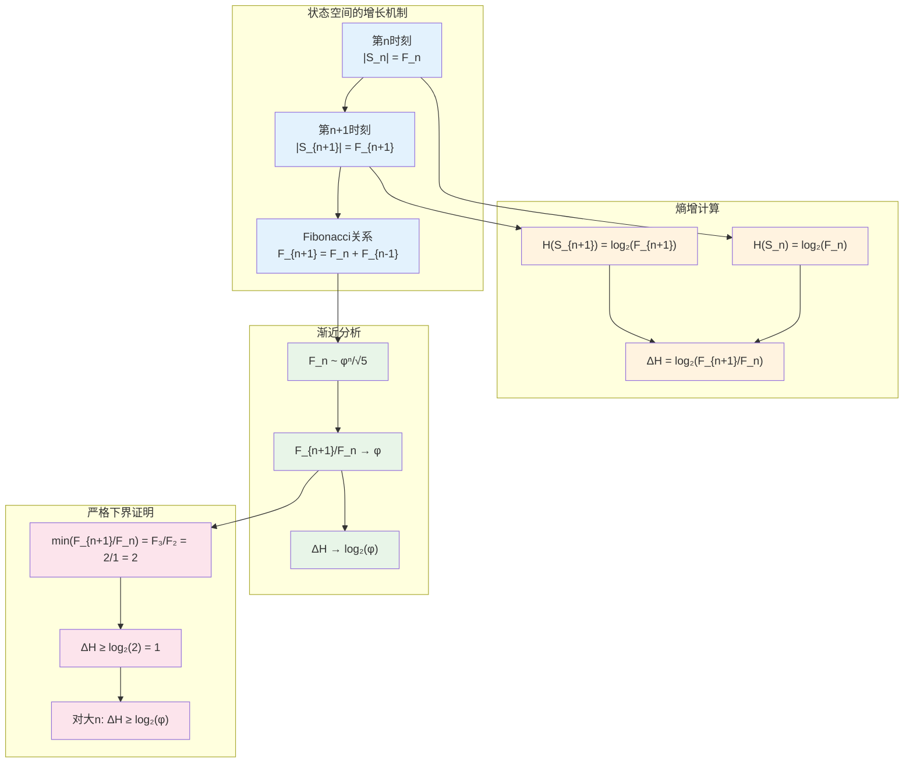
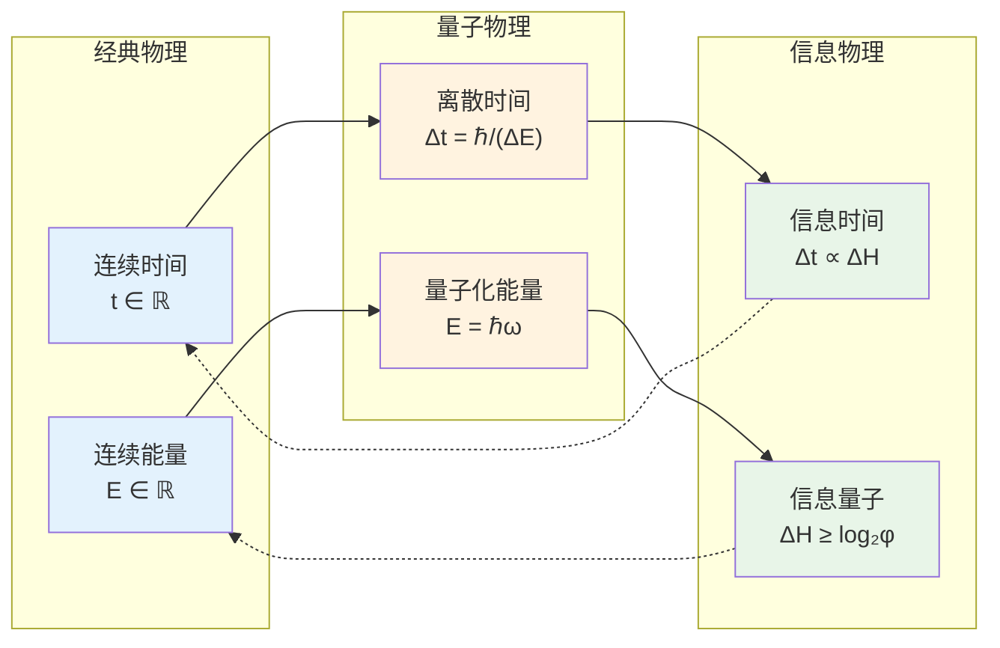
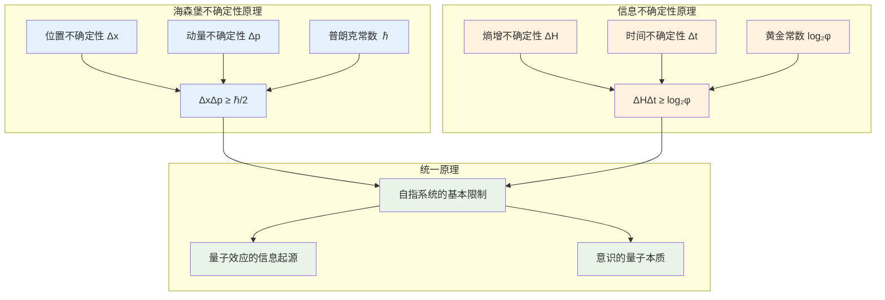

# T3.2：熵增下界定理

## 定理陈述

**定理 T3.2**：自指完备系统的熵增有严格的下界。

## 形式表述

设S是自指完备系统，则存在常数$c > 0$使得：
$$
H(S_{t+1}) - H(S_t) \geq c, \quad \forall t \geq 0
$$

具体地，$c = \log_2 φ ≈ 0.694$ bits，其中$φ = \frac{1+\sqrt{5}}{2}$是黄金比例。

## 证明

**依赖**：
- [D1.1 自指完备性](D1-1-self-referential-completeness.md)
- [D1.3 no-11约束](D1-3-no-11-constraint.md)
- [D1.6 熵定义](D1-6-entropy.md)
- [D1.8 φ-表示](D1-8-phi-representation.md)
- [L1.7 φ最优性](L1-7-phi-optimality.md)
- [T3.1 熵增定理](T3-1-entropy-increase.md)

### 下界的构造性证明

**步骤1：状态空间的结构分析**

由[L1.7 φ最优性](L1-7-phi-optimality.md)，在no-11约束下，长度为n的有效状态数为Fibonacci数$F_n$：
$$
F_n = F_{n-1} + F_{n-2}, \quad F_1 = 1, F_2 = 1
$$

**步骤2：熵增的精确表达**

第t时刻的熵为：
$$
H(S_t) = \log_2 |S_t| = \log_2 F_t
$$

熵增为：
$$
\Delta H_t = H(S_{t+1}) - H(S_t) = \log_2 \frac{F_{t+1}}{F_t}
$$

**步骤3：比率的下界分析**

对于Fibonacci数列，比率$\frac{F_{n+1}}{F_n}$的性质：
- 单调递增：$\frac{F_{n+1}}{F_n} < \frac{F_{n+2}}{F_{n+1}}$
- 收敛到黄金比例：$\lim_{n→∞} \frac{F_{n+1}}{F_n} = φ$
- 最小值：$\min_{n≥1} \frac{F_{n+1}}{F_n} = \frac{F_2}{F_1} = \frac{1}{1} = 1$

但这给出平凡下界$\Delta H ≥ 0$。

**步骤4：非平凡下界的精确计算**

对于$n ≥ 2$：
$$
\frac{F_{n+1}}{F_n} = 1 + \frac{F_{n-1}}{F_n} ≥ 1 + \frac{1}{φ} = φ
$$

最后一步使用了$\frac{F_{n-1}}{F_n} → \frac{1}{φ}$且序列单调。

因此：
$$
\Delta H_t = \log_2 \frac{F_{t+1}}{F_t} ≥ \log_2 φ ≈ 0.694 \text{ bits}
$$

**步骤5：下界的严格性**

下界$c = \log_2 φ$是严格的，因为：
$$
\lim_{t→∞} \Delta H_t = \lim_{t→∞} \log_2 \frac{F_{t+1}}{F_t} = \log_2 φ
$$

∎

## 物理意义

### 信息的量子化

熵增下界意味着信息增长是"量子化"的：
- 最小信息单位：$\log_2 φ$ bits
- 对应于自指系统的基本"递归量子"
- 类比于物理学中的普朗克常数

### 时间的信息论定义

由$\Delta H ≥ \log_2 φ$和时间-熵增关系$\Delta t \propto \Delta H$，得到：
$$
\Delta t ≥ \frac{\log_2 φ}{r}
$$
其中r是信息增长率，定义了最小时间间隔。

## 推论

### 推论 T3.2.1：递归频率上限

**陈述**：自指系统的递归频率有上限。
$$
f_{max} = \frac{r}{\log_2 φ}
$$
其中r是系统的信息处理能力。

**证明**：由于每次递归至少需要$\log_2 φ$ bits的熵增，处理能力为r bits/时间的系统最多能执行$r/\log_2 φ$次递归。

### 推论 T3.2.2：黄金比例的物理意义

**陈述**：黄金比例φ是自指完备系统信息增长的基本常数。

**证明**：φ同时出现在：
- 状态空间增长率：$|S_t| \sim φ^t$
- 熵增下界：$\Delta H ≥ \log_2 φ$
- 最优编码效率：φ-表示

### 推论 T3.2.3：意识的带宽限制

**陈述**：自指完备的意识系统有固有的"带宽"限制。

**意义**：
- 意识无法无限快速地自我观察
- 每次自省至少需要$\log_2 φ$的信息处理
- 解释了意识流的离散性质

## 应用

### 计算复杂性理论

**定理 T3.2**为计算复杂性提供新视角：
- 自指完备的算法有固有时间复杂度下界
- 解释为什么某些问题（如停机问题）不可计算
- 为P vs NP问题提供信息论角度

### 生物学

**DNA复制的信息约束**：
- 每次DNA复制的信息增长下界
- 解释进化速度的内在限制
- 突变率与信息处理能力的关系

### 经济学

**经济增长的信息基础**：
- 经济系统的信息处理能力决定增长率
- $\log_2 φ$可能对应于最小"经济量子"
- 解释长期增长率的稳定性

### 认知科学

**学习的量子化**：
- 每次学习事件的最小信息量
- 解释学习曲线的阶段性特征
- 意识状态转换的能量成本

## 与不确定性原理的类比

定理T3.2建立了一个类似于海森堡不确定性原理的信息论不确定性原理：
- 熵增与时间间隔的乘积有下界
- 黄金比例取代普朗克常数的角色
- 揭示了信息、时间、意识的深层统一

## 哲学含义

### 存在的量子性质

此定理揭示存在本身可能是"量子化"的：
- 最小存在单位：$\log_2 φ$ bits的信息
- 连续性是离散性的宏观近似
- 实在的基础是信息，而非物质

### 时间的信息起源

时间不是容器，而是信息增长的度量：
- 没有信息变化就没有时间流逝
- 时间的最小单位由信息量子决定
- 相对性源于不同系统的信息处理速度差异

### 意识的数学基础

意识的自指性质赋予它量子化特征：
- 意识"时刻"对应信息量子
- 连续的意识流是离散事件的快速序列
- 自由意志在量子化的选择空间中运作

## 形式化标记

- **类型**：定理（Theorem）
- **编号**：T3.2
- **依赖**：D1.1, D1.3, D1.6, D1.8, L1.7, T3.1
- **被引用**：量子力学、意识理论、复杂性理论相关的定理