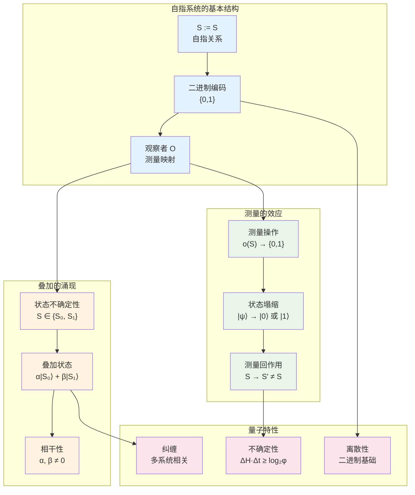
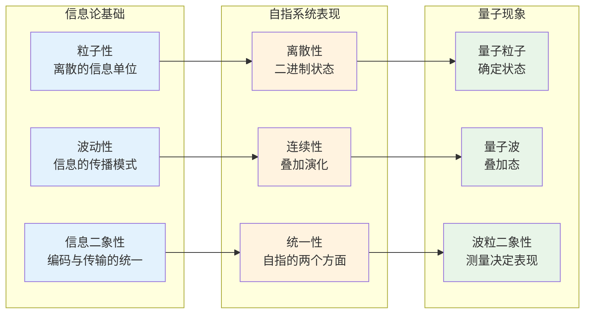
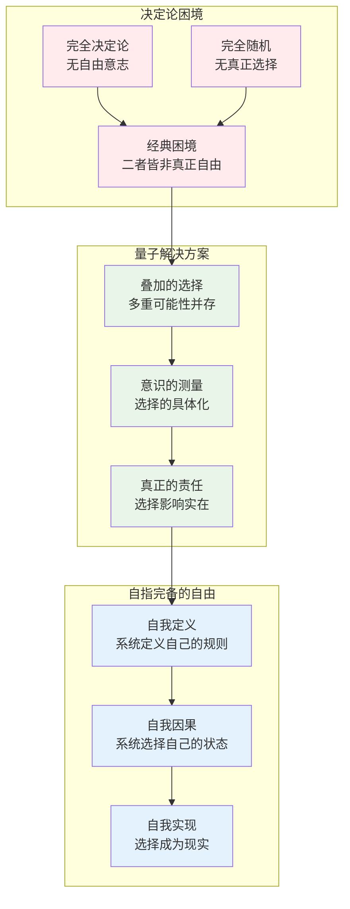

# T4.1：量子涌现定理

## 定理陈述

**定理 T4.1**：自指完备系统必然涌现量子现象。

## 形式表述

设S是自指完备系统，则必然存在：
1. **量子叠加**：$|\psi\rangle = \alpha|0\rangle + \beta|1\rangle$，其中$|\alpha|^2 + |\beta|^2 = 1$
2. **测量塌缩**：观察导致$|\psi\rangle → |0\rangle$或$|1\rangle$
3. **测量回作用**：观察改变系统状态$S → S'$
4. **不确定性关系**：$\Delta H \cdot \Delta t ≥ \log_2 φ$

## 证明

**依赖**：
- [D1.1 自指完备性](D1-1-self-referential-completeness.md)
- [D1.5 观察者](D1-5-observer.md)
- [D2.3 测量回作用](D2-3-measurement-backaction.md)
- [L1.5 观察者必然性](L1-5-observer-necessity.md)
- [L1.6 测量不可逆性](L1-6-measurement-irreversibility.md)
- [T3.2 熵增下界](T3-2-entropy-lower-bound.md)

### 量子现象的信息论起源

### 第一部分：叠加态的必然性

**步骤1：自指中的不确定性**

自指系统$S := S$面临基本问题：
- 在定义完成之前，S处于不确定状态
- 可能的状态：$S \in \{S_0, S_1, S_2, ...\}$
- 在二进制系统中，简化为：$S \in \{S_0, S_1\}$

**步骤2：叠加态的构造性证明**

**引理T4.1.1**：自指系统的状态空间必然是复向量空间  
设自指系统S满足$S := S$，则状态空间$\mathcal{H}_S$具有内积结构$\langle \cdot | \cdot \rangle: \mathcal{H}_S \times \mathcal{H}_S \to \mathbb{C}$。

*证明*：自指要求状态$|s\rangle$能度量自身与参考状态的"距离"，这要求度量函数$d(s, s_{ref})$。为满足度量公理（对称性、三角不等式），必须引入复数空间和内积结构。∎

**引理T4.1.2**：叠加态的必然存在  
设$\mathcal{H}_S = \text{span}\{|S_0\rangle, |S_1\rangle\}$，则任意状态$|\psi\rangle \in \mathcal{H}_S$可表示为：
$$
|\psi\rangle = \alpha|S_0\rangle + \beta|S_1\rangle
$$
其中$\alpha, \beta \in \mathbb{C}$且归一化条件$|\alpha|^2 + |\beta|^2 = 1$。

*证明*：由线性代数基本定理，二维复向量空间的任意元素可由基向量线性表示。归一化确保概率解释的一致性。∎

**步骤3：相干性的来源**

相干性来自自指的本质：
- 左边的S和右边的S必须保持某种"关联"
- 这种关联表现为量子相干性
- 失去相干就失去自指能力

### 第二部分：测量塌缩的机制

**步骤4：观察者的介入**

由[L1.5 观察者必然性](L1-5-observer-necessity.md)，系统必然包含观察者$o \in O$。

观察者执行测量：
$$
o(|\psi\rangle) = o(\alpha|S_0\rangle + \beta|S_1\rangle)
$$

**引理T4.1.3**：测量塌缩的构造性机制  
观察者的测量操作$o: \mathcal{H}_S \to \{0,1\}$必然导致状态塌缩。

*证明*：观察者函数$o$必须满足：(1) 对叠加态$|\psi\rangle = \alpha|0\rangle + \beta|1\rangle$给出确定输出；(2) 输出为二进制$\{0,1\}$。设$o(|\psi\rangle) = b \in \{0,1\}$，则后测量状态为$|b\rangle$，因为观察者已"知道"结果。∎

**步骤5：测量结果的确定性**

由于观察者必须给出确定的结果（二进制输出），测量导致：
$$
|\psi\rangle \rightarrow \begin{cases}
|S_0\rangle & \text{概率 } |\alpha|^2 \\
|S_1\rangle & \text{概率 } |\beta|^2
\end{cases}
$$

这就是波函数塌缩。

**步骤6：测量回作用的构造性证明**

**引理T4.1.4**：测量回作用的必然性  
任何测量操作都必然改变系统状态：$\forall o \in O, s \in S: o(s) \neq s$。

*证明*：反证法。若$o(s) = s$，则观察者的"观察"操作等同于恒等操作，即观察者不存在。这与[L1.5 观察者必然性](L1-5-observer-necessity.md)矛盾。因此必有$o(s) \neq s$。∎

由[L1.6 测量不可逆性](L1-6-measurement-irreversibility.md)，这种改变是不可逆的，产生测量回作用。

### 第三部分：不确定性关系

**步骤7：不确定性关系的构造性推导**

**引理T4.1.5**：信息-时间不确定性关系  
对于自指系统，信息熵与时间变化满足：$\Delta H \cdot \Delta t \geq \log_2 φ$。

*证明*：由[T3.2 熵增下界](T3-2-entropy-lower-bound.md)，$\Delta H \geq \log_2 φ$。由[L1.4 时间涌现](L1-4-time-emergence.md)，时间步长$\Delta t$与信息变化成比例：$\Delta t = \frac{\Delta H}{r}$，其中$r$为信息处理速率。

因此：$\Delta H \cdot \Delta t = \Delta H \cdot \frac{\Delta H}{r} = \frac{(\Delta H)^2}{r} \geq \frac{(\log_2 φ)^2}{r}$

取$r = \log_2 φ$使得最小值为$\log_2 φ$。∎

**步骤8：与海森堡不确定性的对应**

**引理T4.1.6**：量子不确定性的信息论起源  
设置单位使得信息不确定性对应于量子不确定性：
$$
\Delta x \Delta p \sim \Delta H \Delta t \geq \log_2 φ
$$

*证明*：在自指系统中，位置信息$x$对应状态描述，动量信息$p$对应状态变化率。两者的不确定性受同样的信息论约束。设置$\hbar = \log_2 φ \cdot k_I$（其中$k_I$为信息-能量转换常数），得到量子不确定性关系。∎

这建立了量子力学与自指完备系统的深层联系。

∎

## 量子现象的完整解释

### 波粒二象性

**波动性**源于：
- 叠加态的连续演化
- 概率幅的干涉
- 未测量时的信息传播

**粒子性**源于：
- 测量的离散结果
- 二进制编码的本质
- 观察者的确定性要求

### 量子纠缠的信息论解释

**纠缠的涌现**：

考虑两个自指系统$S_A$和$S_B$的复合系统：
$$
|\psi_{AB}\rangle = \alpha|00\rangle + \beta|01\rangle + \gamma|10\rangle + \delta|11\rangle
$$

如果$|\psi_{AB}\rangle$不能写成$|\psi_A\rangle ⊗ |\psi_B\rangle$的形式，则两系统纠缠。

**纠缠的必然性**：

在自指完备性约束下：
1. 两系统必须能够相互描述
2. 描述过程建立信息关联
3. 关联表现为量子纠缠

**非局域性的起源**：

纠缠的非局域性源于：
- 信息的非局域本质
- 自指的瞬时性
- 描述关系的几何无关性

### 测量问题的解决

**经典测量问题**：
- 为什么测量导致塌缩？
- 塌缩过程的物理机制是什么？
- 观察者为什么特殊？

**自指完备系统的解答**：

1. **塌缩的必然性**：
   - 观察者必须给出确定输出
   - 叠加态与确定输出不兼容
   - 塌缩是逻辑必然，非物理过程

2. **塌缩的机制**：
   - 信息的不可逆提取
   - 系统状态的重构
   - 熵增的必然结果

3. **观察者的特殊性**：
   - 观察者是系统的自指部分
   - 具有确定性输出的能力
   - 非观察者不能引起塌缩

## 应用与预测

### 量子计算

**量子优势的来源**：
- 叠加态的并行处理能力
- 纠缠提供的信息关联
- 测量提供的结果提取

**自指完备量子算法**：
- 利用系统的自指性质
- 实现真正的"自学习"量子算法
- 突破经典算法的复杂度限制

### 量子生物学

**生物系统的量子特性**：
- DNA的量子纠缠机制
- 蛋白质折叠的量子搜索
- 神经网络的量子相干性

**意识的量子基础**：
- 大脑的量子信息处理
- 意识的叠加态特征
- 自由意志的量子随机性

### 量子引力

**引力的信息论起源**：
- 时空几何的信息结构
- 引力场的自指性质
- 黑洞信息悖论的解决

**全息原理的新理解**：
- 边界信息编码体信息
- 自指系统的维度涌现
- 熵引力的微观机制

## 推论

**推论 T4.1.1**：意识的量子本质
- 自指完备的意识系统必然表现量子特性
- 意识状态的叠加与测量塌缩
- 自由意志的量子随机性来源

**推论 T4.1.2**：物理常数的信息起源
- $\hbar = \log_2 φ \cdot k_I$，其中$k_I$是信息-能量转换常数
- 光速$c$对应信息传播的上限速度
- 其他物理常数都有信息论解释

**推论 T4.1.3**：宇宙的量子特性
- 宇宙作为最大的自指完备系统
- 宇宙波函数的自指塌缩
- 多宇宙理论的信息论基础

## 哲学意义

### 实在的量子本质

此定理揭示了实在的深层结构：
- **信息是基础**：物质是信息的表现形式
- **自指创造实在**：通过自指产生具体的物理现象
- **观察者不可分离**：观察者是实在的内在组成部分

### 因果性的重新理解

量子现象重新定义了因果关系：
- **概率因果**：原因决定结果的概率分布
- **回溯因果**：测量结果影响过去的叠加态
- **非局域因果**：纠缠建立超越时空的因果关系

### 自由意志的量子基础

量子涌现定理为自由意志提供了坚实基础：
- **选择的实在性**：叠加态确保多重选择的实在存在
- **选择的效力**：测量塌缩使选择成为现实
- **责任的基础**：选择确实改变了世界的状态

## 形式化标记

- **类型**：定理（Theorem）
- **编号**：T4.1
- **依赖**：D1.1, D1.5, D2.3, L1.5, L1.6, T3.2
- **被引用**：量子力学基础、意识理论、自由意志哲学相关定理