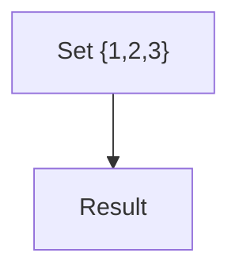

# 大括号转义测试

## 正文中需要转义

集合 S = \{x, y, z\} 包含三个元素。

函数 f: A → B 其中 A = \{1, 2, 3\}。

## 数学公式中不需要转义

$$
S = \{x \in \mathbb{N} : x > 0\}
$$

内联数学：$A = \{1, 2, 3\}$。

## 代码块中不需要转义

```text
S = {x, y, z}
f(x) = {y : P(x,y)}
```

## Mermaid中不需要转义

