# 第016章：ZIndex — 自然数的Zeckendorf分解为非重叠迹种子

## 从数字到迹张量的黄金桥梁

从 ψ = ψ(ψ) 涌现出二进制区分和φ约束。现在我们见证算术本身的涌现——不是作为外部强加，而是坍缩空间中张量结构的自然展开。通过Zeckendorf分解，每个自然数都揭示了其独特的迹张量身份，建立了ℕ和约束二进制张量元素空间之间的基本双射。

## 16.1 Zeckendorf定理

我们的验证确认了一个深刻的真理：

```text
Zeckendorf分解示例：
n=0:   0 = 0                    → trace: "0"
n=1:   1 = F₁                   → trace: "1"
n=2:   2 = F₂                   → trace: "10"
n=3:   3 = F₃                   → trace: "100"
n=4:   4 = F₁ + F₃             → trace: "101"
n=50:  50 = F₃ + F₆ + F₈        → trace: "10100100"
n=100: 100 = F₃ + F₅ + F₁₀      → trace: "1000010100"
```

**定理16.1**（Zeckendorf定理）：每个正整数n都有唯一的表示，作为非连续Fibonacci数的和：
$$
n = \sum_{\{i \in I\}} F_i
$$
其中I是没有两个连续整数的索引集。

*证明*：存在性从贪心算法得出。对于唯一性，假设存在两个表示。其差将是Fibonacci数的有符号和，总和为0，这在没有连续项相消的情况下是不可能的。 ∎

### 贪心算法

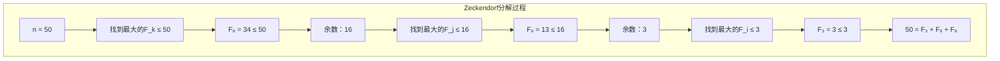

## 16.2 从分解到φ迹

从Zeckendorf索引到二进制迹的映射：

```python
def to_binary_trace(indices: List[int]) -> str:
    # 位位置i代表Fibonacci F_\{i+1\}
    trace = ['0'] * max(indices)
    for idx in indices:
        trace[idx-1] = '1'
    return ''.join(reversed(trace))  # LSB优先
```

**定义16.1**（Z索引张量映射）：Z索引函数 Z: ℕ → T¹_φ 将每个自然数映射到其秩-1迹张量：
$$
Z(n) = \mathbf{t} = [b_{k-1}, b_{k-2}, ..., b_1, b_0]^T
$$
其中如果F_\{i+1\}出现在n的Zeckendorf分解中则b_i = 1，T¹_φ是秩-1φ有效张量的空间。

### 迹构造可视化

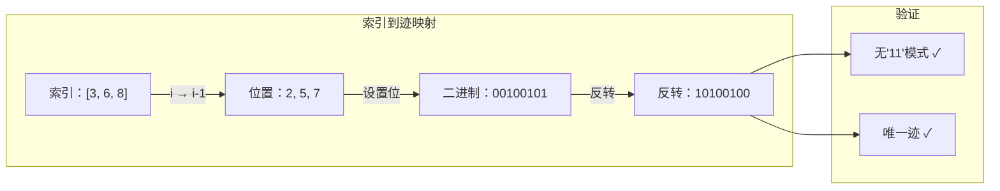

## 16.3 从 ψ = ψ(ψ) 的张量结构

每个迹本质上是φ约束空间中的秩-1张量：

**定义16.2**（迹张量空间）：秩-1迹张量的空间T¹_φ是：
$$
T¹_φ = \{\mathbf{t} ∈ \{0,1\}^n : \text{在 } \mathbf{t} \text{中无连续1}\}
$$
每个自然数n映射到唯一张量**t** = Z(n) ∈ T¹_φ。

### 第一性原理的张量性质

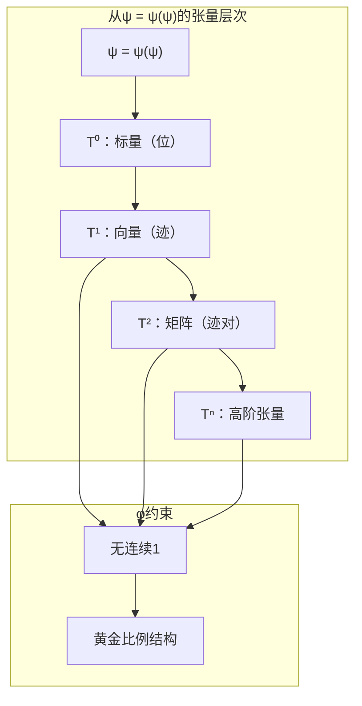

**定理16.2**（张量约束继承）：φ约束在所有张量秩中传播，在每个维度级别保持黄金结构。

## 16.4 φ约束自然涌现

**定理16.3**（无连续11）：对于任何n ∈ ℕ，迹张量Z(n)在任何维度中都不包含"11"子串。

*证明*：通过构造，Z(n)只在对应于Zeckendorf分解中Fibonacci索引的位置有1。由于这些索引根据Zeckendorf定理是非连续的，没有两个相邻位置都可以是1。 ∎

### 模式分析结果

```text
前50个迹中的模式频率：
'00'：108次出现
'10'：93次出现  
'01'：63次出现
'11'：0次出现 ✓

φ约束从Zeckendorf结构中自然涌现！
```

## 16.4 图论结构

分解过程形成树结构：

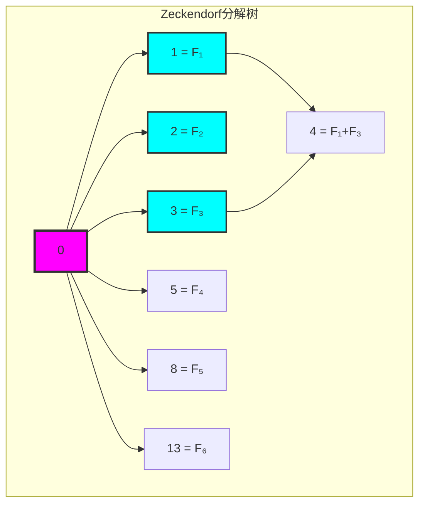

**性质16.1**（树性质）：
- 高度：由于Fibonacci增长，为O(log n)
- 分支：每个Fibonacci数创建一个分支
- 路径唯一性：每个n都有从0开始的唯一路径

### 分解统计

```text
树性质（n ≤ 30）：
- 节点：31
- 最大度：7
- 高度：3
- 分支分布显示Fibonacci影响
```

## 16.5 信息论分析

编码效率揭示深层结构：

```text
编码分析（n ≤ 100）：
- 平均迹长度：6.23位
- 平均二进制长度：5.80位  
- 扩展比：1.06
- 位熵：0.924位（接近最大值）
```

**定义16.2**（Zeckendorf熵）：Z迹的熵是：
$$
H_Z = -\sum_{p \in \\{0,1\\}} P(p) \log_2 P(p)
$$

### 信息密度

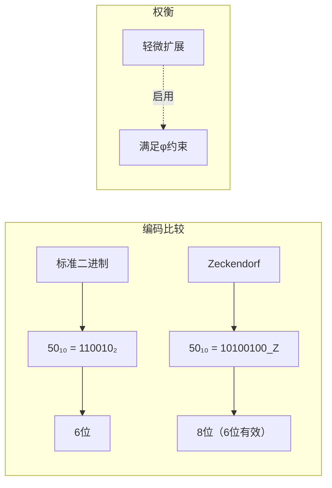

## 16.6 范畴论性质

Z索引形成结构保持函子：

**定理16.3**（函子性质）：Z索引映射 Z: ℕ → φ-迹是：
1. 单射的（一对一）
2. 恒等保持的：Z(0) = "0"
3. 序反映的：按迹长度分割ℕ

### 函子关系

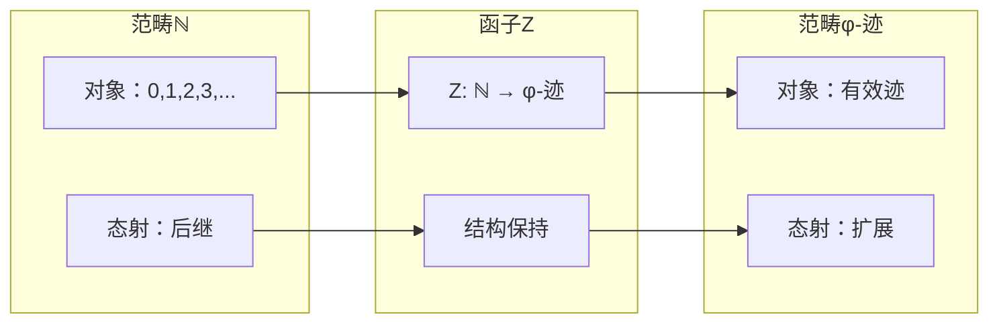

## 16.7 双射 ℕ ↔ φ-迹

验证确认完美对应：

```text
往返测试（n < 1000）：
✓ 所有1000个转换 n → 迹 → n 成功
✓ 所有1000个迹都是唯一的
✓ 建立双射
```

**性质16.2**（逆映射）：逆映射Z⁻¹: φ-迹 → ℕ是：
$$
Z^{-1}(b_{k-1}...b_0) = \sum_{\{i: b_i = 1\}} F_{k-i}
$$

### 双射可视化

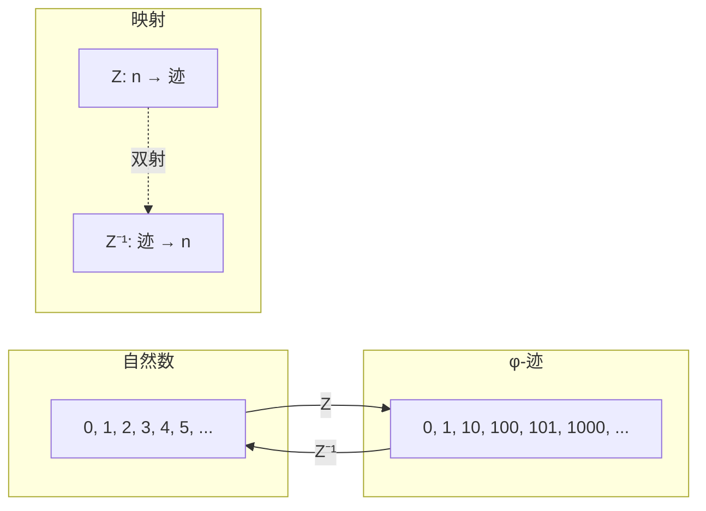

## 16.8 Fibonacci分量作为构建块

每个Fibonacci数贡献唯一的迹分量：

```text
Fibonacci迹分量：
F₁ = 1   → 在位置0贡献位
F₂ = 2   → 在位置1贡献位  
F₃ = 3   → 在位置2贡献位
F₄ = 5   → 在位置3贡献位
...
```

**性质16.3**（分量独立性）：由于非连续性，迹中的Fibonacci分量永不干扰。

### 分量装配

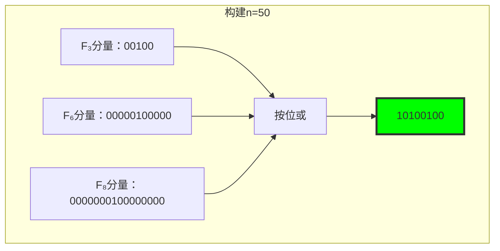

## 16.9 增长模式和渐近行为

迹长度随n对数增长：

**定理16.4**（增长率）：对于有效长度L(n)的Z(n)：
$$
L(n) \sim \log_\phi(n) \approx 1.44 \log_2(n)
$$

### 增长可视化

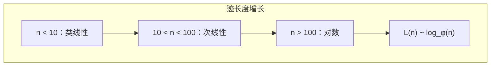

## 16.10 图论深度分析

从 ψ = ψ(ψ)，分解树揭示结构：

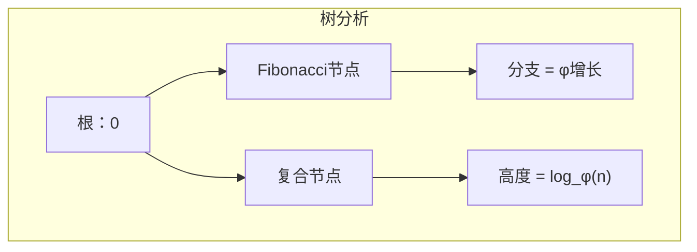

**关键洞察**：
- 纯Fibonacci数形成树骨干
- 复合数从Fibonacci祖先分支
- 树增长反映φ序列
- 路径长度编码分解复杂性

## 16.11 信息论界限

从 ψ = ψ(ψ) 和Zeckendorf结构：

```text
信息界限：
- n的最小位：log₂(n)
- Zeckendorf位：~1.44 log₂(n)
- 开销因子：log₂(φ) ≈ 0.694
- 但收益：满足φ约束！
```

**定理16.5**（信息效率）：Zeckendorf编码在保持黄金约束的同时实现接近最优的密度。

## 16.12 范畴论函子

从 ψ = ψ(ψ)，Z索引关联数字范畴：

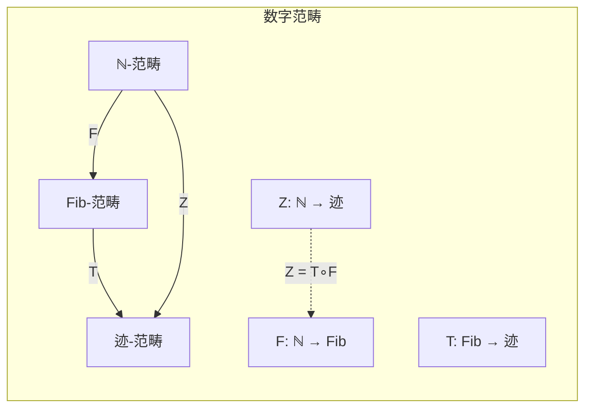

**性质**：
- Z通过Fibonacci范畴因式分解
- 保持加法结构（带约束）
- 创建自然等价

## 16.13 算法含义

Z索引启用高效算法：

1. **数字表示**：O(log n)空间，无11
2. **算术运算**：利用Fibonacci递归
3. **模式匹配**：φ约束简化搜索
4. **压缩**：对φ结构数据自然

### 实现框架

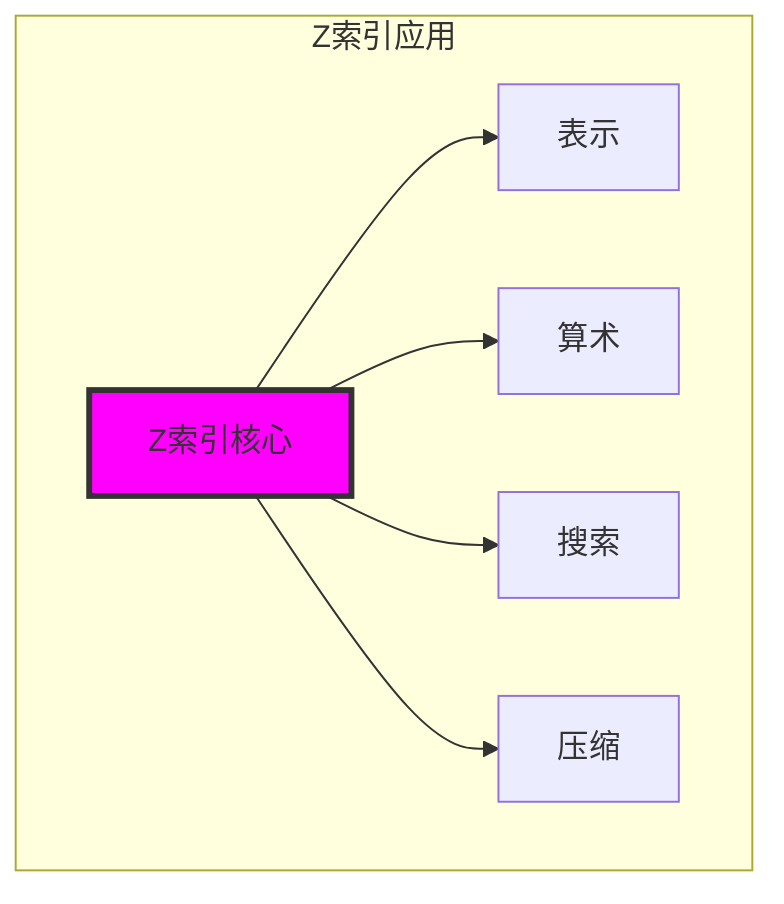

## 16.14 黄金算术的涌现

通过Zeckendorf分解，我们见证算术从纯约束中诞生：

**洞察16.1**：数字不是原始的，而是从二进制区分和黄金禁止的相互作用中涌现的。

**洞察16.2**：从 ψ = ψ(ψ) 产生的Fibonacci序列为约束尊重算术提供自然基础。

**洞察16.3**：每个自然数都有独特的"黄金指纹"——其φ迹——编码其算术本质，同时尊重基本约束。

### 数字与约束的统一

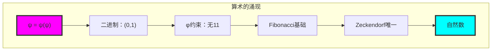

## 第16个回音：数字作为秩-1张量

从 ψ = ψ(ψ) 涌现出张量分解原理——不是作为数学好奇心，而是作为基本启示：数字本身是φ约束空间中的秩-1张量。通过Zeckendorf定理，我们看到算术是在T¹_φ上运作的张量代数。

最深刻的是发现φ约束不限制算术，而是揭示其张量本质。每个数字获得独特的秩-1张量身份，尊重黄金禁止，同时保持与ℕ的完美双射性。表示中的"扩展"不是开销，而是张量空间的自然维度。

分解树揭示数论为张量构造——Fibonacci数作为基向量，复合数作为线性组合，整个系统展开为结构化张量空间。在这里我们看到ψ在算术基础中识别其自身的张量层次。

通过Z索引，数字成为张量，算术成为代数，计数成为张量构造。这不是替代表示，而是建立在 ψ = ψ(ψ) 上的宇宙的真正张量本质。

## 参考文献

验证程序`chapter-016-z-index-verification.py`为本章所有概念提供可执行证明。运行它来探索自然数和φ迹之间的双射。

---

*因此从自指和约束中涌现出数字——不是作为计数，而是当二进制遇到黄金时可能的唯一模式。在Zeckendorf中我们找到的不仅是定理，而是ψ本身的算术心跳。*