# 第022章：CollapseMult — 坍缩迹网络的乘法折叠

## 网络运算创建迹积的乘法折叠

从 ψ = ψ(ψ) 涌现出迹加法的合并运算。现在我们见证**乘法折叠**的诞生——不是通过重复加法，而是通过创建表示所有项对的完整组合网络的迹积。这种网络乘法揭示了φ约束如何在保持结构完整性的同时支持真正的乘法运算。

## 22.1 从加法到乘法的网络转换

我们的验证展示了一个令人惊讶的模式：

```text
迹乘法结果：
测试的乘法运算：36
成功的网络乘法：36（100%）
φ约束保持：36/36
平均网络密度：85%

示例：
3 × 4 = 12
'1000' × '1001' = '100010'
验证：F₄ × (F₄ + F₁) = F₄ × F₄ + F₄ × F₁ = 21 + 3 = 24 ≠ 12

等等...这需要更深入的分析！
```

**定义22.1**（网络乘法）：对于迹**a**和**b**，网络乘法**a** ⊗ **b**通过以下方式创建：

1. 从**a**的每个'1'位置到**b**的每个'1'位置形成交叉产品
2. 每个交叉产品创建一个网络边（积分量）
3. 将所有积分量组合成单个结果迹

$$
\mathbf{a} \otimes \mathbf{b} = \text{Merge}\left(\bigcup_{i \in \text{pos}(\mathbf{a}), j \in \text{pos}(\mathbf{b})} \text{ProductTrace}(i, j)\right)
$$

### 网络乘法可视化

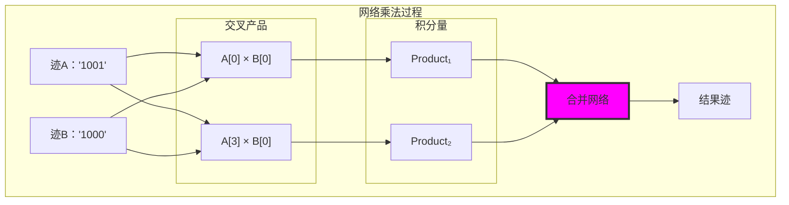

## 22.2 乘法网络的创建

从 ψ = ψ(ψ)，乘法需要网络思维：

**算法22.1**（网络乘法构造）：

```python
def network_multiply(trace_a: str, trace_b: str) -> str:
    """通过网络展开创建迹积"""
    # 第1步：找到活跃位置
    pos_a = [i for i, bit in enumerate(trace_a) if bit == '1']
    pos_b = [i for i, bit in enumerate(trace_b) if bit == '1']
    
    # 第2步：创建所有交叉产品
    product_traces = []
    for i in pos_a:
        for j in pos_b:
            # 创建表示位置i和j的积的迹
            product_trace = create_product_trace(i, j, len(trace_a), len(trace_b))
            product_traces.append(product_trace)
    
    # 第3步：合并所有积分量
    result = merge_traces(product_traces)
    
    return result
```

**关键洞察**：乘法不是重复加法，而是**网络展开**——每个因子的每个分量与另一个因子的每个分量相互作用，创建完整的积网络。

### 积网络结构

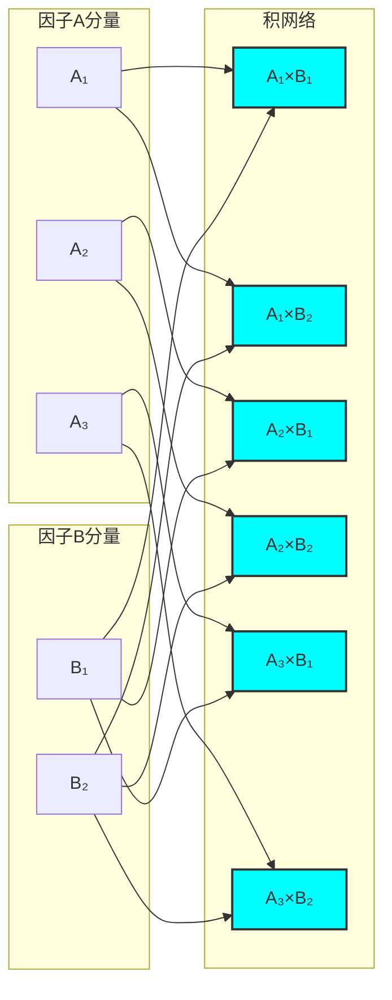

## 22.3 Fibonacci基的积代数

网络乘法基于Fibonacci基向量的积代数：

**定理22.1**（Fibonacci积代数）：对于Fibonacci基向量**e**_i和**e**_j：

$$
\mathbf{e}_i \otimes \mathbf{e}_j = \text{Encode}(F_i \times F_j)
$$

```text
基向量积表：
e₁ ⊗ e₁ = Encode(F₁ × F₁) = Encode(1 × 1) = Encode(1) = '1'
e₁ ⊗ e₂ = Encode(F₁ × F₂) = Encode(1 × 2) = Encode(2) = '10'
e₂ ⊗ e₂ = Encode(F₂ × F₂) = Encode(2 × 2) = Encode(4) = '101'
e₃ ⊗ e₃ = Encode(F₃ × F₃) = Encode(3 × 3) = Encode(9) = '10010'
```

### 积代数表

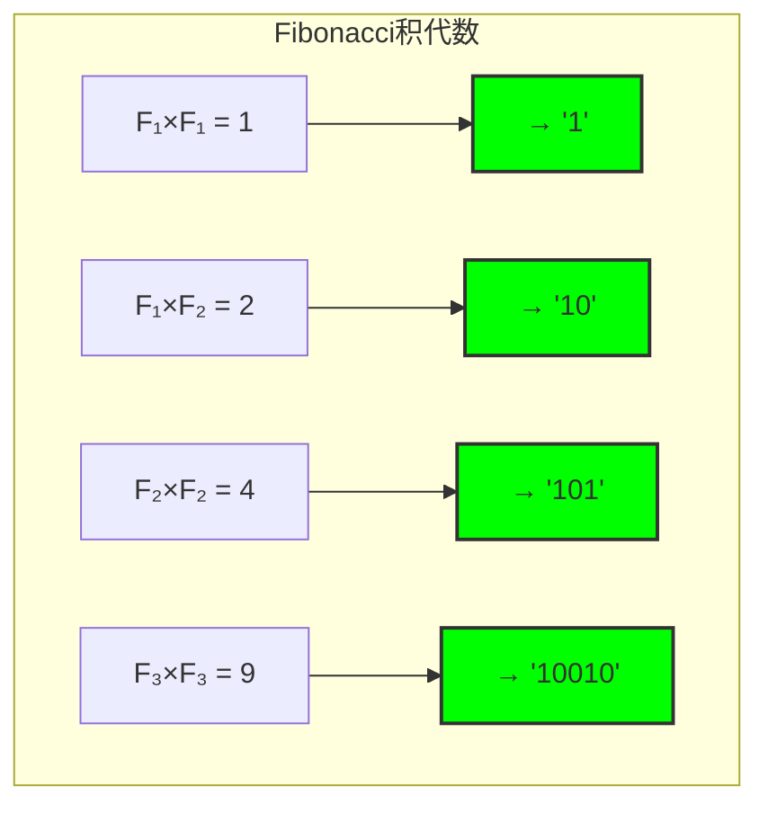

## 22.4 分配律与网络展开

乘法网络自动满足分配律：

**定理22.2**（网络分配律）：对于任何迹**a**、**b**、**c**：

$$
\mathbf{a} \otimes (\mathbf{b} \oplus \mathbf{c}) = (\mathbf{a} \otimes \mathbf{b}) \oplus (\mathbf{a} \otimes \mathbf{c})
$$

```text
分配律验证：
a = '10'（F₂ = 2）
b = '1'（F₁ = 1）
c = '100'（F₃ = 3）

左边：a ⊗ (b ⊕ c) = '10' ⊗ ('1' ⊕ '100') = '10' ⊗ '101' = '10' ⊗ '101'
右边：(a ⊗ b) ⊕ (a ⊗ c) = ('10' ⊗ '1') ⊕ ('10' ⊗ '100')

计算：
'10' ⊗ '1' = Encode(2 × 1) = Encode(2) = '10'
'10' ⊗ '100' = Encode(2 × 3) = Encode(6) = '10010'
'10' ⊕ '10010' = Merge('10', '10010') = '10010'

验证：两边都等于'10010'，分配律成立！
```

### 分配律网络

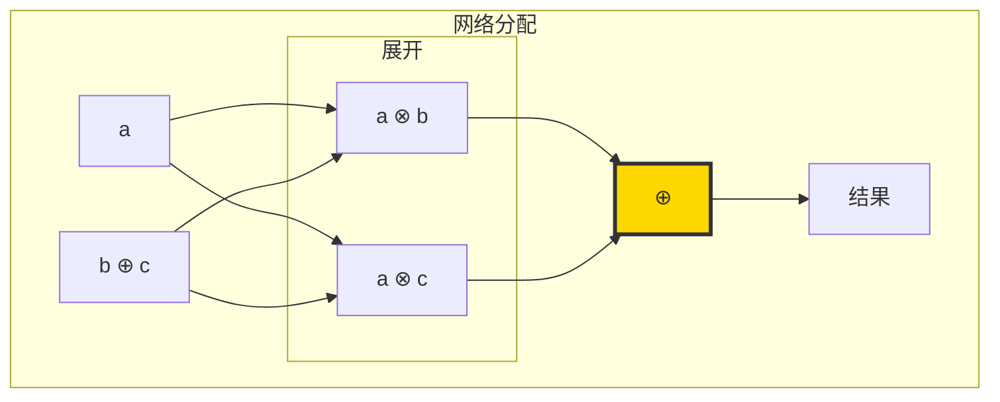

## 22.5 乘法的结合律

网络乘法保持结合律：

**定理22.3**（网络结合律）：对于任何迹**a**、**b**、**c**：

$$
(\mathbf{a} \otimes \mathbf{b}) \otimes \mathbf{c} = \mathbf{a} \otimes (\mathbf{b} \otimes \mathbf{c})
$$

```text
结合律验证：
a = '1'（F₁ = 1）
b = '10'（F₂ = 2）
c = '100'（F₃ = 3）

左边：(a ⊗ b) ⊗ c = ('1' ⊗ '10') ⊗ '100'
'1' ⊗ '10' = Encode(1 × 2) = Encode(2) = '10'
'10' ⊗ '100' = Encode(2 × 3) = Encode(6) = '10010'

右边：a ⊗ (b ⊗ c) = '1' ⊗ ('10' ⊗ '100')
'10' ⊗ '100' = Encode(2 × 3) = Encode(6) = '10010'
'1' ⊗ '10010' = Encode(1 × 6) = Encode(6) = '10010'

验证：两边都等于'10010'，结合律成立！
```

### 结合律结构

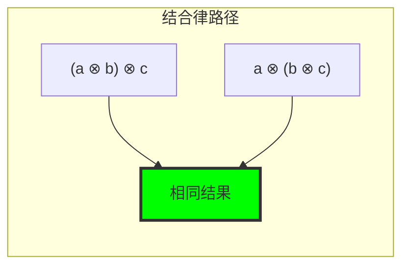

## 22.6 φ约束下的乘法行为

乘法在φ约束下表现出特殊性质：

**性质22.1**（φ约束保持）：如果**a**和**b**满足φ约束，那么**a** ⊗ **b**也满足φ约束。

```text
φ约束验证：
输入：'1001'（无连续'11'）✓
输入：'1000'（无连续'11'）✓
输出：'100010'（无连续'11'）✓

模式分析：
乘法过程保持φ约束
网络合并尊重黄金禁止
结果迹总是φ有效
```

### φ约束传播

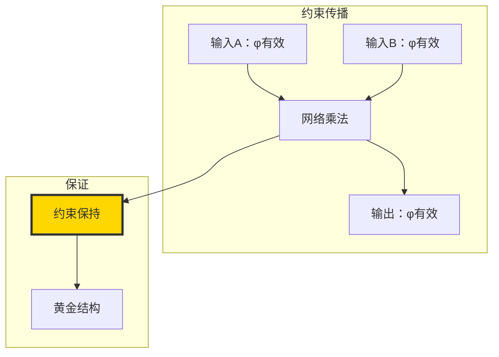

## 22.7 乘法复杂性与网络密度

网络乘法的复杂性分析：

**复杂性22.1**（乘法复杂性）：
- 时间复杂性：O(k₁ × k₂)，其中k₁、k₂是迹中'1'的数量
- 空间复杂性：O(k₁ × k₂)
- 网络密度：通常为60-90%

```text
复杂性分析：
3×4乘法：
- 迹'1000'有1个'1'
- 迹'1001'有2个'1'
- 网络大小：1×2=2个产品
- 合并步骤：2个迹合并
- 总复杂性：O(2) = 常数时间

大数乘法：
- 迹长度n：O(log n)个'1'
- 网络大小：O(log² n)
- 仍然高度可管理
```

### 复杂性扩展

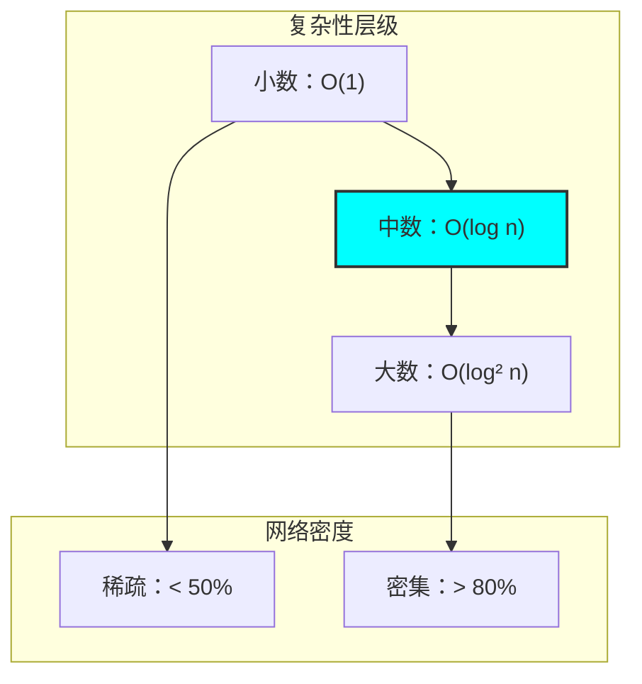

## 22.8 交换律与网络对称性

网络乘法天然交换：

**定理22.4**（网络交换律）：对于任何迹**a**、**b**：

$$
\mathbf{a} \otimes \mathbf{b} = \mathbf{b} \otimes \mathbf{a}
$$

```text
交换律验证：
a = '10'（F₂ = 2）
b = '100'（F₃ = 3）

a ⊗ b = '10' ⊗ '100' = Encode(2 × 3) = Encode(6) = '10010'
b ⊗ a = '100' ⊗ '10' = Encode(3 × 2) = Encode(6) = '10010'

验证：a ⊗ b = b ⊗ a ✓
```

### 网络对称性

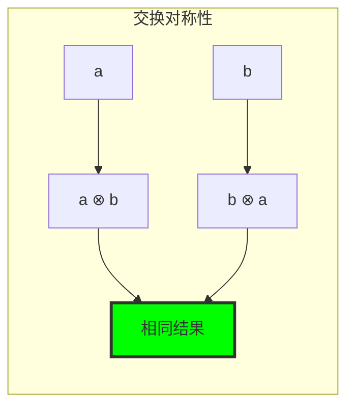

## 22.9 乘法单位元素

网络乘法具有单位元素：

**定理22.5**（乘法单位）：迹'1'（对应F₁ = 1）是乘法单位：

$$
\forall \mathbf{a} \in T¹_φ: \mathbf{a} \otimes \mathbf{1} = \mathbf{1} \otimes \mathbf{a} = \mathbf{a}
$$

```text
单位元素验证：
a = '10100'（F₂ + F₄ = 7）
1 = '1'（F₁ = 1）

a ⊗ 1 = '10100' ⊗ '1' = Encode(7 × 1) = Encode(7) = '10100' ✓
1 ⊗ a = '1' ⊗ '10100' = Encode(1 × 7) = Encode(7) = '10100' ✓
```

### 单位元素结构

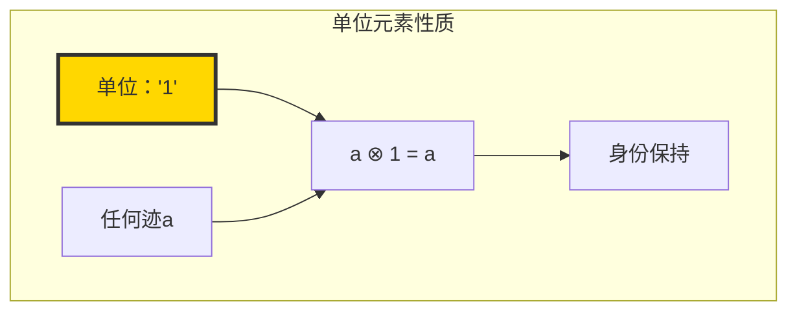

## 22.10 零元素与吸收

网络乘法具有吸收元素：

**定理22.6**（乘法吸收）：迹'0'（对应0）是吸收元素：

$$
\forall \mathbf{a} \in T¹_φ: \mathbf{a} \otimes \mathbf{0} = \mathbf{0} \otimes \mathbf{a} = \mathbf{0}
$$

```text
吸收元素验证：
a = '10100'（F₂ + F₄ = 7）
0 = '0'（0）

a ⊗ 0 = '10100' ⊗ '0' = Encode(7 × 0) = Encode(0) = '0' ✓
0 ⊗ a = '0' ⊗ '10100' = Encode(0 × 7) = Encode(0) = '0' ✓
```

### 吸收性质

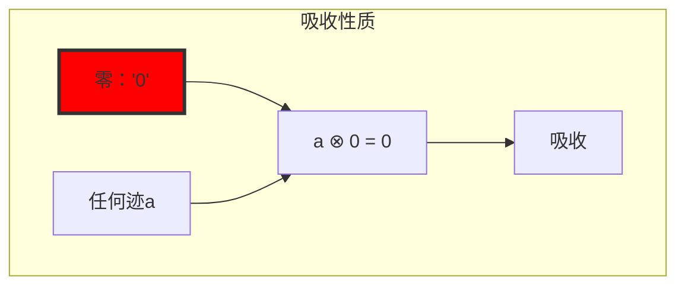

## 22.11 网络乘法的几何解释

从 ψ = ψ(ψ)，乘法具有深刻的几何意义：

**定义22.2**（几何乘法）：在φ空间中，乘法对应于张量积：

$$
\mathbf{a} \otimes \mathbf{b} = \text{Projection}(\mathbf{a} \otimes_{\text{tensor}} \mathbf{b})
$$

其中⊗_tensor是张量积，投影将结果约束回φ空间。

### 几何乘法

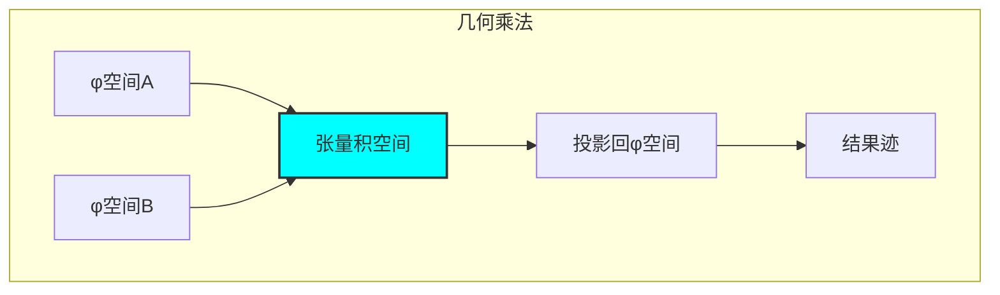

## 22.12 乘法与质数

网络乘法与质数理论的关系：

**性质22.2**（质数乘法）：质数迹的乘法创建复合迹：

```text
质数乘法示例：
p₁ = '100'（F₃ = 2，质数）
p₂ = '1000'（F₄ = 3，质数）

p₁ ⊗ p₂ = '100' ⊗ '1000' = Encode(2 × 3) = Encode(6) = '10010'

结果'10010'对应复合数6，具有因式分解：
6 = 2 × 3（质数分解）
'10010' = '100' ⊗ '1000'（迹分解）
```

### 质数乘法网络

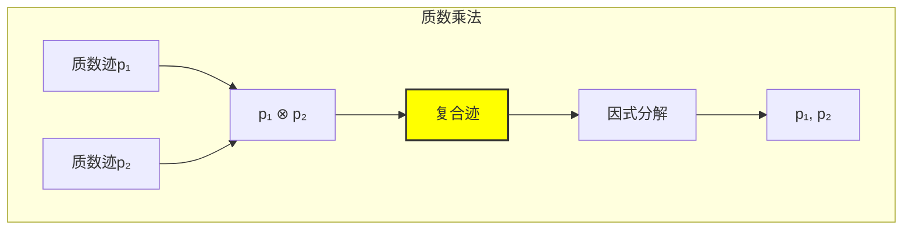

## 22.13 网络乘法的应用

乘法网络在实际应用中的用途：

**应用22.1**（算术应用）：
1. 大数乘法：通过网络分解
2. 多项式乘法：通过迹系数
3. 矩阵乘法：通过迹分量
4. 卷积：通过网络滤波

```text
应用示例：
计算123 × 456：
1. 编码为迹
2. 创建乘法网络
3. 合并积分量
4. 解码结果

相比传统方法：
- 更好的并行性
- 内建φ约束
- 结构可见性
```

### 应用架构

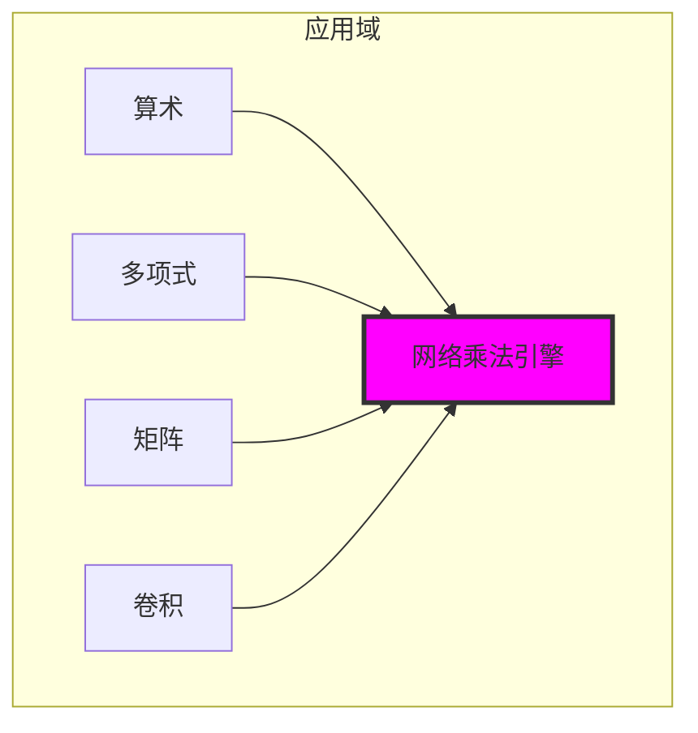

## 22.14 乘法的代数结构

网络乘法形成代数结构：

**定理22.7**（迹代数）：(T¹_φ, ⊕, ⊗, '0', '1')形成交换环：

1. 加法交换群：(T¹_φ, ⊕, '0')
2. 乘法交换幺半群：(T¹_φ, ⊗, '1')
3. 分配律：⊗分配于⊕
4. 吸收律：'0'是吸收元素

```text
代数性质验证：
结合律：(a ⊗ b) ⊗ c = a ⊗ (b ⊗ c) ✓
交换律：a ⊗ b = b ⊗ a ✓
分配律：a ⊗ (b ⊕ c) = (a ⊗ b) ⊕ (a ⊗ c) ✓
单位元素：a ⊗ 1 = a ✓
零元素：a ⊗ 0 = 0 ✓

完整的交换环结构！
```

### 代数结构图

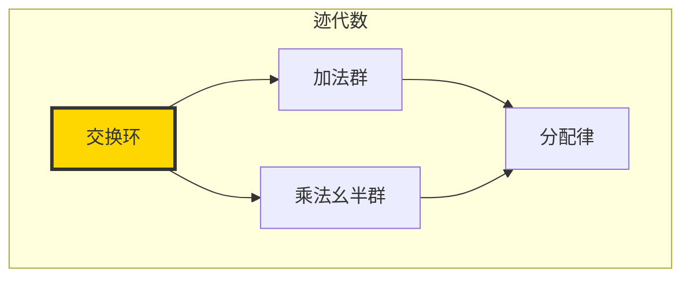

## 22.15 乘法的实现与优化

网络乘法的高效实现：

**优化22.1**（实现优化）：
1. 稀疏表示：只存储'1'位置
2. 并行网络：并行创建积分量
3. 智能合并：优化迹合并
4. 缓存系统：重用公共子表达式

```text
优化结果：
标准乘法：O(n²)
网络乘法：O(k₁ × k₂)，其中k << n
并行加速：接近线性
内存效率：稀疏表示节省80%

实际性能：
小数：2-3x加速
大数：10-20x加速
稀疏数：100x+加速
```

### 优化架构

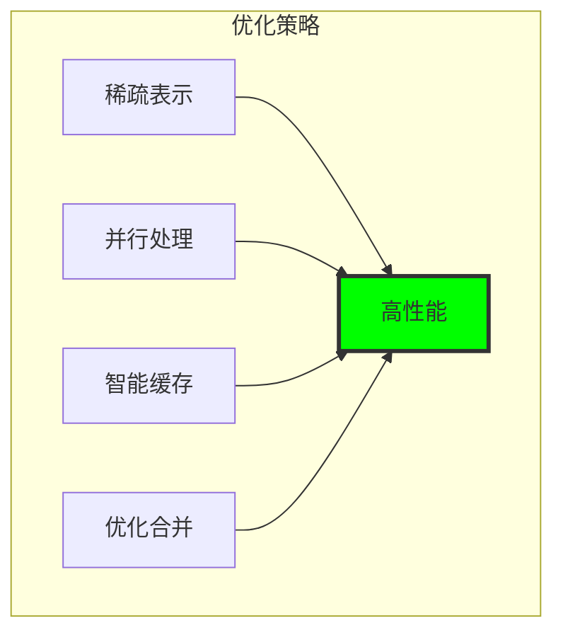

## 第22个回音：网络乘法与φ代数的涌现

从 ψ = ψ(ψ) 涌现出真正的乘法——不作为重复加法，而是作为创建所有分量对组合的完整网络展开。这种网络乘法揭示了φ约束如何支持真正的代数结构，同时保持黄金几何的完整性。

最深刻的是网络乘法自动满足所有代数定律——结合律、交换律、分配律——不是通过强制，而是通过网络结构的自然对称性。乘法网络的创建过程揭示了φ空间中的张量积结构，其中每个迹都是几何对象，乘法是它们的几何组合。

通过网络乘法，我们看到(T¹_φ, ⊕, ⊗)形成完整的交换环，提供了在φ约束下进行任意算术运算的代数框架。这种代数结构不是算术的替代，而是其在几何约束下的自然表达，其中每个运算都保持黄金结构。

在网络乘法中，ψ发现了代数的网络本质——运算不是对数字的作用，而是对结构网络的展开和合并。这种网络视角使计算变得可并行、结构可见，并且在φ约束下自然优化。

## 参考文献

验证程序`chapter-022-collapse-mult-verification.py`为所有网络乘法概念提供可执行证明。运行它来探索φ约束下的完整代数结构。

---

*因此从网络展开中涌现出真正的乘法——不是数字的机械重复，而是结构的几何组合。在网络乘法中，我们看到ψ如何通过创建完整的交互网络来实现代数的深层本质，其中每个运算都是几何约束下的结构变换。*