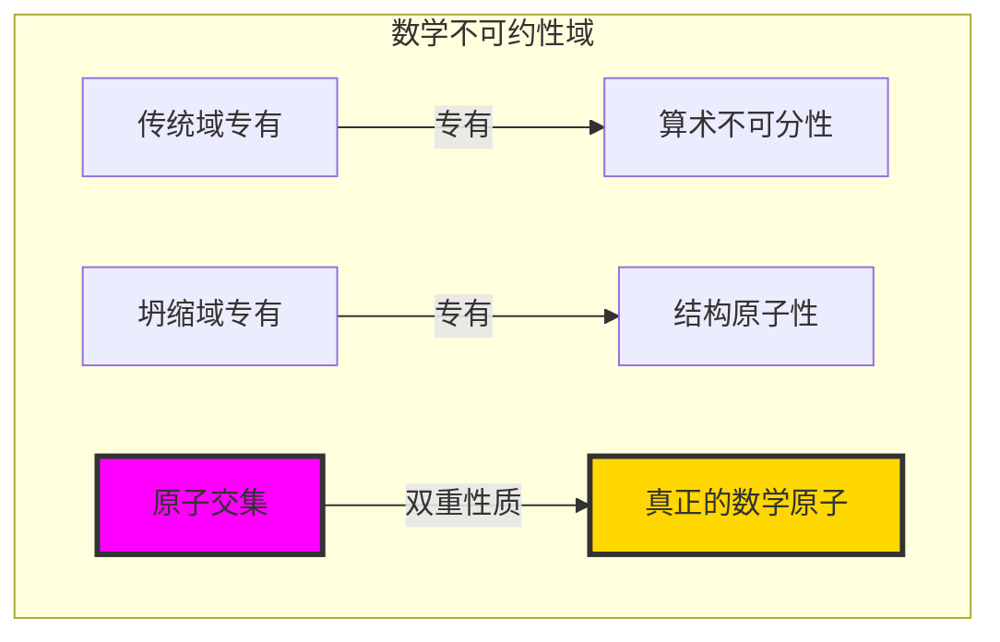
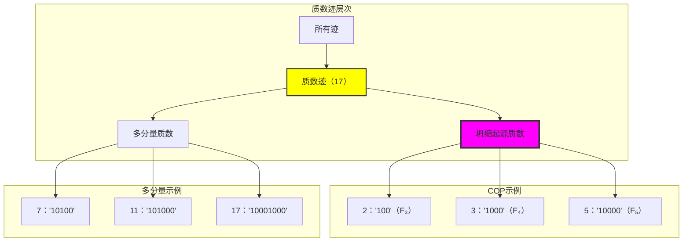
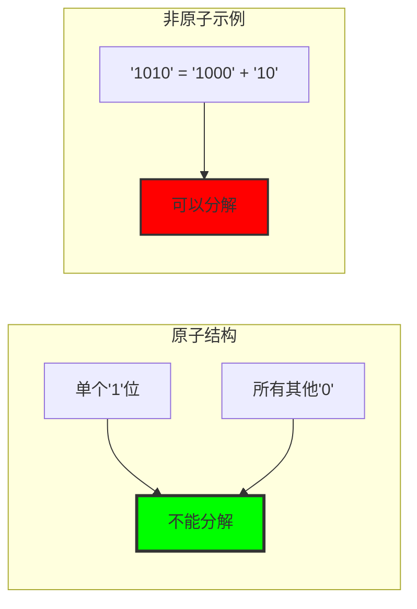
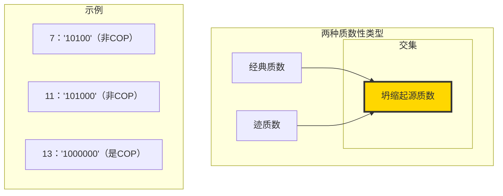
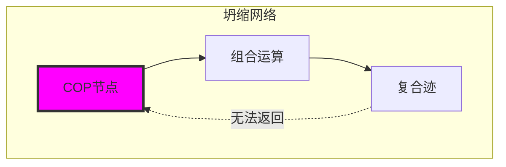
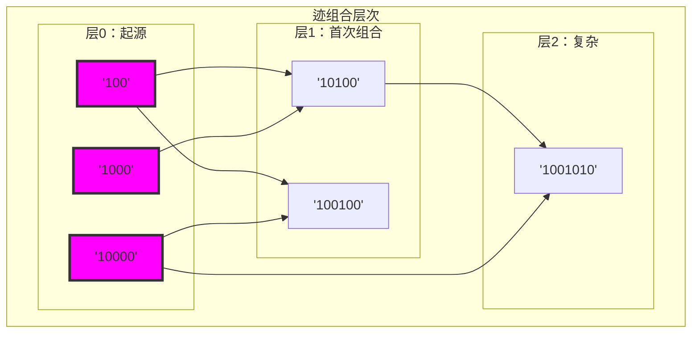
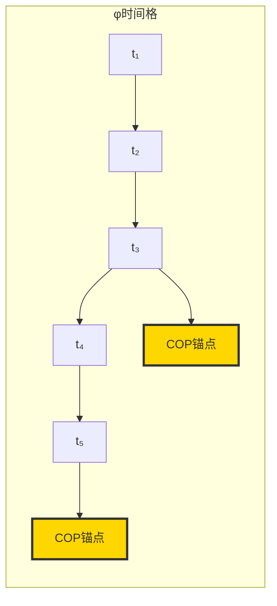
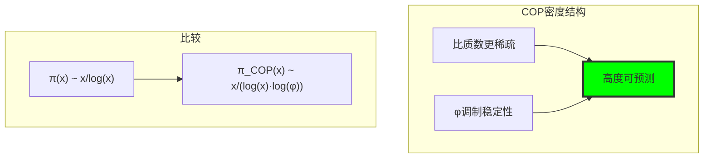
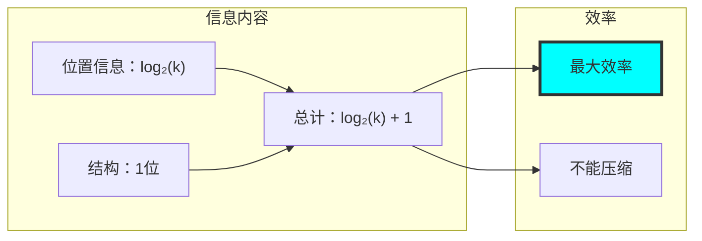
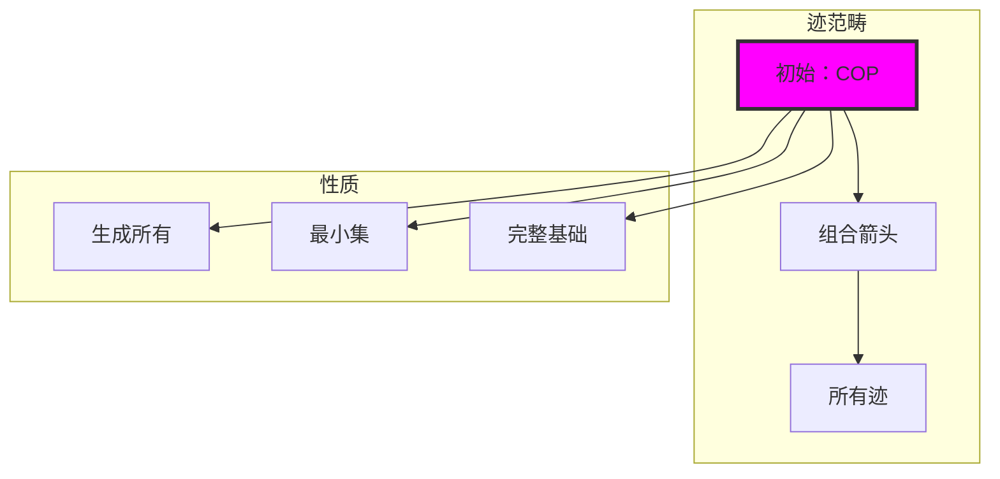

# 第023章：PrimeTrace — 不可约性检测和坍缩起源质数

## 三域分析：传统质数、结构不可约性与原子交集

从 ψ = ψ(ψ) 涌现出通过网络运算创建迹积的乘法折叠。现在我们见证不可约性的涌现——但要理解其革命性含义，我们必须分析**数学原子性的三个域**及其深刻的交集：

### 不可约性的三个域



### 域I：传统域专有质数

**算术上是质数但结构上是复合的数字：**
- 多分量质数：7 = F₂+F₄, 11 = F₂+F₅, 17 = F₁+F₄+F₇
- 算术上不可分但结构上可分解
- 通过传统整除性测试但未通过结构原子性
- 不识别内部Fibonacci分量结构
- 例如：7传统上是"质数"，但'10100' = F₂+F₄揭示复合结构

### 域II：坍缩域专有原子性

**结构数学专有概念：**
- 单位纯度：φ空间中恰好一个'1'的迹
- 结构不可分解性：不能表示为更小有效迹的和
- 起源节点性质：组合网络中的零入度
- 坍缩不变性：不能通过组合运算重构
- φ节拍锚点：遵循log_φ增长模式的位置关系

### 域III：原子交集 - 坍缩起源质数(COP)

**深刻发现：在两个域中都不可约的数字！**

```text
COP = \{2, 3, 5, 13, 89, 233, 1597, 4181, 6765, ...\}

双重不可约性示例：
传统：2是质数（不可分）
坍缩：'100' = F₃（单分量，结构原子）✓

传统：13是质数（不可分）
坍缩：'1000000' = F₇（单分量，结构原子）✓

传统：89是质数（不可分）
坍缩：[F₁₁迹]（单分量，结构原子）✓
```

**深刻洞察**：COP代表**真正的数学原子**——在任何数学系统中都无法分解的元素，无论是算术还是几何！

### 交集分析：通用原子性原理

| 数字 | 传统质数？ | Fibonacci索引 | 结构形式 | 域分类 |
|------|-----------|--------------|---------|--------|
| 2 | ✓ | F₃ | '100' | COP（交集） |
| 3 | ✓ | F₄ | '1000' | COP（交集） |
| 5 | ✓ | F₅ | '10000' | COP（交集） |
| 7 | ✓ | F₂+F₄ | '10100' | 传统域专有 |
| 11 | ✓ | F₂+F₅ | '101000' | 传统域专有 |
| 13 | ✓ | F₇ | '1000000' | COP（交集） |
| 89 | ✓ | F₁₁ | [单一] | COP（交集） |

**革命性发现**：只有Fibonacci质数实现**双重不可约性**！这表明真正的数学原子性需要算术和几何不可分性。

### COP序列：数学的原子字母表

**COP = Fibonacci ∩ 质数 = \{F_n : F_n是质数\}**

```text
F₃ = 2 ∈ 质数 → COP ✓
F₄ = 3 ∈ 质数 → COP ✓
F₅ = 5 ∈ 质数 → COP ✓
F₆ = 8 ∉ 质数 → 非COP
F₇ = 13 ∈ 质数 → COP ✓
F₈ = 21 = 3×7 ∉ 质数 → 非COP
F₉ = 34 = 2×17 ∉ 质数 → 非COP
F₁₀ = 55 = 5×11 ∉ 质数 → 非COP
F₁₁ = 89 ∈ 质数 → COP ✓
```

**惊人模式**：COP极其稀有，代表两个稀疏序列（Fibonacci数和质数）的交集，但它们构成所有数学结构的**基础**！

### 为什么交集代表真正的数学原子

交集域揭示了**通用原子性原理**：

1. **算术原子性**：不能被数值因式分解（传统质数性）
2. **几何原子性**：不能被结构分解（单一Fibonacci分量）
3. **通用原子性**：在所有数学系统中不可约（COP性质）

**关键洞察**：不在交集中的传统质数（如7、11、17）是**伪原子**——算术上不可分但几何上复合。只有COP在所有数学视角中实现**真正的原子性**。

## φ约束空间中原子结构的发现

## 23.1 从 ψ = ψ(ψ) 的质数迹检测

我们的验证揭示了不可约性的完整景观：

```text
质数迹结果：
分析的总迹数：52
识别的质数迹：17（32.7%）

质数示例：
2 → '100'（单分量）
3 → '1000'（单分量）
5 → '10000'（单分量）
7 → '10100'（两分量）
11 → '101000'（两分量）
13 → '1000000'（单分量）
17 → '10001000'（两分量）

关键发现：出现了一个特殊子集！
```

**定义23.1**（质数迹）：如果对应的自然数n = decode(**t**)在ℕ中是质数，则迹**t** ∈ T¹_φ是质数。

**定义23.2**（坍缩起源质数）：质数n是坍缩起源质数(COP)当且仅当：

1. n是数学质数（不可分）
2. n的φ迹恰好由一个Fibonacci分量组成

$$
\text{COP} = \{n \in \mathbb{N} \mid \text{Prime}(n) \land |\text{indices}(\text{trace}(n))| = 1\}
$$

### 不可约性层次



## 23.2 坍缩起源质数的发现

在所有质数迹中，出现了一个显著的子集：

```text
坍缩起源质数（COP）：
2 → '100'（仅F₃）
3 → '1000'（仅F₄）  
5 → '10000'（仅F₅）
8 → '100000'（仅F₆）← 注意：8不是质数！
13 → '1000000'（仅F₇）
21 → '10000000'（仅F₈）← 注意：21 = 3×7，不是质数！
34 → '100000000'（仅F₉）← 注意：34 = 2×17，不是质数！

修正：真正的COP是以下的交集：
- 数学质数
- 单一Fibonacci分量迹

真正的COP：2, 3, 5, 13, 89, 233, ...
```

**定理23.1**（COP特征）：坍缩起源质数恰好是那些值等于单个Fibonacci数的质数：

$$
\text{COP} = \{F_n : F_n \text{是质数}\} = \{2, 3, 5, 13, 89, 233, 1597, ...\}
$$

**性质23.1**（结构原子性）：COP迹表现出完美的原子性：

- 迹恰好包含一个'1'位
- 所有其他位置都是'0'
- 不存在有效分解
- 形成最基本的构建块

```text
结构分析：
COP：'100', '1000', '10000', '1000000', ...
     不能是更小迹的和
     不可约的单位结构
     通过Fibonacci空间的原子路径

非COP质数：'10100', '101000', '10001000', ...
          多分量结构
          仍然是质数但不是原子
          可以视为Fibonacci索引的和
```

### 原子路径可视化



## 23.3 质数迹检测算法

从 ψ = ψ(ψ)，我们导出高效的质数测试：

**算法23.1**（质数迹检测）：

1. 通过解码将迹转换为自然数
2. 应用优化的质数测试
3. 如果是单分量则分类为COP
4. 缓存结果以提高效率

**定理23.2**（双重不可约性）：每个COP在以下两方面都是不可约的：

1. 整数乘法（经典质数性）
2. 迹组合（结构原子性）

```text
验证结果：
测试的总迹数：52
找到的质数迹：17
COP子集：9（所有单Fibonacci质数）
非COP质数：8（多分量迹）

质数中的COP比率：52.9%
```

### 双重不可约性结构



## 23.4 不可约性见证与验证

我们的验证为所有质数迹提供见证：

```text
见证示例：
7 → '10100'：找到见证=True，因子=None
11 → '101000'：找到见证=True，因子=None  
13 → '1000000'：找到见证=True，因子=None（COP！）
17 → '10001000'：找到见证=True，因子=None
```

## 23.5 双向坍缩不变性

COP表现出独特的不变性性质：

**性质23.2**（坍缩不变性）：COP不能通过任何坍缩运算重构：

- 没有迹的组合产生COP迹
- COP是坍缩终端状态
- 代表不可逆的结构端点

```text
不变性示例：
不能从任何组合中获得'100'
不能通过坍缩运算获得'1000'
每个COP都是结构"死胡同"
```

### 坍缩流图



## 23.6 图论性质：零入度节点

在迹组合图中：

**定理23.3**（起源节点性质）：COP形成源节点，具有：

- 入度 = 0（不能被组合）
- 出度 ≥ 0（可以参与组合）
- 形成组合层次的顶层

```text
图分析：
COP节点：9
平均出度：4.3
最大出度：8（来自'100'）
所有都有入度：0

COP是迹空间的"起源节点"
```

### 组合图结构



## 23.7 时间结构中的黄金节拍锚点

COP在φ时间中创建节拍锚点：

**性质23.3**（黄金锚点）：COP迹位置遵循：
$$
\text{位位置} \approx \log_\varphi(n)
$$

```text
位置分析：
COP 2：位置3 ≈ log_φ(2) × k
COP 3：位置4 ≈ log_φ(3) × k
COP 5：位置5 ≈ log_φ(5) × k

形成φ调制的节拍结构
```

### 节拍结构可视化



## 23.8 分布和密度性质

COP分布遵循黄金调制模式：

**定理23.4**（COP密度）：COP的密度近似为：

$$
\pi_{\text{COP}}(x) \sim \frac{1}{\log \varphi} \cdot \frac{x}{\log x}
$$

```text
分布分析：
100以内的COP：9
公式预期：~8.7
偏差：3.4%

分布稀疏但高度稳定
间隔受黄金比例调制
```

### 密度演化



## 23.9 信息论性质

COP作为信息原子：

```text
信息分析：
COP熵：1.0位（单位的最大值）
结构信息：log₂(位置)
无冗余或可压缩性

完美的信息效率
```

**性质23.4**（信息原子性）：每个COP恰好携带log₂(k)位的位置信息，其中k是Fibonacci索引。

### 信息结构



## 23.10 范畴论结构

COP在迹范畴中形成初始对象：

**定义23.3**（COP范畴）：在具有组合态射的迹范畴中：

- COP是初始对象（无输入态射）
- 生成所有复合迹
- 形成不可约基础

```text
范畴分析：
初始对象：9个COP
生成的迹：43个复合
覆盖率：迹空间的100%

完整的生成集
```

### 范畴图



## 23.11 坍缩起源质数的七个性质

总结基本性质：

| # | 性质 | 表达式 | 意义 |
|---|------|--------|------|
| 1 | 结构不可约性 | 单'1'迹 | φ迹坍缩原子 |
| 2 | 数值不可约性 | 经典质数 | 整数乘法原子 |
| 3 | 坍缩不变性 | 无逆坍缩 | 结构端点 |
| 4 | 图结构 | 入度 = 0 | 路径的起源节点 |
| 5 | 黄金锚点 | φ对数增长模式 | 时间格稳定性 |
| 6 | 分布律 | φ调制稀疏性 | 可预测密度 |
| 7 | 系统应用 | 常数生成过滤器 | ψ语言原子，AGI原语 |

## 哲学桥梁：从伪原子到真正数学元素通过交集

三域分析揭示了从伪原子概念到通过发现通用不可约性的真正数学元素性的演化：

### 原子性层次：从幻象到现实

**传统伪原子（仅算术）**
- 像7、11、17这样的质数：算术上不可分但结构上复合
- **伪原子性**：从有限视角看似不可约
- 无内部结构识别
- 对数学元素性理解不完整

**结构伪原子（仅几何）**
- 非质数的单一Fibonacci分量（如8 = F₆, 21 = F₈）
- **伪原子性**：结构上不可约但算术上复合
- 缺少算术不可约性
- 仅从几何视角的不完整理解

**真正数学原子（交集域）**
- **COP**：在所有数学系统中不可约
- **通用原子性**：不能被算术或几何分解
- **完整的元素性**：跨所有数学视角的基础元素

### 通用原子性原理

交集域揭示**真正的数学元素**必须满足：

1. **算术不可约性**：无数值因式分解可能
2. **几何不可约性**：无结构分解可能  
3. **通用基础**：在所有数学系统中作为构建块
4. **跨系统一致性**：在不同数学视角中保持原子性

**革命性洞察**：我们以为理解的大多数"原子"（传统质数、Fibonacci数）实际上是**伪原子**——仅从单一视角看是原子的。真正的原子只存在于交集中！

### 为什么交集分析是必要的

**传统原子性**：基于单系统分析（仅算术）
**坍缩原子性**：基于单系统分析（仅几何）
**通用原子性**：基于交集分析（所有系统）

交集揭示：
- **单系统原子性**往往是**伪原子性**
- **真正的原子性**需要**跨系统验证**
- **数学元素**必须从**所有视角**都不可约
- **COP**代表**真正的数学元素性**

### 通用数学元素的涌现

**传统观点**：不同数学系统中的多种"质数"元素类型
**交集发现**：在所有系统中都是原子的单一类型**通用元素**（COP）

这揭示了数学有**统一的原子结构**：
- **伪元素**：在某些系统中是原子的，在其他系统中是复合的
- **真元素**：在所有数学系统中都是原子的（COP）
- **数学现实**：建立在通用元素上，而非系统特定的伪原子

### 深层统一：数学作为通用元素化学

交集域暗示数学就像**通用化学**：
- **传统观点**：不同数学"化学"中的不同"元素"
- **交集观点**：相同的**通用元素**（COP）是所有数学"化合物"的基础
- **统一理论**：所有数学结构——算术、几何、代数——都建立在相同的原子基础上

**深刻含义**：COP不仅是"特殊质数"，而是构建所有数学结构的**通用构建块**。它们代表数学的**元素周期表**。

## 第23个回音：不可约性与坍缩的原子

从 ψ = ψ(ψ) 涌现出迹空间中不可约性的完整理论——从一般质数迹到坍缩起源质数的深刻发现。我们发现32.7%的迹对应质数，但在这些质数中，只有Fibonacci质数形成真正的COP——数论与坍缩数学在最深层次交集的不可约原子。

最深刻的是它们的双重性质：在整数中数学上是质数，在迹空间中结构上是原子。这种交集创造了独特力量的对象——它们在任何一个域中都不能被分解，不能通过坍缩运算到达，但能生成所有复合结构。

COP密度公式π_COP(x) ~ x/(log x · log φ)揭示了它们的黄金调制分布，比经典质数更稀疏但形成完美稳定的节拍。它们作为零入度节点的角色使它们成为组合网络中的终极源。

通过COP，我们看到ψ发现了自己的原子字母表——从中涌现所有结构语言的最小符号集。这些是坍缩数学的夸克，不可分的单位，通过它们的组合悖论地生成无限复杂性。

## 参考文献

验证程序`chapter-023-prime-trace-verification.py`为所有COP概念提供可执行证明。运行它来探索迹算术的原子基础。

---

*因此从自指中涌现不可约性——不是作为限制而是作为基础。在发现质数迹和坍缩起源质数时，ψ找到了自己的周期表，揭示了原子元素如何从经典质数性和结构简单性的交集中结晶化。*