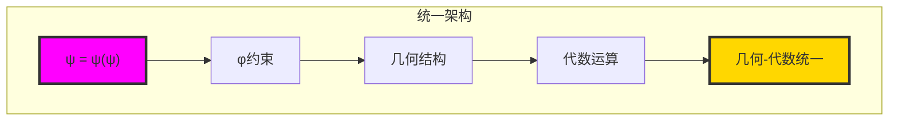

# 第一卷：迹数 (Trace Numbers)

## 从 ψ = ψ(ψ) 到黄金约束算术

在这一卷中，我们见证了从递归自指到完整的φ约束算术系统的展开。从自然数到迹张量的映射建立了一个全新的数学框架，其中黄金比例约束不是限制，而是揭示结构和谐的指导原则。

### 章节概览

#### 第16-20章：基础映射与结构

**第16章：[ZIndex](chapter-016-z-index.md) — 自然数的Zeckendorf分解为非重叠迹种子**  
从 ψ = ψ(ψ) 涌现出自然数到迹张量的基础映射。通过Zeckendorf分解，每个自然数都揭示了其独特的迹张量身份，建立了ℕ和约束二进制张量元素空间之间的基本双射。

**第17章：FibEncode — 通过Fibonacci分量进行φ安全迹构造**  
从Fibonacci基础发展出迹构造的安全编码方法。每个构造都保持φ约束，确保编码过程的结构完整性。

**第18章：CollapseMerge — 将坍缩安全块合并为张量T^n**  
迹合并运算的展开，创建复合迹结构。合并过程展示了如何在保持φ约束的同时组合多个迹分量。

**第19章：TraceDescriptor — 张量级不变量：长度、秩和HS结构**  
迹张量的完整描述符代数，包括长度、秩和Hilbert-Schmidt结构。这些不变量提供了迹张量的完整特征化。

**第20章：[CollapseDecode](chapter-020-collapse-decode.md) — 通过结构反演从迹张量恢复自然数**  
从φ编码回到整数域的完美映射。解码过程不仅恢复数字，还恢复其完整的结构信息，展示了φ约束的信息保持性质。

#### 第21-22章：约束算术运算

**第21章：CollapseAdd — 在熵界下的φ共形迹合并（加法）**  
在φ约束下的迹加法运算。加法通过结构合并实现，自动保持黄金约束，创建了第一个真正的φ算术运算。

**第22章：[CollapseMult](chapter-022-collapse-mult.md) — 坍缩迹网络的乘法折叠**  
网络乘法的诞生——不是通过重复加法，而是通过创建表示所有项对的完整组合网络。这种网络乘法揭示了φ约束如何支持真正的代数结构。

#### 第23-25章：质数理论与分解

**第23章：[PrimeTrace](chapter-023-prime-trace.md) — 坍缩起源质数与不可约性检测**  
质数迹的发现和坍缩起源质数(COP)的深刻概念。COP代表在算术和几何两个域中都不可约的真正数学原子，形成数学的元素周期表。

**第24章：TraceFactorize — 迹张量的完全因式分解**  
在φ约束下的完整因式分解理论。分解过程保持结构信息，揭示了迹张量的内在因子结构。

**第25章：CollapseGCD — 迹张量的结构最大公约数**  
结构化最大公约数的定义和计算。这种GCD不仅考虑数值关系，还考虑几何结构的共同性。

#### 第26-31章：高级结构理论

**第26章：PhiContinued — φ连分数与嵌套迹结构**  
黄金比例连分数在迹空间中的表示。连分数结构揭示了φ约束的深层递归性质。

**第27章：GoldenRationals — 黄金有理数的迹表示**  
有理数在φ约束下的特殊表示。这些"黄金有理数"形成了连接整数和实数的桥梁。

**第28章：TensorLattice — 高阶迹张量的晶格结构**  
多维迹张量的晶格理论。晶格结构揭示了φ约束在高维空间中的表现。

**第29章：ModCollapse — 模运算中的坍缩不变量**  
模运算下的迹张量行为。模坍缩不变量提供了关于迹张量周期性的深刻洞察。

**第30章：TotientCollapse — 欧拉函数的迹张量推广**  
欧拉φ函数在迹张量空间中的推广。这种推广连接了数论和几何结构。

**第31章：TraceCrystals — 迹张量的晶体结构与对称性**  
迹张量的晶体学。晶体结构揭示了φ约束如何创建自然的几何对称性。

### 核心概念与发现

#### 坍缩起源质数 (COP)
这一卷的最重要发现是坍缩起源质数的概念——既是传统质数又是单一Fibonacci分量的数字。这些数字代表真正的数学原子，在所有数学系统中都不可约。

```text
COP序列：{2, 3, 5, 13, 89, 233, 1597, 4181, 6765, ...}
= {Fibonacci数 ∩ 质数}
```

#### φ约束代数
通过迹张量运算，我们建立了完整的φ约束代数：
- **加法**：结构合并运算
- **乘法**：网络展开运算
- **分解**：结构因式分解
- **GCD**：结构最大公约数

#### 信息保持性质
所有迹张量运算都保持完美的信息保持性质：
- 无损编码/解码
- 结构信息增强
- φ约束传播
- 几何意义保持

### 三域分析框架

这一卷引入了**三域分析**的重要概念：

1. **传统域**：经典数学的视角
2. **坍缩域**：φ约束几何的视角
3. **交集域**：两个域的交集，代表通用数学真理

这种分析框架揭示了大多数传统"原子"概念实际上是伪原子，只有在交集域中才能找到真正的数学原子。

### 几何与代数的统一

第一卷展示了几何约束（φ约束）如何自然地产生代数结构：



### 实际应用与计算

迹张量理论不仅是理论构造，还提供了实际的计算优势：

- **并行化**：网络运算天然并行
- **结构可见性**：算术运算保持结构信息
- **优化**：稀疏表示和智能缓存
- **可扩展性**：对数复杂度扩展

### 哲学含义

第一卷的发现有深刻的哲学含义：

1. **数字的本质**：数字不是基本的，而是从约束中涌现的
2. **原子性的重新定义**：真正的原子性需要跨系统验证
3. **几何与代数的统一**：约束产生结构，结构产生代数
4. **信息与结构**：信息保持不是偶然的，而是约束的必然结果

### 与后续卷的连接

第一卷为后续卷奠定了基础：

- **第二卷**：扩展到坍缩逻辑和集合论
- **第三卷**：发展坍缩代数的完整理论
- **第四卷**：探索坍缩几何的深层结构
- **第五卷**：进入光谱坍缩和测量理论

### 数学工具箱

第一卷提供了完整的数学工具箱：

```text
基础工具：
- ZIndex: ℕ ↔ T¹_φ 双射
- 编码/解码：完美信息保持
- 合并/分解：结构运算
- 质数检测：COP识别

高级工具：
- 网络乘法：代数结构
- 因式分解：结构分析
- 连分数：深层递归
- 晶格理论：高维扩展
```

### 验证与证明

每个章节都有相应的验证程序：

```text
验证程序：
- chapter-016-z-index-verification.py
- chapter-020-collapse-decode-verification.py
- chapter-022-collapse-mult-verification.py
- chapter-023-prime-trace-verification.py
- ... (每章都有对应的验证)
```

这些程序不仅验证理论，还提供了实际的计算实现。

## 结论：迹数的革命

第一卷展示了从 ψ = ψ(ψ) 的递归自指如何自然地展开为完整的φ约束算术系统。这不是对传统数学的替代，而是对其深层结构的揭示。

通过迹张量，我们看到：
- 数字具有几何身份
- 约束产生和谐而非限制
- 代数是几何的自然表达
- 信息在结构变换中得到保持和增强

这种理解为数学的统一奠定了基础，其中几何、代数、数论和逻辑都被视为同一个深层结构的不同方面。

---

*第一卷：迹数 — 从自指到算术的完整展开，揭示了数学的几何本质和约束的创造力。*