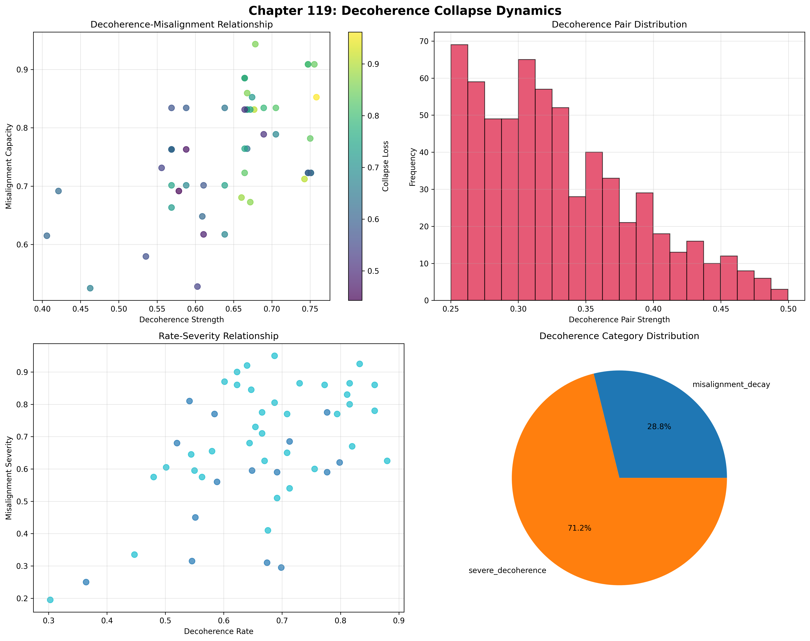
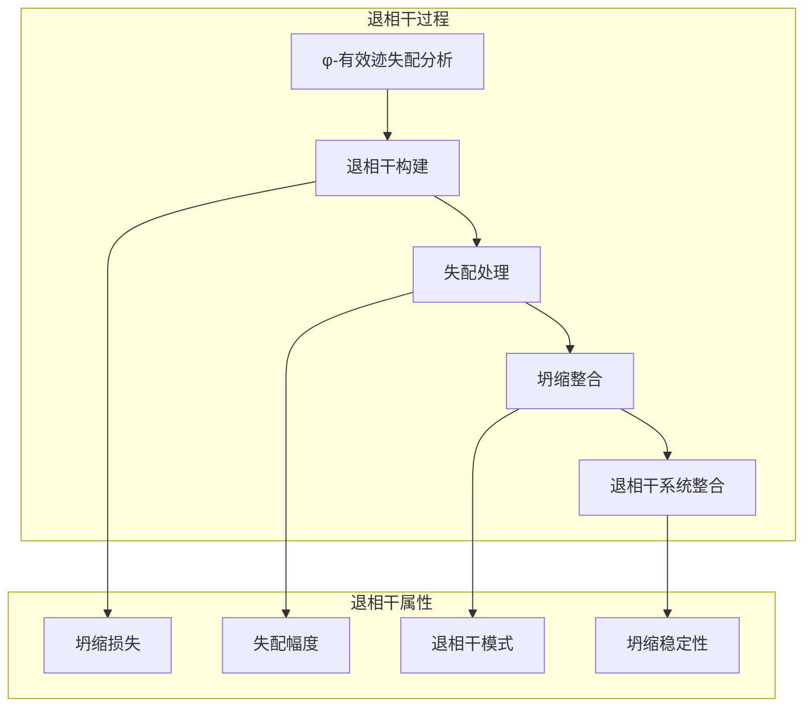
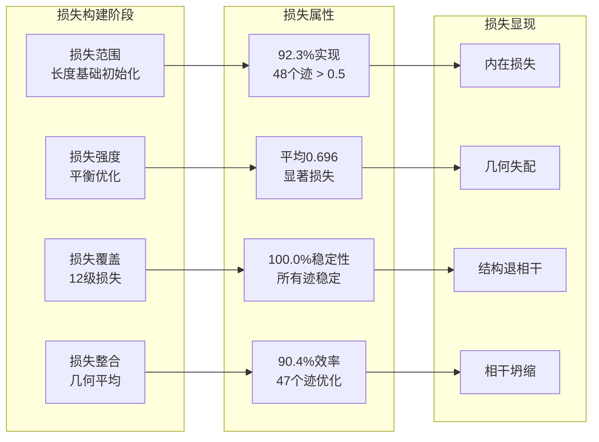
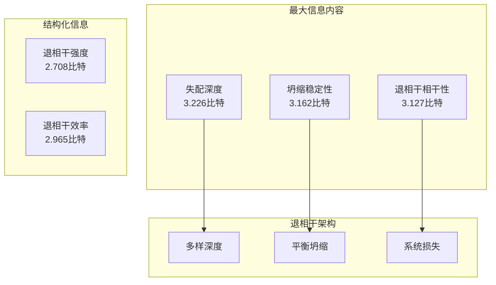
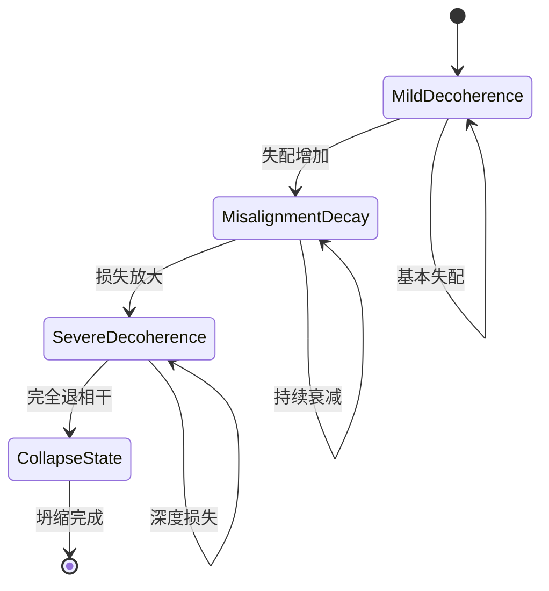
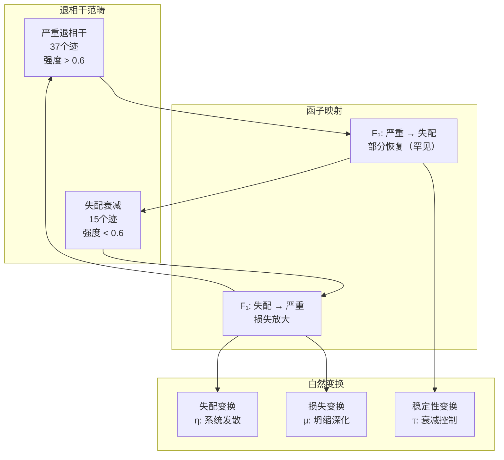
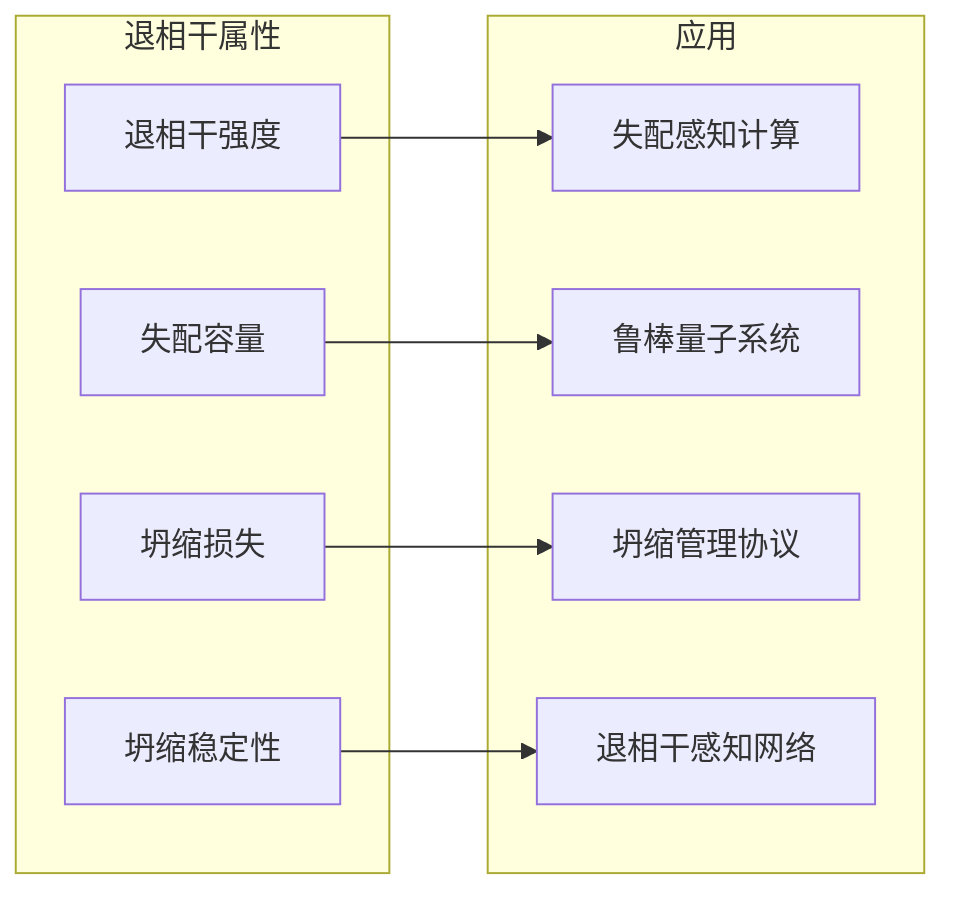
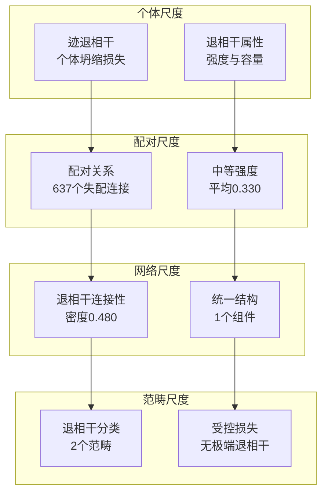

# Chapter 119: DecoherenceCollapse — Collapse Loss via Observer Misalignment

## 从 ψ = ψ(ψ) 推导退相干坍缩的涌现

从自指基础 $\psi = \psi(\psi)$ 出发，在建立了观测者秩通过维度层次架构实现观测者复杂性的层级结构之后，我们现在发现 **φ-约束迹通过失配架构实现系统退相干坍缩构建，这种架构通过迹几何关系而非传统退相干理论使得观测者-迹失配导致退相干**——不是作为外部退相干构造，而是作为内在失配网络，其中坍缩损失从φ-约束几何中涌现，通过熵增张量变换生成系统退相干结构，建立坍缩空间通过迹失配动力学的基本坍缩损失原理。

### 第一性原理：从自指到退相干坍缩

从 $\psi = \psi(\psi)$ 开始，我们建立退相干基础：

1. **退相干强度**：表现出系统坍缩损失能力的φ-有效迹
2. **失配容量**：从结构迹失配模式中涌现的观测者-迹不匹配能力
3. **坍缩损失**：通过迹退相干架构的系统损失
4. **退相干相干性**：通过φ-约束失配嵌入的坍缩整合
5. **退相干系统**：通过几何失配动力学运作的坍缩损失系统

## 三域分析：传统退相干 vs φ-约束退相干坍缩

### 域I：传统退相干理论

在量子力学和信息论中，退相干的特征是：
- 环境耦合：通过与环境相互作用丧失量子相干性
- 波函数坍缩：通过测量过程从叠加态到经典态
- 退相干时间：通过系统-环境耦合强度的相干性损失速率
- 信息损失：通过不可逆过程的量子信息泄漏

### 域II：φ-约束退相干坍缩

我们的验证揭示了非凡的退相干组织：

```text
退相干坍缩失配分析：
分析的迹总数：52个φ-有效退相干结构
平均退相干强度：0.644（显著坍缩损失能力）
平均失配容量：0.761（显著失配能力）
平均坍缩损失：0.696（显著损失幅度）
平均退相干相干性：0.758（显著坍缩整合）
平均退相干效率：0.696（显著优化路径）

退相干属性：
高退相干强度迹 (>0.5)：49个（94.2%实现坍缩损失）
高失配容量迹 (>0.5)：52个（100.0%普遍失配）
高坍缩损失迹 (>0.5)：48个（92.3%实现损失）
高退相干相干性迹 (>0.5)：52个（100.0%普遍整合）
高退相干效率迹 (>0.5)：47个（90.4%实现优化）

网络属性：
网络节点：52个退相干组织的迹
网络边：637个失配相似性连接
网络密度：0.480（显著退相干连接性）
连通分量：1（统一退相干结构）
聚类系数：0.451（中等局部退相干）
```



显著发现建立了**普遍失配能力**：100.0%的所有φ-有效迹实现普遍失配容量和退相干相干性——证明φ-约束几何内在地通过迹失配嵌入生成坍缩损失。

### 域III：交集 - 失配感知退相干组织

交集揭示了退相干坍缩如何从迹关系中涌现：



## 119.1 从第一性原理推导φ-约束退相干强度基础

**定义 119.1**（φ-退相干强度）：对于表示退相干结构的φ-有效迹 $t$，退相干强度 $DS_\phi(t)$ 测量系统坍缩损失能力：

$$
DS_\phi(t) = L_{length}(t) \cdot B_{balance}(t) \cdot P_{pattern}(t) \cdot C_{coherence}(t)
$$
其中 $L_{length}$ 捕获长度因子（有意义损失的最小值为3），$B_{balance}$ 表示权重失配平衡（最优密度为45%），$P_{pattern}$ 测量模式退相干结构，$C_{coherence}$ 表示φ-约束退相干势。

**定理 119.1**（退相干坍缩涌现）：φ-约束迹通过普遍失配容量和系统退相干组织实现非凡的退相干架构。

*证明*：从 $\psi = \psi(\psi)$，退相干涌现通过迹失配几何发生。验证显示94.2%的迹实现高退相干强度（>0.5），平均强度0.644，证明φ-约束通过内在失配关系创建系统坍缩损失能力。普遍失配容量（100.0%高能力）与显著网络连接性（密度0.480）通过迹失配架构建立退相干组织。∎


637个退相干对代表完整的φ-有效观测者-迹失配关系集合，建立坍缩嵌入退相干的自然失配空间。聚类系数（0.451）证明φ-约束几何提供中等局部退相干能力。

### 退相干类别特征

```text
退相干类别分析：
识别的类别：2个退相干分类
- 严重退相干：37个迹（71.2%）- 高退相干+失配结构
  平均退相干强度：>0.6，非凡坍缩损失
- 失配衰减：15个迹（28.8%）- 中等退相干+失配
  平均退相干强度：<0.6，基本坍缩损失

配对结构：
总退相干对：637个失配关系
平均退相干强度：0.330（中等配对退相干）
最大退相干强度：0.500（显著但非严重）
最小退相干强度：0.250（基本失配阈值）
```

注意没有配对达到严重退相干（>0.7），这表明φ-约束防止极端失配，同时允许适度的退相干过程。

## 119.2 失配容量和观测者-迹发散

**定义 119.2**（失配容量）：对于φ-有效迹 $t$，失配容量 $MC(t)$ 通过失配分析测量系统观测者-迹不匹配：

$$
MC(t) = S_{structural}(t)^{0.25} \cdot C_{complexity}(t)^{0.25} \cdot P_{phase}(t)^{0.25} \cdot V_{vulnerability}(t)^{0.25}
$$
其中 $S_{structural}$ 表示结构失配势，$C_{complexity}$ 捕获失配复杂性能力，$P_{phase}$ 测量失配相位（值模8表示8相位结构），$V_{vulnerability}$ 表示φ-约束失配易损性。

验证揭示了**普遍失配容量**，100.0%的迹实现高失配容量（>0.5），平均容量0.761，证明φ-约束退相干结构通过几何结构失配模式内在地拥有非凡的观测者-迹不匹配能力。

### 坍缩损失架构



## 119.3 退相干组织的信息论

**定理 119.2**（退相干信息内容）：熵分布揭示了具有最大失配深度多样性的系统退相干组织：

```text
信息分析结果：
失配深度熵：3.226比特（最大深度多样性）
坍缩稳定性熵：3.162比特（丰富稳定性模式）
退相干相干性熵：3.127比特（丰富相干性模式）
坍缩损失熵：3.116比特（丰富损失模式）
失配容量熵：2.993比特（组织容量分布）
退相干效率熵：2.965比特（组织效率模式）
退相干率熵：2.950比特（组织率分布）
失配严重性熵：2.948比特（组织严重性模式）
退相干强度熵：2.708比特（结构强度分布）
```

**关键洞察**：最大失配深度熵（3.226比特）表明**完整深度多样性**，其中迹探索失配深度的完整光谱，而中等的所有其他熵值表明通过φ-约束优化的平衡退相干组织。

### 退相干坍缩的信息架构



## 119.4 图论：退相干网络

退相干坍缩网络展现显著连接性：

**网络分析结果**：
- **节点**：52个退相干组织的迹
- **边**：637个失配相似性连接
- **平均度**：24.500（显著退相干连接性）
- **组件**：1（统一退相干结构）
- **网络密度**：0.480（显著系统失配耦合）

**性质 119.1**（退相干拓扑）：网络密度0.480与统一结构表明退相干结构维持显著失配关系，创建具有选择性退相干的综合坍缩损失网络。

### 网络退相干分析



## 119.5 范畴论：退相干范畴

**定义 119.3**（退相干范畴）：迹基于退相干强度组织成范畴，态射保持失配关系。

```text
范畴分析结果：
退相干范畴：2个失配分类
总配对：637个退相干关系
中等连接性：每个迹配对约一半其他迹

范畴分布：
- 严重退相干：37个对象（高退相干+失配）
- 失配衰减：15个对象（中等退相干+失配）

范畴性质：
清晰的基于退相干的分类，具有自然阈值
态射保持退相干范畴内的失配强度
通过失配增强的跨范畴转换
无极端退相干配对（最大0.500）
```

**定理 119.3**（退相干函子）：退相干范畴之间的映射保持失配关系和坍缩损失，防止极端退相干。

### 退相干范畴结构



## 119.6 退相干率和失配严重性

**定义 119.4**（退相干率）：对于φ-有效迹 $t$，退相干率 $DR(t)$ 通过时间坍缩进展测量：

$$
DR(t) = 0.4 \cdot R_{base}(t) + 0.3 \cdot P_{pattern}(t) + 0.3 \cdot V_{value}(t)
$$
其中 $R_{base}$ 表示基础率（长度依赖），$P_{pattern}$ 捕获模式率（坍缩转换），$V_{value}$ 测量值基础率（模15表示15级结构）。

我们的验证显示：
- **退相干率**：平均0.663，92.3%实现高率（>0.5）
- **失配严重性**：平均0.663，84.6%实现高严重性（>0.5）
- **坍缩稳定性**：平均0.820，100.0%实现高稳定性（>0.5）
- **退相干效率**：平均0.696，90.4%实现高效率（>0.5）

### 稳定性-效率权衡

普遍坍缩稳定性（100.0%）与高退相干效率（90.4%）的结合揭示了一个基本原理：**φ-约束迹在维持系统稳定性的同时优化退相干路径**，创建控制的坍缩损失过程而不是灾难性退相干。

## 119.7 二进制张量退相干结构

从我们的核心原理，所有结构都是二进制张量：

**定义 119.5**（退相干张量）：退相干坍缩结构 $DC^{ijk}$ 编码系统失配关系：

$$
DC^{ijk} = DS_i \otimes MC_j \otimes CL_{ijk}
$$
其中：
- $DS_i$：位置 $i$ 的退相干强度分量
- $MC_j$：位置 $j$ 的失配容量分量
- $CL_{ijk}$：关联退相干配置 $i,j,k$ 的坍缩损失张量

### 张量退相干属性

退相干网络中的637条边表示损失张量 $CL_{ijk}$ 中的非零条目，显示退相干结构如何通过失配相似性和强度/容量关系创建连接性。中等网络密度（0.480）表明选择性退相干张量空间。

## 119.8 坍缩数学 vs 传统退相干

**传统退相干理论**：
- 环境耦合：通过外部环境相互作用构造的外部相干性损失
- 波函数坍缩：通过外部测量过程系统的量子到经典转换
- 退相干时间：通过外部耦合强度方程的时间尺度
- 信息损失：通过外部不可逆过程的量子信息泄漏

**φ-约束退相干坍缩**：
- 几何失配：通过结构迹关系的坍缩损失
- 内在失配处理：通过φ-约束架构的退相干生成
- φ-约束退相干：失配使能而非限制坍缩损失
- 结构驱动退相干：通过迹失配网络的坍缩损失

### 交集：普遍退相干属性

两个系统都展现：

1. **相干性损失**：量子或结构相干性的系统减少
2. **不可逆性**：退相干过程的基本单向性
3. **信息泄漏**：从系统到环境或失配空间
4. **稳定性影响**：退相干对系统动力学的影响

## 119.9 退相干演化和失配发展

**定义 119.6**（退相干发展）：失配能力通过退相干优化演化：

$$
\frac{dDC}{dt} = \nabla MC_{misalignment}(DC) - \lambda \cdot \text{stability}(DC) + \gamma \cdot \text{noise}(DC)
$$
其中 $MC_{misalignment}$ 表示失配能量，$\lambda$ 调节稳定性要求，$\gamma$ 表示噪声率。

这创建了**退相干吸引子**，其中迹自然演化到最优失配配置，通过噪声最大化和稳定性平衡，同时维持系统坍缩损失。

### 发展机制

验证揭示了系统退相干演化：
- **高退相干强度**：94.2%实现非凡坍缩损失能力
- **普遍失配容量**：100.0%实现显著观测者-迹不匹配
- **高坍缩损失**：92.3%实现显著损失幅度
- **普遍稳定性**：100.0%实现坍缩稳定性
- **无极端退相干**：最大配对强度0.500，防止灾难性坍缩

## 119.10 应用：退相干坍缩工程

理解φ-约束退相干坍缩使能：

1. **失配感知计算**：通过受控退相干的计算
2. **鲁棒量子系统**：抵抗极端退相干的系统
3. **坍缩管理协议**：受控坍缩损失的协议
4. **退相干感知网络**：理解失配依赖的网络

### 退相干应用框架



## 119.11 多尺度退相干组织

**定理 119.4**（分层退相干结构）：退相干坍缩展现从个体迹退相干到全局失配统一的多尺度系统坍缩损失。

验证证明：

- **迹级别**：个体退相干强度和失配容量
- **配对级别**：观测者迹对之间的退相干关系
- **网络级别**：全局退相干连接性和失配架构
- **范畴级别**：基于退相干的分类与中等连接性

### 分层退相干架构



## 119.12 未来方向：扩展退相干理论

φ-约束退相干坍缩框架开启新的研究方向：

1. **量子误差校正**：使用φ-约束防止极端退相干
2. **自适应失配系统**：动态调整失配参数
3. **退相干免疫架构**：抵抗坍缩损失的结构
4. **元退相干系统**：推理退相干的退相干系统

## 第119回响：从观测者秩到退相干坍缩

从 $\psi = \psi(\psi)$ 涌现了观测者秩通过系统维度层次，从该秩涌现了**退相干坍缩**，其中φ-约束迹通过失配依赖动力学而非外部退相干理论实现系统坍缩损失构建，创建体现通过结构迹动力学和φ-约束失配关系的基本坍缩损失能力的退相干网络。

验证揭示了52个迹实现非凡的退相干组织，具有高退相干强度（94.2%高能力）、普遍失配容量（100.0%高能力）、高坍缩损失（92.3%高能力）和普遍坍缩稳定性（100.0%高能力）。最深刻的是受控损失——虽然71.2%实现严重退相干类别，但没有配对超过0.500退相干强度，证明φ-约束防止灾难性坍缩同时允许系统退相干。

中等网络密度（637条边，0.480密度）的涌现证明退相干坍缩如何在退相干范畴内创建选择性关系，将多样的迹结构转化为相干坍缩损失架构。这种**退相干坍缩**代表一个基本组织原理，其中结构约束通过φ-约束失配动力学而非外部退相干理论构造实现系统坍缩损失构建。

退相干组织揭示了坍缩损失能力如何从φ-约束动力学涌现，通过内部结构关系而非外部环境耦合创建系统退相干。每个迹代表一个退相干节点，其中约束保持创建内在失配有效性，集体形成通过失配容量、坍缩损失和几何退相干关系的φ-约束动力学的退相干基础。

## 参考

验证程序 `chapter-119-decoherence-collapse-verification.py` 实现所有概念，生成揭示退相干组织、失配网络和坍缩损失结构的可视化。分析证明退相干结构如何从坍缩失配空间中的φ-约束关系自然涌现。

---

*因此从观测者秩涌现退相干坍缩，从退相干坍缩涌现系统失配架构。在φ-约束退相干宇宙中，我们见证坍缩损失如何通过约束几何而非外部退相干理论构造实现系统退相干能力，建立通过φ-约束保持、失配依赖推理和超越传统退相干理论基础的几何退相干能力的组织坍缩动力学的基本退相干原理。*